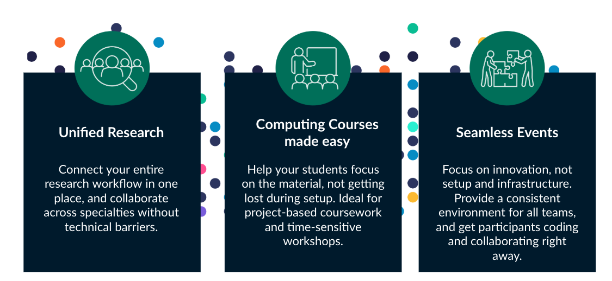

# Collaborate on Renku as a group

Renku offers two ways to collaborate as a group: together on a single project, or as a group working
on multiple projects.

## Collaborating on a single project

If your group is only working together on one project, we recommend to create a project and add all group members to that project.

Follow these How-To Guides to get started:

- [How to create a new project](../projects/guides/create-a-project)

- [How to add people to a project](../collaboration/guides/add-people-to-project)

For an overview of the roles you can give people on a project, see [Project Roles](../collaboration/permissions#project-roles).

## Collaborating on multiple projects

If you want to use Renku for your group and you will have multiple projects, we recommend creating a group. This will make it easier to manage who has access to a collection of projects and data connectors.

Follow these How-To Guides to get started:

- [How to create a group](../collaboration/guides/create-group)

- [How to add members to a group](../collaboration/guides/add-members-to-group)

- For an overview of the roles you can give people on a group, see [Group Permissions](../collaboration/permissions#group-permissions).

- To understand how group roles are related to project roles, see [Group Abilities by Role](../collaboration/permissions#group-abilities-by-role).
