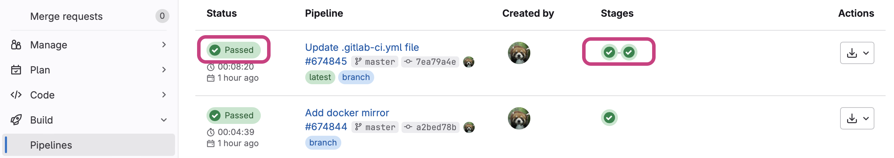
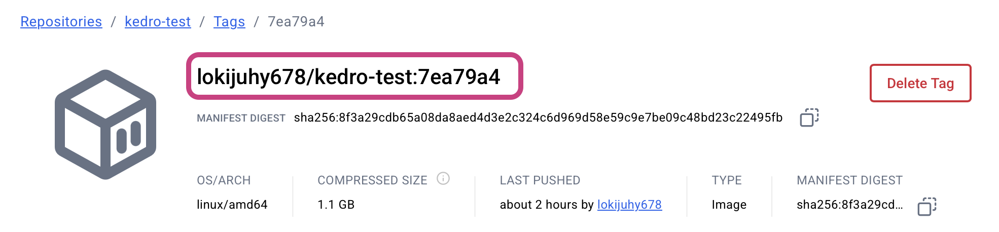

# Migrate an image to Docker Hub

## Part 1: Move your image to Docker Hub

### Prerequisites Setup

**Step 1: Create a DockerHub account**

- Go to [https://hub.docker.com](https://hub.docker.com/) and click "Sign Up"
- Choose a username (this will be part of your image URLs)
- Verify your email address

**Step 2: Create a repository on DockerHub**

- Log into DockerHub and click "Create a Repository"
- Choose a repository name (should match or relate to your GitLab project)
- Set visibility (Public or Private)
- Click "Create"

From here, we offer two methods for migrating a RenkuLab GitLab docker image to Dockerhub.

Use [**Method 1 (GitLab CI)**](#method-1-using-gitlab-cicd-pipeline) if you with to avoid installing docker locally.

Use [**Method 2 (Docker CLI)**](#method-2-using-the-docker-command-line) if you with to avoid rebuilding your image.

### Method 1: Using GitLab CI/CD Pipeline

**Step 3: Set up variables in GitLab**

- Go to your GitLab project → Settings → CI/CD → Variables
- Add these variables, entering the variable name as the KEY:
    - `DOCKERHUB_USER`: Your DockerHub username
    - `DOCKERHUB_REPO`: Your DockerHub repository name
    - `DOCKERHUB_TOKEN`: Your DockerHub access token
        - To get this value, in DockerHub:
            1. In the top right click on your profile and select “Account Settings”
            2. Click on “Personal Access Tokens”
            3. Give your token a name in the “Description” field
            4. Set the expiration date for 30 days, since you don’t need this token for long.
            5. For Access Permission, select “Read & Write”
            6. Copy the token

**Step 4: Modify your CI/CD pipeline in GitLab**

- Edit the `.gitlab-ci.yml` file in your repository and replace it with the following:

```yaml
variables:
  GIT_STRATEGY: fetch
  GIT_SSL_NO_VERIFY: "true"
  GIT_LFS_SKIP_SMUDGE: 1

stages:
  - build
  - mirror

image_build:
  stage: build
  image: docker:stable
  before_script:
    - docker login -u gitlab-ci-token -p $CI_JOB_TOKEN http://$CI_REGISTRY
  script: |
    CI_COMMIT_SHA_7=$(echo $CI_COMMIT_SHA | cut -c1-7)
    docker build --tag $CI_REGISTRY_IMAGE:$CI_COMMIT_SHA_7 .
    docker push $CI_REGISTRY_IMAGE:$CI_COMMIT_SHA_7

mirror:
  stage: mirror
  image: docker:latest
  services:
    - docker:dind
  script:
    - CI_COMMIT_SHA_7=$(echo $CI_COMMIT_SHA | cut -c1-7)
    - docker login -u $CI_REGISTRY_USER -p $CI_REGISTRY_PASSWORD $CI_REGISTRY
    - docker login -u $DOCKERHUB_USER -p $DOCKERHUB_TOKEN
    - docker pull $CI_REGISTRY_IMAGE:$CI_COMMIT_SHA_7
    - docker tag $CI_REGISTRY_IMAGE:$CI_COMMIT_SHA_7 $DOCKERHUB_USER/$DOCKERHUB_REPO:$CI_COMMIT_SHA_7
    - docker push $DOCKERHUB_USER/$DOCKERHUB_REPO:$CI_COMMIT_SHA_7
```

- Commit your changes. This should trigger a Pipeline run.
- Go to “Build” → “Pipelines” and confirm that the pipeline was successful and now has 2 stages instead of just 1.

    


**Step 5: Confirm your image is on DockerHub & Find its identifier**

- In DockerHub, go to your “Repositories”, click on the repository you created for this project. Under “Tags”, there should be 1 entry. Click on it.
- Copy the image identifier, which is in the form `<username>/<repo-name>:<commit>`

    

Your image is migrated! Continue to [Part 2: create a new session launcher](#part-2-create-a-new-renku-session-launcher-that-uses-the-migrated-image).

### Method 2: Using the Docker command line

**Step 1: Create a RenkuLab GitLab Personal Access Token**

- Go to https://gitlab.renkulab.io/-/user_settings/personal_access_tokens
- Click ‘Add new token”
- Fill out the form, and check the `read_registry` scope

**Step 2: Install Docker locally**

- Ensure Docker is installed and running on your machine
- Verify with: `docker --version`

**Step 3: Log into both registries**

```bash
*# Log into RenkuLan GitLab registry
# replace <token> and <username> with your account details
TOKEN=<token>
echo "$TOKEN" | docker login registry.*renkulab.io *-u <username> --password-stdin

# Log into DockerHub*
docker login
*# Enter your DockerHub username and password*
```

**Step 4: Pull the image from GitLab registry**

Replace with your actual image URL that is listed in your migrated Renku session launcher.

```bash
docker pull registry.renkulab.io/your-username/your-project/your-image:tag
```

**Step 5: Tag the image for DockerHub**

```bash
docker tag registry.renkulab.io/your-username/your-project/your-image:tag your-dockerhub-username/your-repo-name:tag
```

**Step 6: Push to DockerHub**

```bash
docker push your-dockerhub-username/your-repo-name:tag
```

#### Verification and Cleanup

**Step 9: Verify the migration**

- Check your DockerHub repository online to confirm the image appears
- Test pulling from DockerHub:

    ```bash
    docker pull your-dockerhub-username/your-repo-name:tag
    ```


**Step 10: Clean up local images (optional)**

```bash
*# Remove local copies if desired*
docker rmi registry.gitlab.com/your-username/your-project/your-image:tag
docker rmi your-dockerhub-username/your-repo-name:tag
```

Your image is migrated! Continue to [Part 2: create a new session launcher](#part-2-create-a-new-renku-session-launcher-that-uses-the-migrated-image).

## Part 2: Create a new Renku Session Launcher that uses the migrated image

In the project page:

1. Under **Sessions** section click on ➕ to add a new launcher
2. Select **External environment**

    

3. For the container image, enter your **image identifier**.
    - Some examples of image identifiers:
        - `renku/renkulab-py:3.10-0.24.0`
        - `continuumio/anaconda3:2024.06-1`
    - The image identifier should be in the format that works with `docker pull`
4. Depending on the image you’re using, you’ll need to fill in the **Advanced settings**. See the information below for how to fill it in:
    

    :::warning
    This part is important! Please read carefully.
    :::

    <details>
      <summary>I’m using an image that is **newer** than version 0.24.0 (the version number is in the image tag).</summary>

      The only additional parameter you have to provide in the session launcher creation dialog is the `Default URL` and this should be set to `/lab`.

    </details>

    <details>
      <summary>I’m using an image that is **older** than version 0.24.0 (the version number is in the image tag).</summary>

      :::info

      Note: If you are working with an image in a launcher where the **launcher was created before November 27, 2024**, the launcher was migrated automatically with the new Renku release to include the necessary advanced settings. The instructions below apply only to new session launchers you are creating for the first time.

      :::

      Enter the following configuration in the session launcher. Here is an example configuration needed to run a Renku base image of version 0.24.0 or older:
          - **Container Image**: `renku/renkulab-py:3.10-0.24.0` or whatever image you are trying to use
          - **Default URL**: `/lab`  (or `/rstudio` if you are using `renku/renkulab-r` or `renku/renkulab-bioc`).
          - **Mount Directory**: `/home/jovyan/work`
          - **Working Directory**: `/home/jovyan/work`
          - **UID**: `1000`
          - **GID**: `100`
          - **Command ENTRYPOINT**: `["sh", "-c"]`
          - **Command Arguments**:

              ```json
              ["/entrypoint.sh jupyter server --ServerApp.ip=0.0.0.0 --ServerApp.port=8888 --ServerApp.base_url=$RENKU_BASE_URL_PATH --ServerApp.token=\"\" --ServerApp.password=\"\" --ServerApp.allow_remote_access=true --ContentsManager.allow_hidden=true --ServerApp.allow_origin=* --ServerApp.root_dir=\"/home/jovyan/work\""]
              ```
    </details>


5. Select the **Resource class** that best fits your expected computational needs.
6. Give your session launcher a **name**
7. Click on **Add session launcher** button
