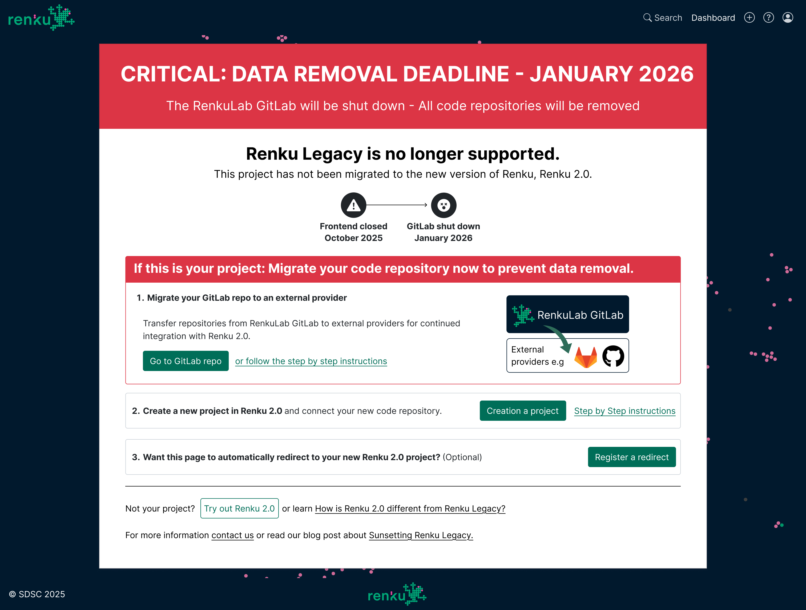

# How to migrate out of RenkuLab GitLab

:::danger

**DATA REMOVAL DEADLINE - JANUARY 2026**

The RenkuLab GitLab (`gitlab.renkulab.io`) will soon be shut down. All code repositories and hosted
images remaining there will be removed. Follow the migration instructions below before January 2026
to save your work.

:::

You have probably landed on this page because you have a code repository or session launcher that
needs to be migrated out of the RenkuLab GitLab before GitLab is shut down in January 2026. **If you
don’t migrate before the shutdown, you will lose access to your code repository and/or docker
image.**

<p class="image-container-l">

</p>

To determine what resources in your project need to be migrated, look for the **Migration needed**
badge on code repositories and session launchers in your project:

<p class="image-container-s">

</p>

Then, follow the instructions below to migrate each resource.

```mdx-code-block
import DocCardList from '@theme/DocCardList';

<DocCardList />

```

:::info

To learn more about the Renku Legacy and GitLab shut downs, see our blog post [Sunsetting Renku
Legacy: Your Guide to a Smooth Transition](https://blog.renkulab.io/sunsetting-legacy/).

:::
