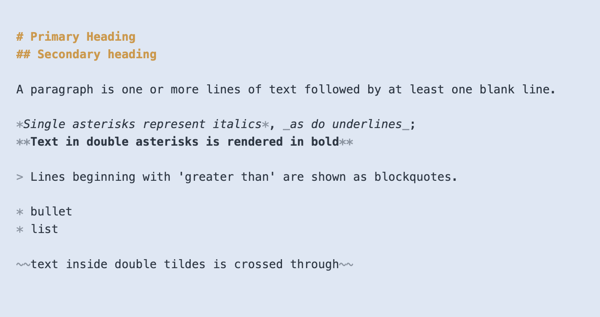

# Writing Documentation in Renku (Renku’s Markdown)

# Basic Formatting

We support basic markdown, like headings, bullets, etc…

# Links

You can create an inline link by wrapping the link display text in brackets `[ ]`, followed by the linked URL in parentheses `( )` with no space in between.