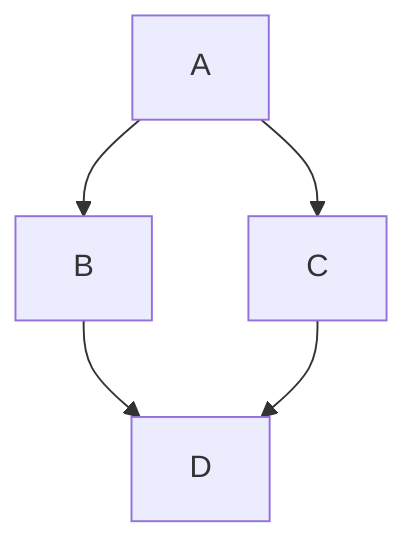
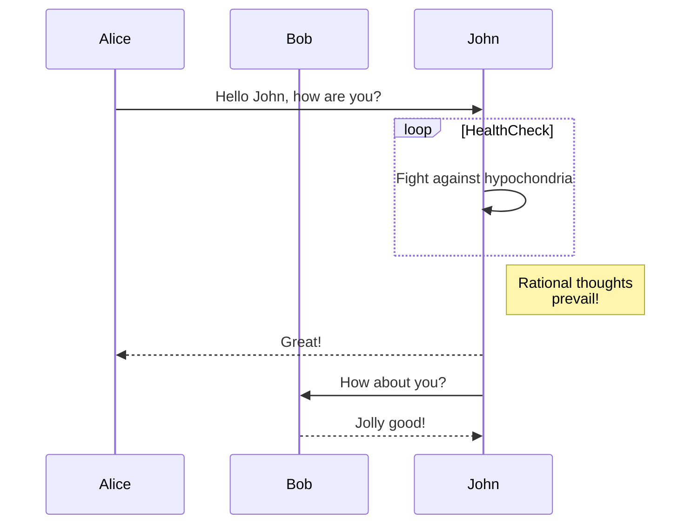

# Writing Documentation in Renku (Renku’s Markdown)

# Basic Formatting

We support basic markdown, like headings, bullets, etc…

```
# Primary Heading
## Secondary heading

A paragraph is one or more lines of text followed by at least one blank line.

*Single asterisks represent italics*, _as do underlines_;
**Text in double asterisks is rendered in bold**

> Lines beginning with 'greater than' are shown as blockquotes.

* bullet
* list

~~text inside double tildes is crossed through~~
```

# Links

You can create an inline link by wrapping the link display text in brackets `[ ]`, followed by the linked URL in parentheses `( )` with no space in between.

```markdown
[text](link.com)
```

# Images

You can add images to your documentation by referencing image links. These work the same as links, plus an `!` at the front.

```markdown

```

If you need to set specific sizes, you can use an HTML tag and take advantage of the `width` and `height` attributes as in the following example:

```html

```

Uploading images is not supported.

    :::info

    **Tip:** Are your images not rendering? Try using the direct image URL, which you can get by doing "Open image in a new tab” and copying the resulting URL.

    :::

# Math Expressions

LaTeX math expressions can be specified in one of two ways:

using `$` to delimit the expression:

```markdown
$\sqrt 2$
```

or declaring a `math` block:

````markdown
```math
\zeta_t \sim N(0,\Sigma_z(t))
```
````

# Mermaid Diagrams

Declaring a “mermaid” block allows input of [Mermaid](https://mermaid.js.org/intro/) diagrams in documentation, for example:

````

```mermaid
graph TD;
    A-->B;
    A-->C;
    B-->D;
    C-->D;
```
````


```mermaid
graph TD;
    A-->B;
    A-->C;
    B-->D;
    C-->D;
```

````

```mermaid
sequenceDiagram
    participant Alice
    participant Bob
    Alice->>John: Hello John, how are you?
    loop HealthCheck
        John->>John: Fight against hypochondria
    end
    Note right of John: Rational thoughts <br/>prevail!
    John-->>Alice: Great!
    John->>Bob: How about you?
    Bob-->>John: Jolly good!
```
````


```mermaid
sequenceDiagram
    participant Alice
    participant Bob
    Alice->>John: Hello John, how are you?
    loop HealthCheck
        John->>John: Fight against hypochondria
    end
    Note right of John: Rational thoughts <br/>prevail!
    John-->>Alice: Great!
    John->>Bob: How about you?
    Bob-->>John: Jolly good!
```

# Emojis

Many common emjoji’s are supported: https://github.com/showdownjs/showdown/wiki/emojis
