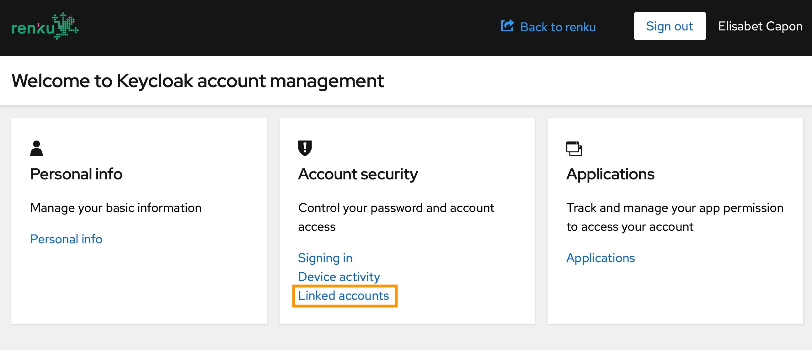
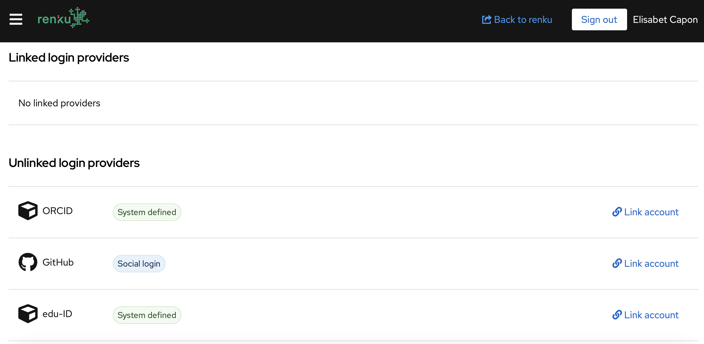

# How to manage your account access: link your Renku account to multiple login providers

If you have multiple options to sign up into your Renku account, you can define all your log in providers in the same Renku account. We hereby explain you the process step-by-step.

1. Sign up into Renku normally.
2. Click on the top right menu in the drop-down under the user icon and select **Account**. 
3. In the **Account security** card, click on **Linked accounts**.

4. Click Link account under the Unlinked login providers section, and follow the steps to validate your account.

 If you find any trouble when completing the process, [contact us](mailto:hello@renku.io)!