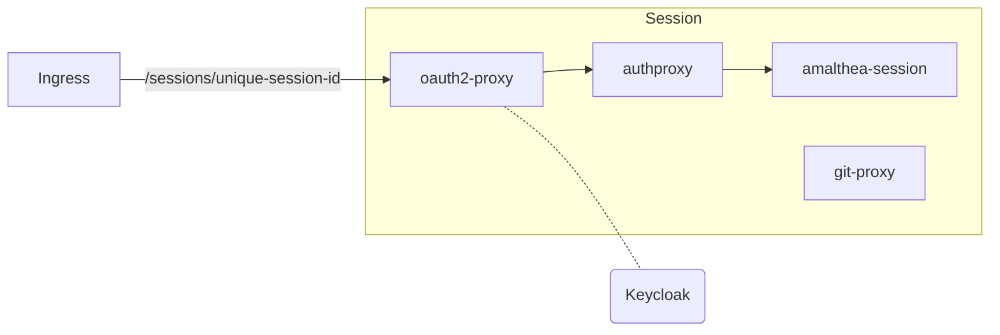
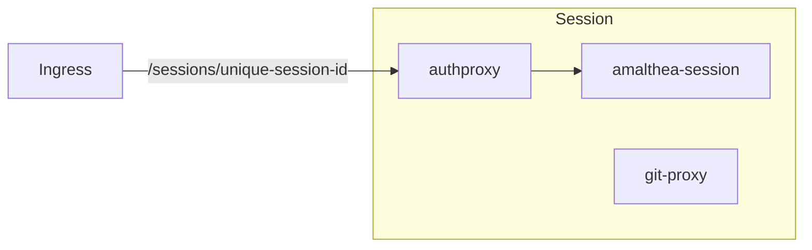
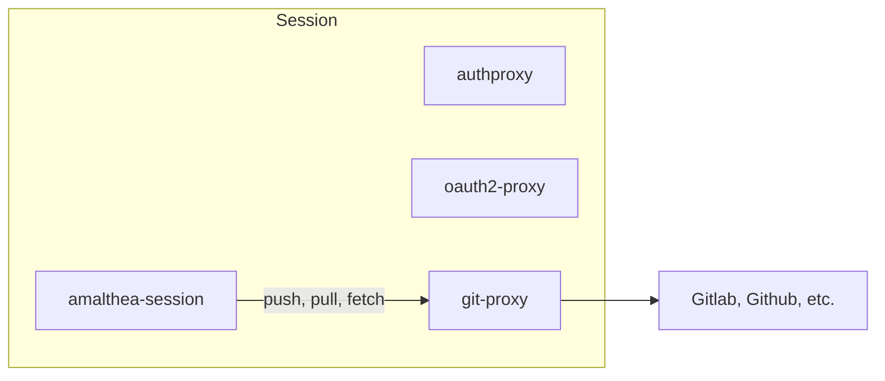

# Sessions

## Overview

List of containers and a short explanation for each for user sessions.

### Containers:
- **amalthea-session**: The container that is running the VS code or other frontend the user accesses.
- **authproxy**: Used to authenticate sessions for anonymous users and to track idleness.
- **oauth2-proxy**: Used to authenticated sessions for registered users.
- **git-proxy**: Used to inject git credentials into requests coming from `amalthea-session`.

### Init containers:
- **git-clone**: Clones all repositories used in the session. 
- **init-certificates**: Injects CA certificates into all other containers.

## Networking

### Registered user

### Anonymous user

### Git access

