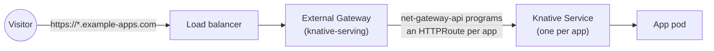

The main purpose of this portion of the documentation is to guide administrators
on how to configure Renku prior to installation via the Helm chart values file.

## Values file

The source code for the Helm chart is located [here](https://github.com/SwissDataScienceCenter/renku/tree/master/helm-chart/renku).
We strongly recommend checking the `values.yaml` as well as all templates if you are unsure how things are
templated or how some portion of the values file affects what is created in your cluster.

:::info
When looking at the source code for the Helm chart make sure you have selected the right
version of Renku. The link above leads to the latest on our main branch which may not match what you
have deployed.
:::

### Resource requests and limits for Renku services

One of the most important setting in your values file is the amount of resources (i.e. CPU and memory)
for the different Renku services that will be deployed. We strongly recommend setting resource requests
for CPU and memory, and resource limits for memory that match the request. In addition to this, you should have
alarms on the memory usage for each service so that more memory can be provisioned when the memory usage
is high (e.g. >80% or 90% of the limit). Without tracking this or acting when memory usage spikes to
do a sudden increase in users your Renku deployment will not run reliably and crucial services will
keep restarting or be permanently unavailable.

Here is an example values for a deployment that should handle approximately 50-100 active users per day.

```yaml
amalthea-sessions:
  controllerManager:
    manager:
      resources:
        limits:
          cpu: 1000m
          memory: 512Mi
        requests:
          cpu: 1000m
          memory: 512Mi
csi-rclone:
  csiControllerRclone:
    rclone:
      resources:
        limits:
          memory: 600Mi
        requests:
          cpu: 100m
          memory: 600Mi
  csiNodepluginRclone:
    rclone:
      resources:
        limits:
          memory: 128Mi
        requests:
          cpu: 100m
          memory: 128Mi
dataService:
  autoscaling:
    enabled: true
    maxReplicas: 5
    minReplicas: 2
    targetCPUUtilizationPercentage: false
    targetMemoryUtilizationPercentage: 75
  resources:
    limits:
      memory: 2048Mi
    requests:
      cpu: 1.3
      memory: 2048Mi
  dataTasks:
    resources:
      limits:
        memory: 300Mi
      requests:
        cpu: 500m
        memory: 300Mi
  k8sWatcher:
    resources:
      limits:
        memory: 500Mi
      requests:
        cpu: 400m
        memory: 500Mi
gateway:
  resources:
    limits:
      memory: 100Mi
    requests:
      cpu: 250m
      memory: 100Mi
  autoscaling:
    enabled: true
    maxReplicas: 7
    targetCPUUtilizationPercentage: 75
    targetMemoryUtilizationPercentage: 75
secretsStorage:
  replicaCount: 2
  resources:
    limits:
      memory: 750Mi
    requests:
      cpu: 10m
      memory: 750Mi
ui:
  client:
    replicaCount: 3
    resources:
      limits:
        memory: 512Mi
      requests:
        cpu: 200m
        memory: 512Mi
  server:
    autoscaling:
      cpuUtilization: 85
      enabled: true
      maxReplicas: 5
      minReplicas: 2
    resources:
      limits:
        memory: 512Mi
      requests:
        cpu: 1000m
        memory: 512Mi
```

:::info
This section discusses the needs for Renku services to handle a specific volume of users, excluding the
compute needs of the sessions that users will be creating.
You still need to provision enough resource to handle the compute requirement for the session(s)
of every user. This is done via resource pools and providing enough nodes in your Kubernetes cluster
and/or with node autoscaling.
:::

### Resource requests and limits for 3rd party services

These services are not developed by Renku but are used by the services we develop and maintain.

```yaml
postgresql:
  resources:
    requests:
      cpu: 3
      memory: 6000Mi
    limits:
      memory: 6000Mi
keycloakx:
  resources:
    limits:
      cpu: 1000m
      memory: 2Gi
    requests:
      cpu: 1000m
      memory: 2Gi
redis:
  replica:
    resources:
      limits:
        cpu: 2
        memory: 3.0Gi
      requests:
        cpu: 2
        memory: 3.0Gi
  sentinel:
    resources:
      requests:
        cpu: 1
        memory: 64Mi
solr:
  resources:
    limits:
      memory: 1536Mi
    requests:
      cpu: 1
      memory: 1536Mi
authz:
  resources:
    limits:
      memory: 500Mi
    requests:
      cpu: 100m
      memory: 500Mi
```

:::info
You may be able to run some of these services with fewer resources. The memory and CPU shown
here are just guides and good starting points for running Renku. Once you deploy and run Renku
for some time you can look at trends and modify things accordingly.
:::

## Harbor and Shipwright

As stated in the [Requirements section](requirements) both of these need to be installed
separately from Renku prior to installing Renku. You may also deploy Renku without Harbor and Shipwright
but then your users will not have the ability to build images from a code repository automatically.

### Configuration with Harbor and Shipwright

1. Create a Harbor project and a secret

This assumes that you have successfully installed Harbor and Shipwright and now you just
have to configure a Harbor project and a robot account that Renku will use.
You can create the project and robot account manually or utilize the scripts that can be found
[here](https://github.com/SwissDataScienceCenter/renku/tree/master/scripts/harbor-init)
in the Renku repository.

This is what is required:

- Public Harbor project.
- Robot account with permissions `list`, `pull`, `push`, `read`.
- Kubernetes secret of type `kubernetes.io/dockerconfigjson` which contains the
  credentials for the robot account and will allow Renku to push images into the Harbor repository.

2. Modify the Helm chart values file

The following section should be added to the values file you are using to install Renku.
Make sure you merge this into the proper sections of an existing file and you do not
end up duplicating sections that already exist. Also there are more options available for customization
such as which nodes should be used for builds and many others, for this prefer to the
[values file](https://github.com/SwissDataScienceCenter/renku/blob/master/helm-chart/renku/values.yaml) in the Renku repository.

```yaml
dataService:
  imageBuilders:
    enabled: true
    outputImagePrefix: harbor.dev.renku.ch/renku-build/
    pushSecretName: renku-build-docker-secret
```

The file above is just an example you will have to modify the options shown as follows:

- `outputImagePrefix`: Should contain the harbor domain name and the name of the Harbor project
  you created in step 1 above. Please make sure you add a trailing `/` at the end. The example
  in the yaml snippet above is for Harbor deployed at the domain `harbor.dev.renku.ch` and for
  a Harbor project called `renku-build`.
- `pushSecretName`: The name the `kubernetes.io/dockerconfigjson` Kubernetes secret that you
  created in step 1 above. This secret will be used by Renku to push images in the Harbor repository.
  The example in the yaml snippet above is for a secret called `renku-build-docker-secret` located
  in the same namespace as where Renku is installed.

By default, only builds from public repositories are enabled. Building from
internal or private repositories requires more work:

- An dedicated registry to hold the images
- Two additional secrets that will hold the credentials to access that
  registry.

Here is an example on how to configure that:

```yaml
dataService:
  imageBuilders:
    enabled: true
    privateRepositoryBuilds:
      enabled: true
      outputPrivateImagePrefix: "harbor.dev.renku.ch/renku-private-build/"
      pushPrivateSecretName: "renku-build-private-docker-secret"
      pullPrivateSecretName: "renku-pull-private-docker-secret"
```

The same rules applies as for the public builds:

- `outputPrivateImagePrefix` contains the Harbor domain and project name.
  The prefix **must** be different from `outputImagePrefix`.
- `pushPrivateSecretName` is the secret to push the image created to the
  dedicated registry. The corresponding robot account should have the
  `list`, `pull`, `push` and `read` permissions.
- `pullPrivateSecretName` is the secret the pod will need to load the image.
  The corresponding robot account should only have the `pull` permission.

3. Label the node(s) you want to use for the builds with `renku.io/node-purpose: image-build`

### Build strategy

The last action required to have your system ready is to deploy the [BuildStrategy
for Shipwright](https://github.com/SwissDataScienceCenter/renku-data-services/blob/main/components/renku_pack_builder/manifests/buildstrategy.yaml).

### Configuration without Harbor and Shipwright

This is the default and no further steps are needed.

## Knative

In order to use Renku Apps, Knative needs to be installed and configured prior to installing Renku
(see [Requirements](requirements#knative)). Apps are served from a domain of their own, so this
section also covers choosing that domain and giving it the DNS and TLS it needs.

The examples below are the arrangement we run, with the cloud-specific parts replaced by
placeholders. A Gateway API implementation and a load balancer address usually come from your
cloud provider, though exactly how varies, so substitute what applies to your environment. Nothing
here is specific to a cloud, and nothing in Renku depends on which one you use.

### 1. Enable the Knative feature flags

Renku's apps use pod spec fields that Knative rejects at admission unless the corresponding feature
flag is enabled. Add the following to your `KnativeServing` resource:

```yaml
apiVersion: operator.knative.dev/v1beta1
kind: KnativeServing
metadata:
  name: knative-serving
  namespace: knative-serving
spec:
  config:
    features:
      kubernetes.podspec-persistent-volume-claim: enabled
      kubernetes.podspec-persistent-volume-write: enabled
      kubernetes.podspec-node-selector: enabled
      kubernetes.podspec-affinity: enabled
      kubernetes.podspec-tolerations: enabled
```

- The two `persistent-volume` flags are needed to mount data connectors, which apps do through
  the same `csi-rclone` storage class as sessions.
- `affinity`, `tolerations` and `node-selector` are needed because an app inherits the node
  affinity and tolerations of its resource class, exactly as a session does.

### 2. Put a Gateway API gateway in front of Knative

Knative needs a networking layer to turn each app into a route. We use
[`net-gateway-api`](https://github.com/knative-extensions/net-gateway-api), which programs
[Gateway API](https://gateway-api.sigs.k8s.io/) `HTTPRoute`s against a gateway you provide, instead
of the Kourier ingress the operator installs by default.

Broadly, this means:

- Installing `net-gateway-api`'s release manifests for your Knative version, then disabling
  Kourier and pointing Serving at the new ingress class
  (`ingress-class: "gateway-api.ingress.networking.knative.dev"`).
- Creating two `Gateway` objects in `knative-serving`: an external one (TLS-terminating, for your
  apps domain) and a cluster-local one. Both need `allowedRoutes.namespaces.from: All`, since the
  `HTTPRoute`s belong to apps living in the sessions namespace, not `knative-serving`.
- Pointing `net-gateway-api`'s `config-gateway` ConfigMap at those gateways.
- Giving the external gateway a **stable, pre-allocated load balancer address** (via
  `spec.infrastructure.annotations`, using your cloud's load-balancer-controller keys). The apps
  domain's DNS record points at this address, so a floating one means every app becomes
  unreachable if the gateway is ever recreated.

Which `GatewayClass` and load-balancer annotations apply depends on your Gateway API implementation
(Istio, Envoy Gateway, Contour, or a cloud-managed one). Consult its docs for the exact manifests.



### 3. Configure the apps domain

Knative routes by hostname, so every app gets its own hostname under a domain you set aside for
apps. We do this with a wildcard, the simplest arrangement, which the rest of this section assumes:

- A **wildcard DNS record** (for example `*.example-apps.com`) pointing at the load balancer address
  of the external gateway from the previous step, not the nginx ingress that serves Renku itself.
- A **wildcard TLS certificate** covering that domain, in the `knative-serving` namespace and
  referenced by that gateway's HTTPS listener. [cert-manager](https://cert-manager.io/) can issue
  it, but the solver has to be **DNS-01**, because ACME will not issue a wildcard over HTTP-01:

  ```yaml
  apiVersion: cert-manager.io/v1
  kind: Certificate
  metadata:
    name: knative-wildcard
    namespace: knative-serving
  spec:
    secretName: knative-wildcard-tls
    issuerRef:
      name: letsencrypt-dns01
      kind: ClusterIssuer
    dnsNames:
      - "*.example-apps.com"
  ```

Other arrangements work as well. If a wildcard certificate is not an option for you, Knative can
obtain a certificate per app instead: set `external-domain-tls: "enabled"` rather than the
`"disabled"` shown below, and install a certificate provider for it; note that issuing then happens
while a user is waiting for their app to come up. If wildcard DNS is the part you would rather
avoid, something like [external-dns](https://kubernetes-sigs.github.io/external-dns/) can create
records per app from the Knative routes. Neither path is what we run, so you are on your own for the
details, but nothing in Renku depends on the wildcard.

:::warning[Prefer a separate registrable domain]

Use a registrable domain that is **not** the one your platform is served on: if Renku is on
`example.com`, apps on something like `example-apps.com` rather than `apps.example.com`. Otherwise
a cookie scoped to the shared parent domain is readable by JavaScript running inside an app,
turning any app into a way to steal a user's platform session. This is what our own deployments do
(`renkulab.io` for the platform, `*.renkulab.app` for apps). Decide this before the first app is
launched.

:::

Renku labels every app's Knative Service with `renku.io/project-slug` and `renku.io/project-id-slug`.
A domain template can use those to produce a hostname that identifies the project rather than
exposing Renku's internal app name:

```yaml
apiVersion: operator.knative.dev/v1beta1
kind: KnativeServing
metadata:
  name: knative-serving
  namespace: knative-serving
spec:
  config:
    network:
      external-domain-tls: "disabled"
      domain-template: |-
        {{- if and (index .Labels "renku.io/project-slug") (index .Labels "renku.io/project-id-slug") -}}
        {{ index .Labels "renku.io/project-slug" }}-{{ index .Labels "renku.io/project-id-slug" }}.{{.Domain}}
        {{- else -}}
        {{.Name}}.{{.Domain}}
        {{- end -}}
    domain:
      example-apps.com: ""
```

With the example above an app is served at `<project-slug>-<project-id-slug>.example-apps.com`,
where `project-id-slug` is a short fragment of the project's id that keeps hostnames unique when
two projects share a slug. The `else` branch matters: it stops any Knative Service that is not one
of Renku's apps from producing an invalid hostname.

Renku never builds the hostname itself; it reads whatever Knative assigns, so the template above is
what your users will see and share.

A wildcard covers exactly one label, so keep it in step with your domain template:
`*.example-apps.com` covers `my-project-01ab23cd.example-apps.com` but not
`my-project-01ab23cd.team.example-apps.com`. A mismatch shows up as apps that resolve but fail TLS,
not as an install-time error.

`external-domain-tls: "disabled"` tells Knative not to obtain a certificate per app, which is what
you want when TLS is terminated at the gateway with a certificate that already covers every app
hostname. Leave it enabled if you are letting Knative issue them instead.

### 4. Enable apps in the Renku values file

A single value turns the feature on:

```yaml
apps:
  enabled: true
```

:::warning
Setting `apps.enabled` back to `false` does not remove apps that are already running. See
[Apps](../operation/apps) for how to remove them.
:::

### 5. Tune the app lobby (optional)

Every shared app link opens through the UI's lobby page, which polls a sleeping app until it
wakes rather than handing a visitor a blank page (see
[Apps sleep when nobody is using them](../../users/compute/app#apps-sleep-when-nobody-is-using-them)).
Three values control how long it waits before giving up:

```yaml
apps:
  appLobby:
    maxAttempts: 7 # 1-100
    probeTimeoutMs: 45000 # 1000-300000
    retryDelayMs: 2000 # 0-60000
```

- `maxAttempts`: how many probes the lobby makes before offering a manual retry.
- `probeTimeoutMs`: how long a single probe may hang before it counts as failed.
- `retryDelayMs`: how long the lobby pauses between probes.

The defaults above give a sleeping app about five and a half minutes to wake. If your gateway's
read timeout is shorter than `probeTimeoutMs`, raise the timeout rather than lowering this value:
a probe the gateway kills early looks like a slow app, not a fast failure.

### The `KnativeServing` resource, in one piece

Steps 1 to 3 each patch the same object. This is what they add up to: the shape we run, minus
`config-gateway`, which is patched separately:

```yaml
apiVersion: operator.knative.dev/v1beta1
kind: KnativeServing
metadata:
  name: knative-serving
  namespace: knative-serving
spec:
  version: "1.16"
  high-availability:
    replicas: 2
  ingress:
    kourier:
      enabled: false
  config:
    features:
      kubernetes.podspec-persistent-volume-claim: enabled
      kubernetes.podspec-persistent-volume-write: enabled
      kubernetes.podspec-node-selector: enabled
      kubernetes.podspec-affinity: enabled
      kubernetes.podspec-tolerations: enabled
    network:
      ingress-class: "gateway-api.ingress.networking.knative.dev"
      external-domain-tls: "disabled"
      domain-template: |-
        {{- if and (index .Labels "renku.io/project-slug") (index .Labels "renku.io/project-id-slug") -}}
        {{ index .Labels "renku.io/project-slug" }}-{{ index .Labels "renku.io/project-id-slug" }}.{{.Domain}}
        {{- else -}}
        {{.Name}}.{{.Domain}}
        {{- end -}}
    domain:
      example-apps.com: ""
```

