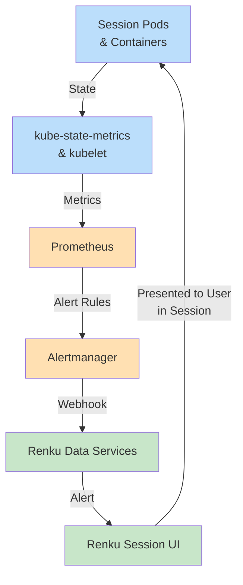

Renku can receive alerts and display them to users within the Renku session interface. This allows users to be alerted to issues with their active sessions, such as high memory usage, low disk space, or out-of-memory kills.

## Overview

In addition to dedicated endpoints for creating, listing, and resolving alerts, Renku has built-in support for handling alerts sent from Prometheus Alertmanager via a webhook integration. Support for other alerting systems may be added in the future.

When configured, Alertmanager sends session-related alerts to Renku based on metrics from user sessions. The alerts appear directly in the Renku session UI, allowing users to be notified about issues affecting their sessions.



The integration works as follows:
1. Prometheus monitors your cluster and evaluates alert rules for Renku sessions
2. When an alert fires (or resolves), Alertmanager sends a webhook to Renku Data Services
3. Renku authenticates the webhook request using OAuth2 client credentials
4. Renku creates (or resolves) user alerts in the database
5. Users see the alerts in the Renku session UI

## Prerequisites

    - [Prometheus](https://prometheus.io/) with [Prometheus Alertmanager](https://prometheus.io/docs/alerting/latest/alertmanager/) and [kube-state-metrics](https://github.com/kubernetes/kube-state-metrics) deployed in your cluster
    - Renku deployed in your cluster with the `alerts.alertmanager.enabled=true` Helm value set

## Setting up Alertmanager Webhook Integration

The following steps configure Alertmanager to send session-related alerts to Renku.

### OAuth2 Authentication

The Alertmanager webhook endpoint requires authentication using OAuth2 client credentials. An initialization script has already created the following Keycloak resources in the `Renku` realm:

    - `alertmanager-webhook` OAuth2 client: Enables Alertmanager to authenticate webhook requests to Renku Data Services
    - `alertmanager-webhook` realm role: Assigned to the client's service account to control access to the webhook endpoint
    - Token audience configuration: The client is configured to include `renku` in the token audience claim

You will need the client secret from this client to proceed.

## Step 1: Store the Client Secret in Kubernetes

Create a Kubernetes secret for the OAuth2 client secret in the namespace where Prometheus Alertmanager is deployed (e.g., `monitoring`):

```bash
kubectl create secret generic alertmanager-oauth2-secret \
  --namespace monitoring \
  --from-literal=oauth2-client-secret='YOUR_CLIENT_SECRET'
```

## Step 2: Configure Alertmanager

### Mount the Secret

Add the secret mount for the secret you created in step 1 to your Prometheus Helm values:

```yaml
alertmanager:
  extraSecretMounts:
    - name: oauth2-secret
      mountPath: /etc/alertmanager/secrets
      secretName: alertmanager-oauth2-secret
      readOnly: true
```

### Configure the Webhook Receiver

Add the Renku webhook receiver to your Alertmanager configuration:

```yaml
alertmanager:
  config:
    global:
      resolve_timeout: 1m

    receivers:
      - name: "renku-webhook"
        webhook_configs:
          - url: 'https://your-renku-instance.com/api/data/webhooks/alertmanager'
            send_resolved: true
            max_alerts: 1
            http_config:
              oauth2:
                client_id: 'alertmanager-webhook'
                client_secret_file: '/etc/alertmanager/secrets/oauth2-client-secret'
                token_url: 'https://your-renku-instance.com/auth/realms/Renku/protocol/openid-connect/token'

    route:
      receiver: "default"
      routes:
        - matchers:
            - purpose="renku-session"
          receiver: "renku-webhook"
```

## Step 3: Configure kube-state-metrics

To make user information available in alerts, configure `kube-state-metrics` to expose the `safe_username` label from AmaltheaSession resources:

```yaml
kube-state-metrics:
  customResourceState:
    enabled: true
    config:
      spec:
        resources:
          - groupVersionKind:
              group: amalthea.dev
              version: v1alpha1
              kind: AmaltheaSession
            labelsFromPath:
              safe_username: [metadata, labels, "renku.io/safe-username"]
            metrics:
              - name: "amaltheasession_info"
                help: "Information about AmaltheaSession resources"
                each:
                  type: Info
                  info:
                    labelsFromPath:
                      name: [metadata, name]
                      namespace: [metadata, namespace]
```

This creates the `kube_customresource_amaltheasession_info` metric with a `safe_username` label.

## Step 4: Configure Prometheus Alert Rules

Alert rules must include specific labels and annotations for Renku to process them correctly.

### Required Labels

- `safe_username`: Keycloak user ID of the alert recipient
- `statefulset`: Name of the AmaltheaSession statefulset in question
- `purpose: renku-session`: Identifies this as a session alert (optional, used for alert routing)

### Required Annotations

- `title`: Alert title displayed to users (required)
- `description`: Alert message body (required)

Descriptions can include markdown formatting.

### Example Alert Rules

#### High Memory Usage

```yaml
groups:
  - name: RenkuSessionAlerts
    rules:
      - alert: RenkuSessionHighMemory
        expr: >
          sum by(statefulset, safe_username, namespace) (
            label_replace(
              round((
                container_memory_usage_bytes{container="amalthea-session"}
                /
                container_spec_memory_limit_bytes{container="amalthea-session"}
              ) * 100, 1) > 90,
              "statefulset", "$1", "pod", "^(.*)-[0-9]+$"
            )
            * on(statefulset) group_left(safe_username)
            label_replace(
              kube_customresource_amaltheasession_info,
              "statefulset", "$1", "name", "(.*)"
            )
          )
        labels:
          severity: warning
          purpose: renku-session
        annotations:
          title: "High memory usage"
          description: "Memory usage over 90% of capacity"
```

#### Low Disk Space

```yaml
      - alert: RenkuSessionHighDiskUsage
        expr: >
          sum by (persistentvolumeclaim, namespace, statefulset, safe_username) (
            label_replace(
              (kubelet_volume_stats_available_bytes / kubelet_volume_stats_capacity_bytes * 100)
              * on(persistentvolumeclaim, namespace) group_left(label_app_kubernetes_io_instance)
              kube_persistentvolumeclaim_labels{label_app_kubernetes_io_name="AmaltheaSession"},
              "statefulset", "$1", "label_app_kubernetes_io_instance", "(.+)"
            )
            * on(statefulset, namespace) group_left(safe_username)
            label_replace(
              kube_customresource_amaltheasession_info,
              "statefulset", "$1", "name", "(.+)"
            )
          ) < 10
        labels:
          severity: warning
          purpose: renku-session
        annotations:
          title: "Low disk space"
          description: "Disk space usage over 90% of capacity"
```

#### OOM Killed

```yaml
      - alert: RenkuSessionOOMKilled
        expr: >
          sum by(statefulset, safe_username, namespace) (
            label_replace(
              (
                delta(kube_pod_container_status_restarts_total{container="amalthea-session"}[5m])
                * on(namespace, pod, container) group_left(reason)
                kube_pod_container_status_last_terminated_reason{reason="OOMKilled", container="amalthea-session"}
              ) > 0,
              "statefulset", "$1", "pod", "^(.*)-[0-9]+$"
            )
            * on(statefulset) group_left(safe_username)
            label_replace(
              kube_customresource_amaltheasession_info,
              "statefulset", "$1", "name", "(.*)"
            )
          ) > 0
        labels:
          severity: warning
          purpose: renku-session
        annotations:
          title: "Session restarted"
          description: "This session ran out of memory and has been restarted"
```

## Verification

Test the integration by sending a test alert:

```bash
# Get an OAuth2 token
TOKEN=$(curl -X POST \
  "https://your-renku-instance.com/auth/realms/Renku/protocol/openid-connect/token" \
  -d "grant_type=client_credentials" \
  -d "client_id=alertmanager-webhook" \
  -d "client_secret=YOUR_CLIENT_SECRET" \
  | jq -r '.access_token')

# Send a test alert
curl -X POST \
  "https://your-renku-instance.com/api/data/webhooks/alertmanager" \
  -H "Authorization: Bearer $TOKEN" \
  -H "Content-Type: application/json" \
  -d '{
    "version": "4",
    "groupKey": "test",
    "status": "firing",
    "alerts": [{
      "status": "firing",
      "labels": {
        "safe_username": "KEYCLOAK_USER_ID",
        "statefulset": "SESSION_STATEFULSET_NAME",
      },
      "annotations": {
        "title": "Test Alert",
        "description": "Testing the webhook integration"
      },
      "startsAt": "2025-11-27T12:00:00Z"
    }]
  }'
```

Log into Renku as the test user to verify the alert appears in the UI.
