Capacity reservations allow Renku administrators to pre-provision compute capacity for scheduled events such as courses, hackathons, or training sessions. By creating placeholder pods ahead of time, you can reduce session startup delays and ensure resources are available when users need them.

## How It Works

When you create a capacity reservation, the system:

1. **Generates occurrences** based on your recurrence schedule (once, daily, or weekly)
2. **Deploys placeholder pods** ahead of each occurrence (configurable lead time)
3. **Monitors active sessions** that match the reservation's resource class
4. **Scales placeholder pods** down as real user sessions start (placeholder pods are evicted)
5. **Cleans up** placeholder deployments when the scheduled time window ends

Placeholder pods use minimal resources (the `pause` container image) but request the same compute resources as real sessions. They run with low priority, so Kubernetes automatically evicts them when user sessions need resources. This allows you to "warm up" capacity without blocking real sessions from starting.

:::info
Capacity reservations work alongside [Resource Pools and Classes](70-rps.md). The capacity reservation's `resource_class_id` helps to determines which user sessions will reuse the pre-provisioned capacity.
:::

## Use Cases

Capacity reservations are ideal for:

- **Scheduled courses**: Pre-provision 20 pods for a Monday morning workshop
- **Training sessions**: Ensure capacity is available for all participants
- **Peak usage periods**: Warm up capacity during known busy hours
- **Demonstrations**: Pre-provision capacity for demos or presentations

## Creating a Capacity Reservation

:::note
Capacity reservations are currently managed via the API only. There is no admin panel UI for capacity reservations yet. See Renku's Swagger page for API documentation.
:::

To create a capacity reservation, send a POST request to `/api/data/capacity-reservations` with the following configuration:

### Basic Settings

- **Name**: A descriptive name for the reservation (e.g., "Monday Data Science Course")
- **Resource Class ID**: Select which resource class this reservation targets.

### Recurrence Configuration

Define when the capacity should be provisioned:

- **Type**: Choose from:
  - `once` - Single occurrence on a specific date and time
  - `daily` - Repeats every day
  - `weekly` - Repeats on specific days of the week
- **Start Date**: When to begin creating occurrences
- **End Date**: When to stop creating occurrences
- **Schedule**: For `weekly` recurrence, define time windows for each day:
  - **Day of Week**: 1=Monday, 2=Tuesday, ..., 7=Sunday
  - **Start Time**: When the capacity window starts **in UTC** (e.g., `08:00`)
  - **End Time**: When the capacity window ends **in UTC** (e.g., `18:00`)

:::info
For `once` and `daily` recurrence types, you still need to provide at least one schedule entry with `day_of_week` set appropriately.
:::

### Provisioning Configuration

Control how placeholder pods are deployed:

- **Placeholder Count**: Number of placeholder pods to deploy
- **Lead Time (minutes)**: How many minutes before the scheduled start time to deploy placeholders. For example, setting this to 30 means pods will be created 30 minutes before the session starts.
- **Scale Down Behavior**: How to scale as user sessions start:
  - `maintain` - Keep spare capacity constant. If you have 20 placeholders and 5 active sessions, maintain 15 placeholders. The total (placeholders + sessions) stays at 20.
  - `reduce` - Gradually reduce spare capacity over time. Spare capacity decreases linearly from the initial count to zero by the end time.
  - `none` - Don't scale based on sessions. Maintain the fixed placeholder count regardless of active sessions.

### Optional Settings

- **Project Template ID**: (Optional) Further restrict which sessions match this reservation by project template ID. Only sessions created from this template will count toward active sessions for scaling.

## Scale Down Behavior Examples

To illustrate the difference between `maintain` and `reduce`:

**Scenario**: Course from 9:00-12:00, 20 placeholder pods, current time 10:30 (halfway through)

| Active Sessions | `maintain` Behavior | `reduce` Behavior |
|----------------|---------------------|-------------------|
| 5 sessions | Keep 15 placeholders<br/>(20 total) | Keep 7-8 placeholders<br/>(spare reduced 50%) |
| 15 sessions | Keep 5 placeholders<br/>(20 total) | Keep 2-3 placeholders<br/>(spare reduced 50%) |
| 20 sessions | 0 placeholders<br/>(all replaced) | 0 placeholders<br/>(all replaced) |

**Use `maintain` when**: You want to ensure spare capacity is always available (e.g., for a Hackathon where users may join at any time)

**Use `reduce` when**: You expect all users to join at the start and want to free up resources gradually

**Use `none` when**: You just want placeholder pods for the duration without consideration for active sessions (e.g., for node pre-warming)

### Scale Down Modes Comparison

The charts below show how each scale-down behavior manages warm capacity over a 4-hour course window, from lead-in time through the end of the occurrence. Each chart illustrates a different scenario showing how placeholders and active sessions interact under each behavior.

#### `maintain` Behavior

Maintains constant total capacity by scaling down placeholders as sessions start, keeping the total resources in use fixed throughout the occurrence.

```mermaid
---
config:
  themeVariables:
    xyChart:
      plotColorPalette: '#00AD92, #007A6C'
---
xychart-beta
    x-axis "Time" ["Lead in Time", "Start (0h)", "1h", "2h", "3h", "End (4h)"]
    y-axis "Warm Slots" 0 --> 35
    bar "Placeholders" [35, 35, 35, 35, 35, 35]
    bar "Active Sessions" [0, 10, 10, 15, 20, 20]
```



**How it works**: Total warm slots stay constant at 35 throughout. As active sessions grow from 0 → 20, the system automatically scales down placeholders from 35 → 15. This maintains a constant total of 35 warm slots, replacing placeholders 1:1 with active sessions.

#### `reduce` Behavior

Gradually releases spare capacity over time based on time remaining, progressively freeing cluster resources as the occurrence approaches its end.

```mermaid
---
config:
  themeVariables:
    xyChart:
      plotColorPalette: '#00AD92, #007A6C'
---
xychart-beta
    x-axis "Time" ["Lead in Time", "Start (0h)", "1h", "2h", "3h", "End (4h)"]
    y-axis "Warm Slots" 0 --> 35
    bar "Placeholders" [35, 31, 27, 23, 20, 16]
    bar "Active Sessions" [10, 10, 10, 12, 12, 12]
```



**How it works**: Spare capacity is gradually released using the formula `(placeholder_count - active_sessions) × (time_remaining / total_duration)`. Total warm slots decrease from 35 → 16 over the 4-hour window. With sessions staying relatively stable at 10-12, placeholders reduce from 25 → 4. This decreasing spare capacity frees up cluster resources as the occurrence progresses toward its end time.

#### `none` Behavior

Maintains fixed placeholder deployments with no inverse scaling based on active sessions. Useful for node pre-warming or when you want guaranteed capacity regardless of actual session usage.

```mermaid
---
config:
  themeVariables:
    xyChart:
      plotColorPalette: '#00AD92, #007A6C'
---
xychart-beta
    x-axis "Time" ["Lead in Time", "Start (0h)", "1h", "2h", "3h", "End (4h)"]
    y-axis "Warm Slots" 0 --> 45
    bar "Placeholders" [25, 30, 40, 45, 40, 45]
    bar "Active Sessions" [0, 5, 15, 20, 15, 20]
```



**How it works**: Maintains a fixed deployment with no automatic scaling based on active sessions. Placeholder pods stay constant at 25 throughout. As sessions fluctuate from 0 → 20 → 15 → 20, total warm slots vary from 25 → 45, but the placeholder count never changes. This provides guaranteed reserved capacity regardless of actual usage patterns.

## Viewing and Managing Reservations

### List All Reservations

Use `GET /api/data/capacity-reservations` to retrieve all capacity reservations, which returns:
- Reservation ID, name, and resource class
- Recurrence configuration (type, dates, schedule)
- Provisioning settings (placeholder count, lead time, scale-down behavior)

### Delete a Reservation

Send a `DELETE /api/data/capacity-reservations/{reservation_id}` request. Deleting a reservation will:
1. Remove the reservation from the database
2. Delete all occurrences associated with that reservation, even if they are active
3. Clean up any active placeholder deployments
4. Cancel background tasks monitoring this reservation

:::warning
Deleting a reservation is immediate and cannot be undone. Any active placeholder deployments will be removed, but user sessions will not be affected.
:::

## How Sessions Are Matched

The system matches user sessions to capacity reservations using the **resource class ID**. When a user starts a session:

1. Renku creates an AmaltheaSession custom resource with annotations including `renku.io/resource_class_id`
2. The capacity reservation background task counts sessions with matching resource class IDs
3. For each active occurrence, the system calculates how many placeholder pods to scale down
4. Kubernetes evicts low-priority placeholder pods to make room for the user's session

Only non-hibernated sessions are counted toward active sessions.

## Background Tasks

Two background tasks manage capacity reservations:

### Deployment Creator (runs every 5 minutes)

- Checks for pending occurrences within their lead time window
- Creates Kubernetes Deployments with placeholder pods
- Updates occurrence status from `pending` to `active`
- Uses the configured resource class's CPU and memory requests

### Session Monitor (runs every 30 seconds)

- Monitors all active occurrences
- Counts matching active sessions
- Scales placeholder deployments up or down based on scale-down behavior
- Cleans up deployments and marks occurrences as `completed` when the end time is reached

## Kubernetes Resources

Each active occurrence creates a Kubernetes **Deployment** with these characteristics:

- **Image**: `registry.k8s.io/pause:3.9` (minimal pause container)
- **Priority Class**: Uses the resource pool's priority class (typically low priority)
- **Resources**: Matches the resource class's CPU and memory requests
- **Labels**:
  - `renku.io/capacity-reservation: "true"`
  - `renku.io/reservation-id: "<reservation-ulid>"`
- **Annotations**:
  - `renku.io/occurrence-id: "<occurrence-ulid>"`

:::note
All capacity reservation endpoints require administrator authentication.
:::

## Best Practices

1. **Set appropriate lead times**: Allow enough time for pods to be scheduled and start (typically 15-30 minutes)
2. **Monitor resource usage**: Check that your resource pool quotas can accommodate both placeholder pods and real sessions
3. **Use descriptive names**: Name reservations clearly so you can identify them later (include day, time, and purpose)

## Example: Weekly Course Reservation

Create a capacity reservation for a weekly data science course that runs every Monday and Wednesday from 9 AM to 1 PM:

```json
{
  "name": "Data Science 101 - Spring 2026",
  "resource_class_id": 5,
  "recurrence": {
    "type": "weekly",
    "start_date": "2026-02-02",
    "end_date": "2026-05-15",
    "schedule": [
      {
        "day_of_week": 1,
        "start_time": "09:00",
        "end_time": "13:00"
      },
      {
        "day_of_week": 3,
        "start_time": "09:00",
        "end_time": "13:00"
      }
    ]
  },
  "provisioning": {
    "placeholder_count": 25,
    "lead_time_minutes": 30,
    "scale_down_behavior": "maintain"
  }
}
```

This reservation will:
- Create 25 placeholder pods 30 minutes before each session (8:30 AM)
- Keep them running during the 4-hour window
- Maintain spare capacity as students join
- Clean up at 1:00 PM
- Repeat every Monday and Wednesday until May 15, 2026
