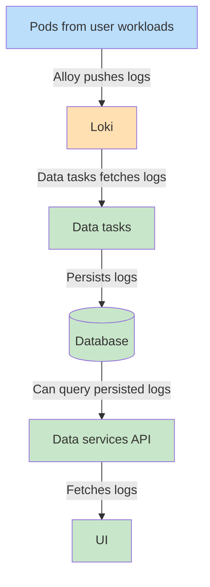

_Introduced in Renku 2.20.0_

By default, logs for user workloads on Renku (interactive sessions, jobs and image builds) are retrieved
served through the API by querying logs from the corresponding Kubernetes pod.
The persisted logs feature allows administrators to set up log forwarding so that logs are persisted
to the data services database which allows them to be retrieved even after the pod has been deleted.

## How it works

Persisted logs work by querying [Loki](https://grafana.com/oss/loki/) and saving the logs to the
data services database.



## Prerequisites

- [Loki](https://grafana.com/oss/loki/) installed in the Kubernetes cluster; see also [logging](./20-logging.md).

## Step 1: Configure Loki and Alloy for persisted logs

[Alloy](https://grafana.com/docs/alloy/latest/) needs to be configured to push the relevant labels and structured metadata
to Loki:

```
// Loki write config
loki.write "default" {
    endpoint {
        url = "<YOUR LOKI-WRITE ENDPOINT>"
    }
}

// You should have a rule similar to this to scrape pod logs
discovery.kubernetes "pod" {
    role = "pod"
    // Restrict to pods on the node to reduce cpu & memory usage
    selectors {
        role = "pod"
        field = "spec.nodeName=" + coalesce(sys.env("HOSTNAME"), constants.hostname)
    }
}

// Defines labels for Loki
discovery.relabel "pod_logs" {
    targets = discovery.kubernetes.pod.targets

    // Rules for defining common labels from Kubernetes
    // [...]

    // Label creation - "pod" field from "__meta_kubernetes_pod_name"
    rule {
        source_labels = ["__meta_kubernetes_pod_name"]
        action = "replace"
        target_label = "pod"
    }

    // Label creation - "container" field from "__meta_kubernetes_pod_container_name"
    rule {
        source_labels = ["__meta_kubernetes_pod_container_name"]
        action = "replace"
        target_label = "container"
    }

    // Label creation -  "app" field from "__meta_kubernetes_pod_label_app_kubernetes_io_name"
    rule {
        source_labels = ["__meta_kubernetes_pod_label_app_kubernetes_io_name"]
        action = "replace"
        target_label = "app"
    }

    // Label creation - "app" field with value "ShipwrightBuildRun" from existence of "__meta_kubernetes_pod_label_buildrun_shipwright_io_name"
    rule {
        source_labels = ["__meta_kubernetes_pod_label_buildrun_shipwright_io_name"]
        action = "replace"
        target_label = "app"
        regex = "(.+)"
        replacement = "ShipwrightBuildRun"
    }

    // Internal label creation - "renku_io_pod_uid" field from "__meta_kubernetes_pod_uid"
    rule {
        source_labels = ["__meta_kubernetes_pod_uid"]
        action = "replace"
        target_label = "renku_io_pod_uid"
    }

    // Internal label creation - "renku_io_launcher_id" field from "__meta_kubernetes_pod_annotation_renku_io_launcher_id"
    rule {
        source_labels = ["__meta_kubernetes_pod_annotation_renku_io_launcher_id"]
        action = "replace"
        target_label = "renku_io_launcher_id"
    }

    // Internal label creation - "renku_io_project_id" field from "__meta_kubernetes_pod_annotation_renku_io_project_id"
    rule {
        source_labels = ["__meta_kubernetes_pod_annotation_renku_io_project_id"]
        action = "replace"
        target_label = "renku_io_project_id"
    }

    // Internal label creation - "renku_io_submission_id" field from "__meta_kubernetes_pod_annotation_renku_io_submission_id"
    rule {
        source_labels = ["__meta_kubernetes_pod_annotation_renku_io_submission_id"]
        action = "replace"
        target_label = "renku_io_submission_id"
    }

    // Internal label creation - "renku_io_run_id" field from "__meta_kubernetes_pod_annotation_renku_io_run_id"
    rule {
        source_labels = ["__meta_kubernetes_pod_annotation_renku_io_run_id"]
        action = "replace"
        target_label = "renku_io_run_id"
    }

    // Internal label creation - "renku_io_session_uid" field from "__meta_kubernetes_pod_annotation_renku_io_session_uid"
    rule {
        source_labels = ["__meta_kubernetes_pod_annotation_renku_io_session_uid"]
        action = "replace"
        target_label = "renku_io_session_uid"
    }

    // Internal label creation - "renku_io_safe_username" field from "__meta_kubernetes_pod_label_renku_io_safe_username"
    rule {
        source_labels = ["__meta_kubernetes_pod_label_renku_io_safe_username"]
        action = "replace"
        target_label = "renku_io_safe_username"
    }

    // Internal label creation - "renku_io_session_type" field from "__meta_kubernetes_pod_label_renku_io_session_type"
    rule {
        source_labels = ["__meta_kubernetes_pod_label_renku_io_session_type"]
        action = "replace"
        target_label = "renku_io_session_type"
    }

    // Internal label creation - "renku_io_buildrun_name" field from "__meta_kubernetes_pod_label_buildrun_shipwright_io_name"
    rule {
        source_labels = ["__meta_kubernetes_pod_label_buildrun_shipwright_io_name"]
        action = "replace"
        target_label = "renku_io_buildrun_name"
    }
}

// loki.source.kubernetes tails logs from Kubernetes containers using the Kubernetes API.
loki.source.kubernetes "pod_logs" {
    targets    = discovery.relabel.pod_logs.output
    forward_to = [loki.process.pod_logs.receiver]
}

// loki.process receives log entries from other Loki components, applies one or more processing stages,
// and forwards the results to the list of receivers in the component's arguments.
loki.process "pod_logs" {
    forward_to = [loki.write.default.receiver]

    // Add structured metadata to pod logs
    stage.structured_metadata {
        regex = "renku_io_.*"   // Adds all extracted values starting with 'renku_io_' to structured metadata.
    }
}
```

Note that you may have additional configuration blocks and more label rules for your own logs processing.

## Step 2: Allow data-tasks to use the loki-read endpoints

If your Kubernetes cluster has network policies deployed, you may need to
allow network traffic to go from the data-tasks pods to the loki-read pods:

```yaml
---
apiVersion: networking.k8s.io/v1
kind: NetworkPolicy
metadata:
  name: loki-read-allow-data-tasks
  namespace: <LOKI NAMESPACE>
spec:
  podSelector:
    matchLabels:
      app.kubernetes.io/component: read
      app.kubernetes.io/instance: loki
  policyTypes:
    - Ingress
  ingress:
    # Allow ingress from "app: renku-data-tasks" pods in then "renku" namespace
    - from:
        - namespaceSelector:
            matchLabels:
              kubernetes.io/metadata.name: renku
          # NOTE: use `namespaceSelector: {}` if you have multiple Renku instances in your cluster
          podSelector:
            matchLabels:
              app: renku-data-tasks
```

## Step 3: Configure persisted logs

Enable persisted logs in the Helm chart values and add the corresponding configuration:

```yaml
dataService:
  # Configuration values for persisted logs
  persistedLogs:
    ## If set to true, enables logs to be pulled from Loki into the backend database.
    enabled: true
    ## The base URL for the Loki read API
    lokiReadUrl: "http://loki-read.<LOKI_NAMESPACE>.svc.cluster.local:3100/"
    ## The TTL for persisted logs
    ttlSeconds: 604800 # 7 days
```

## Verification

Once Renku has been re-deployed with persisted logs enabled, you should be able
to query the persisted logs endpoints, e.g. `GET /api/data/persisted_logs/sessions/{launcher_id}`.

The UI should query the persisted logs endpoints when showing logs for image builds and jobs.
Also, a new "View logs history" menu option should be present on session launchers.
