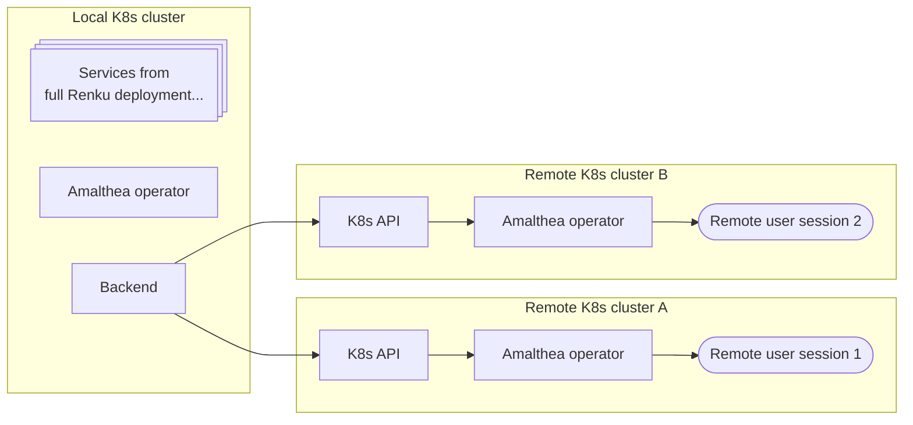

## Introduction

The following describes how to setup a cluster to be able to run Renku sessions, and connect it to a Renku web portal.
For example, using this feature one can launch session from renkulab.io (local cluster) but make them
run on a different Kubernetes cluster (remote cluster A) compared to where all other sessions run.



:::info
The remote clusters do not need a full Renku deployment. But just some custom manifests for
RBAC, priority classes, the Amalthea operator and CSI-rClone.
:::

## Remote cluster configuration

These are the requirements and steps to be done on the remote cluster
that needs to be connected to an existing Renku deployment.

### Network

- Ingress from public Internet
  - load balancer 6443 to 6443 on all cluster nodes (Kubectl API)
  - load balancer 443 to 443 on all worker nodes for HTTPS access to the user session (JupiterLab or Visual Studio Code for example)
  - A valid TLS certificate for HTTPS access to user sesssions. We use CertManager for this.
- Worker nodes need internet access to retrieve code, container images, and data from repositories
- Egress setup: Allow traffic to the main cluster and Internet, while preventing access to any cluster services.

  ```yaml
  apiVersion: networking.k8s.io/v1
  kind: NetworkPolicy
  metadata:
    name: egress-from-renku-v2-sessions
  spec:
    egress:
      - to:
          # DNS resolution
          - namespaceSelector:
              matchLabels:
                kubernetes.io/metadata.name: kube-system
            podSelector:
              matchLabels:
                k8s-app: kube-dns
        ports:
          - port: 53
            protocol: UDP
          - port: 53
            protocol: TCP
      - to:
          # Allow access to any port/protocol as long as it is directed
          # outside of the cluster. This is done by excluding
          # IP ranges which are reserved for private networking from
          # the allowed range.
          - ipBlock:
              cidr: 0.0.0.0/0
              except:
                - 10.0.0.0/8
                - 172.16.0.0/12
                - 192.168.0.0/16
    podSelector:
      matchLabels:
        app.kubernetes.io/created-by: controller-manager
        app.kubernetes.io/name: AmaltheaSession
    policyTypes:
      - Egress
  ```

### Priority classes

Renku uses priority classes to enforce resource quotas for sessions.
You should create the priority classes on the remote cluster manually
for each resource pool that points to a remote cluster and has a quota.

```yaml
apiVersion: scheduling.k8s.io/v1
description: Used to enfore resource quotas for Renku
kind: PriorityClass
metadata:
  name: renku-resource-pool-1-priority-class
preemptionPolicy: Never
value: 100
```

### Storage classes

CSI-driver with automatic provisioning support on your cluster
This storage class will be used to provide the working directory of the user session containers.

### Node taints and labels

User session scheduling is based on label and taints to select nodes where to run the pod associated with each user session.

Labels:
- `renku.io/node-purpose: user` User sessions are scheduled only on nodes with this label
- Extra labels to differentiate node pools as required

Taints:
- Taints to differentiate node pools as required

### Namespace

Dedicated **Namespace** for the user sessions (for example `renku-user-sessions`)

### Authentication

The local cluster needs to authenticate with the remote. Currently this is possible
by generating a kubeconfig for the remote cluster that the backend service from
local cluster will use to access the Kubernetes API. You can generate the credentials
for this authentication by creating a `Role`, `RoleBinding` and a `ServiceAccount` on
the remote cluster.

The exact values for the role can be extracted from the Renku Helm chart
which defines the Role and permissions for the `data-service` in order to
use the local cluster. The same permissions are needed on the remote cluster.

```yaml
apiVersion: v1
kind: ServiceAccount
metadata:
  name: cross-cluster-sa
---
apiVersion: rbac.authorization.k8s.io/v1
kind: Role
metadata:
  name: cross-cluster-role
rules:
  - apiGroups: [""]
    resources: ["pods", "pods/log", "services", "endpoints", "secrets"]
    verbs: ["get", "list", "watch"]
  - apiGroups: [""]
    resources: ["pods", "secrets"]
    verbs: ["delete"]
  - apiGroups: ["apps"]
    resources: ["statefulsets"]
    verbs: ["get", "list", "watch", "patch"]
  - apiGroups: [""]
    resources: ["secrets"]
    verbs: ["create", "update", "delete", "patch"]
  - apiGroups: ["amalthea.dev"]
    resources: ["amaltheasessions"]
    verbs: ["create", "update", "delete", "patch", "list", "get", "watch"]
---
apiVersion: rbac.authorization.k8s.io/v1
kind: RoleBinding
metadata:
  name: cross-cluster-rolebinding
subjects:
  - kind: ServiceAccount
    name: cross-cluster-sa
    namespace: <change to the namespace where the sessions will run>
roleRef:
  kind: Role
  name: cross-cluster-role
  apiGroup: rbac.authorization.k8s.io
```

:::note
Remember to change the namespace in the Rolebinding `subjects` section of the manifest above.
:::

You also need to create secret that will hold the credentials for the Kubernetes API.
Older versions of Kubernetes may create this automatically so check before you create the secret below.

```yaml
apiVersion: v1
kind: Secret
metadata:
  name: cross-cluster-sa-secret
  annotations:
    kubernetes.io/service-account.name: cross-cluster-sa
type: kubernetes.io/service-account-token
```

After you create the secret you should see that it has been populated with values
in the `namespace`, `ca.crt` and `token` keys.
Kubernetes does this automatically due to the `kubernetes.io/service-account.name` annotation.
Here is an example of the fields that Kubernetes will add to the secret:

```yaml
apiVersion: v1
kind: Secret
metadata:
  name: cross-cluster-sa-secret
  annotations:
    kubernetes.io/service-account.name: cross-cluster-sa
data:
  ca.crt: xxxxx
  namespace: xxxxxx
  token: xxxxx
type: kubernetes.io/service-account-token
```


Now we need to extract these values and format them into a valid `kubeconfig`. 

```yaml
apiVersion: v1
kind: Config
clusters:
  - cluster:
      certificate-authority-data: <extract from ca.crt key from the secret above, no need to base64 decode>
      server: <hostname to the remote cluster Kubernetes API>
    name: remote-cluster-A
contexts:
  - context:
      cluster: remote-cluster-A
      namespace: <extract from namespace key from the secret above>
      user: remote-cluster-A
    name: remote-cluster-A
users:
  - name: remote-cluster-A
    user:
      token: <extract from token key from the secret above>
current-context: remote-cluster-A
```

:::note
Remember to base64 decode the namespace and token when you extract them from the secret and save them
in the kubeconfig. The CA certificate does not have to be base64 decoded because the kubeconfig
requires it in base64 encoded form.
:::

Once you have put together the whole kubeconfig, it is a good idea to test this with your local `kubectl` tool.
You should be able to at least list pods in the namespace of the remote cluster.

```bash
KUBECONFIG=<path to kubeconfig.yml> kubectl -n <namespace> get pods
```

### Deploy the User Session Operator (AmaltheaSession)

- Retrieve the helm chart repository:

  ```bash
  helm repo add renku https://swissdatasciencecenter.github.io/helm-charts
  helm repo update
  ```

- User session operator in the `renku-user-sessions` dedicated namespace, with the default priority class and remote service account:

  ```bash
  helm install \
    --generate-name \
    --create-namespace \
    --namespace renku-user-sessions \
    renku/amalthea-sessions
  ```

:::note
The versions of the Amalthea operator between the local and remote clusters must be identical.
Please reach out to the local cluster administrator to check which version you should use.
:::

### Deploy CSI-rClone

CSI-rClone has to run on every node on the remote cluster where sessions may run.
Therefore you need to make sure you add the correct tolerations in the values file for the
Helm chart for any taints you may add on nodes intended for user sessions.

  ```bash
  helm install \
  --create-namespace \
  --namespace csi-rclone \
  csi-rclone \
  renku/csi-rclone
  ```

:::note
The versions of the CSI-rClone between the local and remote clusters must be identical.
Please reach out to the local cluster administrator to check which version you should use.
:::

## Local cluster configuration

### Kubeconfig secret

In the previous section we described how to derive the `kubeconfig` for a remote cluster.
That kubeconfig now needs to be added into a dedicated secret in the "local" cluster
where the backed services will be able to read it and connect to the remote cluster.

The name of the secret with all the remote cluster `kubeconfig`s can be found in the Helm chart 
values file at `.dataService.remoteClustersKubeconfigSecretName`. 
If you do not have this value specified in your Helm chart (by default it is blank).
Then, you should set the value and upgrade your Helm installation.

Here is an example of the `kubeconfig`s secret, assuming the full Renku deployment 
runs under the `renku` namespace:

```yaml
kind: Secret
apiVersion: v1
metadata:
  name: "data-service-secret"
  namespace: "renku"
stringData:
  remote-cluster.yaml: |
    apiVersion: v1
    kind: Config
    clusters:
      - cluster:
          certificate-authority-data: <extract from ca.crt key from the secret above, no need to base64 decode>
          server: <hostname to the remote cluster Kubernetes API>
        name: remote-cluster-A
    contexts:
      - context:
          cluster: remote-cluster-A
          namespace: <extract from namespace key from the secret above>
          user: remote-cluster-A
        name: remote-cluster-A
    users:
      - name: remote-cluster-A
        user:
          token: <extract from token key from the secret above>
```

:::note
The key of the Kubernetes secret should match the `config_name` field in the payload
for registering the cluster with the API.
:::

### Save the configuration via the API

The first step is to define the remote cluster parameters, which are stored using the `/cluster` API endpoint.
Below is an example payload, assuming `remote-cluster.yaml` is the key of the secret that contains all `Kubeconfig`s
for the remote clusters. The name of the secret that contains all remote `Kubeconfig`s can be defined at
`.dataService.remoteClustersKubeconfigSecretName` in the Helm chart values. 

Adapt the example below as required.

```json
{
  "name": "Remote Cluster",
  "config_name": "remote-cluster.yaml",
  "session_protocol": "https",
  "session_host": "sessions.example.org",
  "session_port": 443,
  "session_path": "/sessions",
  "session_ingress_class_name": "renku-user-session-ingress-class",
  "session_ingress_annotations": {},
  "session_storage_class": "renku-user-session-storage-class",
  "session_tls_secret_name": "",
  "session_ingress_use_default_cluster_tls_cert": true
}
```

:::note
When using `"session_ingress_use_default_cluster_tls_cert": true`,
_you have to set_ `"session_tls_secret_name": ""` as well, otherwise the API call will fail.
:::

### Create a resource pool for the remote cluster

Once the cluster connection has been defined, you can use the GET operation to retrieve the cluster connection descriptor, and from there retrieve the associated ULID and create a resource pool which is linked to it.

The following parameters are defined by the remote cluster administrator, with the example values used below:

- quota.id: `renku-resource-pool-1-priority-class`, which is the priority class name to use.

Quota parameters & classes should also be discussed with / provided by the remote cluster administrators as well, so that it matches the resources of the remote cluster.

Again, adapt the following example resource pool description as needed:

```json
{
  "quota": {
    "cpu": 5,
    "memory": 250,
    "gpu": 0,
    "id": "renku-resource-pool-1-priority-class"
  },
  "public": false,
  "default": false,
  "classes": [
    {
      "name": "remote-default",
      "cpu": 0.1,
      "memory": 1,
      "gpu": 0,
      "max_storage": 4,
      "default_storage": 1,
      "default": true
    },
    {
      "name": "remote-small",
      "cpu": 0.1,
      "memory": 1,
      "gpu": 0,
      "max_storage": 4,
      "default_storage": 1,
      "default": false
    },
    {
      "name": "remote-medium",
      "cpu": 0.5,
      "memory": 2,
      "gpu": 0,
      "max_storage": 4,
      "default_storage": 1,
      "default": false
    }
  ],
  "cluster_id": "${REMOTE_CLUSTER_ULID}",
  "name": "Remote Cluster"
}
```

### Update Keycloak configuration

Adapt the Keycloak callback URL in the `renku-jupyterserver` client in the keycloack admin panel of the Renku realm by adding the base url of the external cluster, in both `Valid redirect URLs` and `Web origins`. This should look like:

```
https://www.example.org/*
```

### Restart the backend services

The `renku-data-service`, `renku-k8s-watcher`, and `renku-secrets-storage` pods need to be 
restarted in order to use the new configuration.

As a check, you may watch the logs as each service will announce all the kubeconfigs being loaded as they restart, or during their first remote connections.
