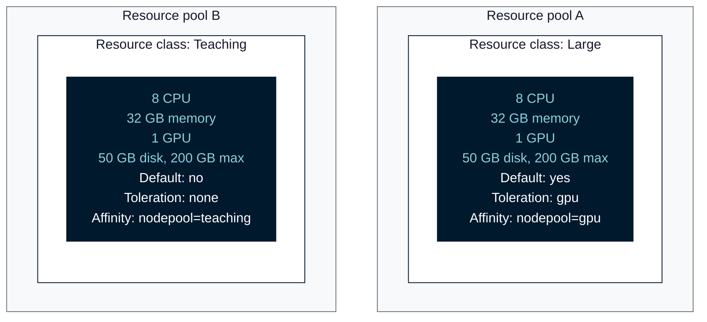
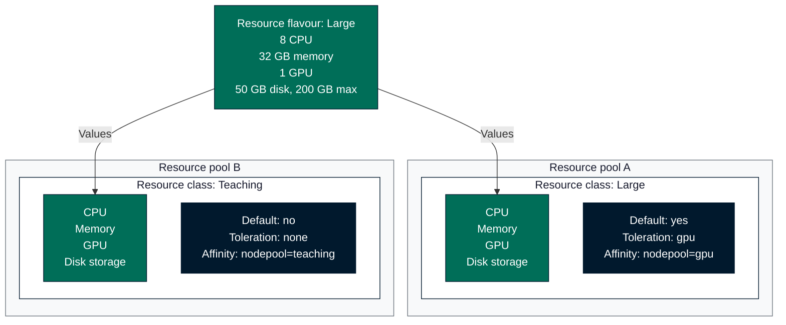

Resource pools allow Renku administrators to:

- control access to compute resources
- assign specific users to specific nodes on the cluster
- limit how much resources (i.e. memory, CPU and/or GPU) users can consume
- control how long can sessions be idle before they are hibernated
- control how long can sessions be hibernated before they are deleted.

## Creating Resource Pools

1. Log into Renku as an administrator and navigate to the admin panel.
   :::info
   The documentation for assigning the Renku administrator role
   can be found [here](user-management).
   :::
2. Click `Add Resource Pool` in the `Compute Resources` section.
3. Come up with a name for the resource pool. This should be concise but
   descriptive so that Renku users can decide which pool to use when they are starting sessions.
4. Define the idleness thresholds that will be used to determine how long
   can sessions be idle before they are hibernated, and once they are hibernated
   how long they can stay hibernated before they are fully deleted.
5. Decide whether the resource pool should be public so that all users can access
   it or private so that you can grant access to the pool to only specific users.
6. Click `Add Resource Pool`.

Resource pools offer a lot more options that what is shown in the creation form.
After you create a resource pool you can change any of these options.

## Resource Classes

Resource classes represent a collection of:

- CPU
- Memory
- GPU
- Default disk storage
- Maximum disk storage
- Kubernetes tolerations
- Kubernetes node affinities

A resource class is what users select when they start a session. A single resource
pool can have many resource classes.

The CPU, memory, GPU and disk storage values can be shared between resource classes
with a [resource flavour](#resource-flavours).

:::info
The node affinities and tolerations can be used to make it so that specific resource
classes run on specific nodes in the Kubernetes cluster. For this admins need to also
create taints on specific nodes directly in the Kubernetes cluster and add
tolerations for these taints in the resource classes. See the Kubernetes documentation on
[assigning pods to nodes](https://kubernetes.io/docs/concepts/scheduling-eviction/assign-pod-node/) and
[taints and tolerations](https://kubernetes.io/docs/concepts/scheduling-eviction/taint-and-toleration/)
for more information on taints, tolerations, affinities and how they can be used
to control scheduling.
:::

## Resource Flavours

Different resource pools frequently offer resource classes of the same size, for example
to fit a given number of sessions on one node. A resource flavour lets you define that
size in one place and share it across resource classes. You set the values one time, and
an update to the resource flavour saves you from updating each resource class
individually.

A resource flavour sets:

- CPU
- Memory
- GPU
- Default disk storage
- Maximum disk storage

Without resource flavours, each resource class has its own copy of these values:

With a resource flavour, the values are in one place and the resource classes link
to it:

A resource class can link to one resource flavour. The resource class then takes its
CPU, memory, GPU and disk storage requests and limits from that resource flavour. The
name, the default flag, the tolerations, and the node affinities are not part of a
resource flavour, and are individual to the resource class on which they are set.

When you modify the resource values in a resource flavour, every resource class linked
to that resource flavour adopts the change, across all resource pools.

In the admin panel, go to `Compute Resources` -> `Resource Flavours` to create, edit and
delete resource flavours. To link or unlink a resource class, use the `Resource Flavour`
field on the resource class form. An unlinked resource class keeps the values it adopted
from the resource flavour, and you can then change them on the resource class.

:::info
You cannot delete a resource flavour whilst it still has links to resource classes. On
the admin panel, each resource flavour shows the resource classes linked to it, so you
can see what an edit or a deletion affects before you make it.
:::

## Quotas

The quota of a resource pool is the total amount of resources (CPU, GPU and memory)
that all resource classes in the pool can have available and use at any one time for all sessions.

For example if you set a quota of 2 CPU and 10Gi of memory. And you have these two resource classes in the pool:

- Resource class A: 1 CPU, 3Gi memory
- Resource class B: 0.5 CPU, 2Gi memory

Then in the resource pool you can only have a maximum of 2 sessions using resource class A,
or 4 sessions using resource class B. Or any other combination of the two that does not go
over the quota. For example you could also have 1 session in resource class A and 2 sessions in resource class B.

Hibernated sessions do not count against the quota.

:::info
Quotas are enforced at the Kubernetes level via the `ResourceQuota` and `PriorityClass`
resources. Priority classes are needed because a `Statefulset` which is used for each Renku session
cannot directly reference a `ResourceQuota` it can only reference a `PriorityClass`, but the
`PriorityClass` can reference a `ResourceQuota`. Therefore when you create a quota for a resource
pool in the admin panel, Renku creates a `ResourceQuota` and a `PriorityClass` in your cluster.
:::

## Idleness Control

In Renku deployments with a lot of users and session churn user sessions can quickly
accumulate if there is no automated way of tracking whether they are active or not and
shutting them down.

A renku session is considered idle if both of the following conditions are true:

- the CPU usage in the session container the user is working in is below 0.300
- the last request from the user browser to the session is 30 minutes or older

Amalthea, the Kubernets operator that manages Renku user sessions, periodically
checks for the 2 conditions mentioned above. Based on the conditions it determines whether
each user session is idle or not. If the session is found to be idle for a period
longer than the specified threshold then the session will be hibernated. This threshold
is the `Maximum idle time before hibernating` option you can specify in the resource pool.
A single instance of the session found to NOT be idle is enough to reset the timer for
the `Maximum idle time before hibernating`. A hibernated session keeps its volumes, secrets
and configuration and those are available when the session is resumed.

When the session is hibernated and if the resource pool has the `Maximum hibernation time before deleting`
option set, then sessions are fully deleted after they have been hibernated for the specified duration.
Resuming the session once is enough to reset the timer. Once a session is deleted
all its resources and associated data are gone and cannot be recovered.

## Access Control

If the resource pool is private then the admin need to assign each user that should
have access to the pool. Renku admins can also remove users from the pool if there is a need.

## Default Resource Pools and Classes

In every Renku deployment there has to be one default resource pool. This pool is public,
it has no quota and it cannot be deleted.

Also, in every resource pool there is one default resource class. This class cannot be deleted
and it can only be updated.
