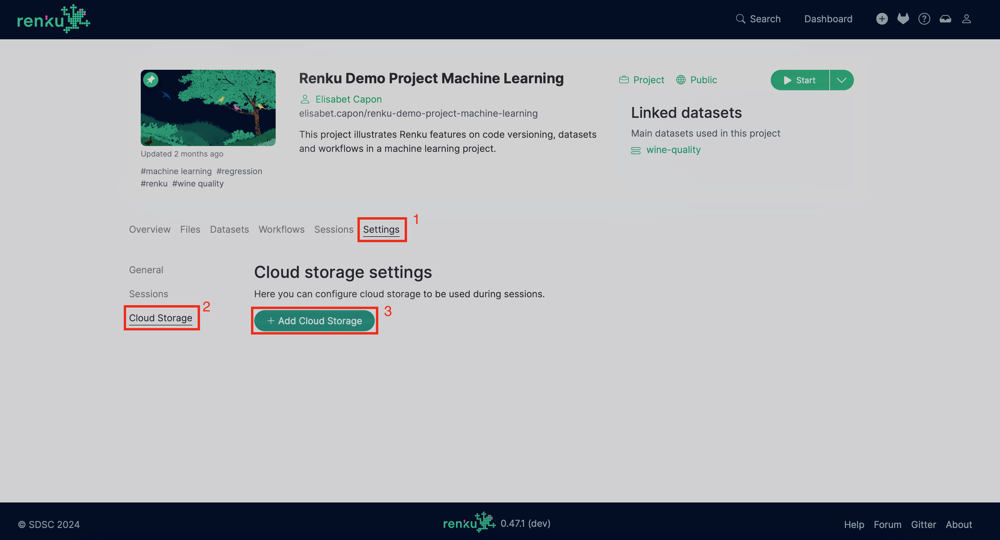

.. _mount_external_storage:

Mount External Storage in Renku Sessions
========================================

Renku supports mounting and accessing data from external storage services like
S3, Azure Blob, WebDAV, etc. The solution is based on
`Rclone <https://rclone.org/>`_; therefore, we support _most_ of the storage
services that Rclone supports, except for anything requiring the OAuth flow.
The experience is optimized for the most commonly used services, such
as S3 and WebDAV.

We support both Read-only and Read/Write access modes.
Please note that explicitly marking an attached storage as Read-only is
**strongly** encouraged every time you don't have writing permissions. This
prevents unexpected error messages when trying to access the storage.

Performances vary based on the specific storage service, the access mode,
and the available bandwidth. In general, reading a lot of data might be slow
and impact the performance. Consider caching data locally when this becomes
a problem for running your algorithms.

.. note::

  Mind that this feature is optional; it is enabled at
  `renkulab.io <http://renkulab.io>`_  but other Renku deployments might not
  support it. Contact your administrator for more details.

How to add an external storage
------------------------------

Currently, we support setting up storage per project and user.
You can do that from the project Settings tab by accessing the Cloud Storage
section.
From there, you can click on the ``Add Cloud Storage`` button and follow the
instructions to go through the guided procedure.

Advanced Mode
~~~~~~~~~~~~~

If you are familiar with `Rclone <https://rclone.org/>`_, you can switch to
the Advanced mode on the top of the modal and copy/paste from any Rclone
configuration file.

Mind that we require a few additional information that cannot be inferred from
the configuration file, such as the storage name, the access mode, and the mount
point for the sessions.

Step-by-step mode
~~~~~~~~~~~~~~~~~

This is the default mode. It will guide you through the process of adding an
external storage to use in your sessions.

Depending on the storage service, the list of options might be long, especially
when clicking the "Show full list" switch. Most of the time, the basic options
are sufficient to set up the storage. For more information, please refer to either
the `Rclone documentation <https://rclone.org/docs/>`_ or the documentation from
the storage provider you are using.

S3 example
~~~~~~~~~~

Here is an example of attaching an S3 bucket to your project.
We pick the public dataset
`Genome in a Bottle (GIAB) <https://registry.opendata.aws/giab/>`_ 
hosted on AWS and show how to attach it to a Renku interactive session:

- Navigate to the Settings - Cloud storage session in one of your Renku projects.
- Click on the "Add Cloud Storage" button and select "S3" for the "Storage Type",
  then pick "AWS" on the provider list. Click on the "Next" button at the bottom.

  .. image:: ../../_static/images/cloud_storage_2.png
    :align: center
    :alt: Storage type and provider selection

- Fill in the form by using ``giab`` as the Source path, and
  ``http://s3.amazonaws.com`` as the Endpoint. We don't need any credentials, and
  the region is optional. Click on the "Next" button.

  .. image:: ../../_static/images/cloud_storage_3.png
    :align: center
    :alt: GIAB bucket options configuration

- On the last page, pick any name for the storage (E.G: ``Giab``), than mark
  this as Read-only. You can change the Mount point too; that determines the
  virtual folder where this is mounted in the running sessions.
  Click on the "Add storage" button.

  .. image:: ../../_static/images/cloud_storage_4.png
    :align: center
    :alt: GIAB bucket final steps

- You can now start a new session and access the bucket at the mount point.

Azure Blob example
~~~~~~~~~~~~~~~~~~

Here is an example of attaching an Azure Blob storage to your project.
We host some data files in the folder ‘test-data’
hosted on Azure and show how to attach it to a Renku interactive session:

- Navigate to the Settings - Cloud storage session in your project.
- Click on the "Add Cloud Storage" button and select "azureblob" for the "Storage Type".
Click on the "Next" button at the bottom.

  .. image:: ../../_static/images/cloud_storage_5.png
    :align: center
    :alt: Azure blob storage selection

- Fill in the form by filling the Source path to mount (keep it blank to mount the
default root, or specify the folder) and the Account Name. Fill in the Shared Key. 
Click on the "Next" button.

  .. image:: ../../_static/images/cloud_storage_6.png
    :align: center
    :alt: Azure blob options configuration

- On the last page, pick any name for the storage (e.g. ``blob_storage``), then mark
  this as Read-only. You can change the Mount point too; that determines the
  virtual folder where this is mounted in the running sessions.
  Click on the "Add storage" button.

  .. image:: ../../_static/images/cloud_storage_7.png
    :align: center
    :alt: Azure blob final steps

- You can now start a new session and access this bucket at the mount point.

WebDAV example
~~~~~~~~~~~~~~

In some cases, you may need to access your cloud storage using a token. In this
example, we show you how to proceed in such cases for WebDAV storage technology.

We select data file which is 
hosted on Polybox (ETHZ storage system based on WebDAV) and show how to attach it to 
a Renku interactive session:

- Navigate to the Settings - Cloud storage session in your Renku project.
- Click on the "Add Cloud Storage" button and select "webdav" for the "Storage Type". 
Click on the "Next" button at the bottom.

  .. image:: ../../_static/images/cloud_storage_8.png
    :align: center
    :alt: WebDAV storage selection

- Fill in the form by filling the Source path to mount (keep it blank to mount the default
root, or specify the folder), and the URL to specify the host to connect to. Fill in the 
Username and the Token (or password). Click on the "Next" button.

  .. image:: ../../_static/images/cloud_storage_9.png
    :align: center
    :alt: WebDAV options configuration

- On the last page, pick any name for the storage (e.g: `webdab_storage``), then mark
  this as Read-only. You can change the Mount point too; that determines the
  virtual folder where this is mounted in the running sessions.
  Click on the "Add storage" button.

  .. image:: ../../_static/images/cloud_storage_10.png
    :align: center
    :alt: WebDAV final steps

- You can now start a new session and access this bucket at the mount point.

Accessing your data example
~~~~~~~~~~~~~~~~~~~~~~~~~~~

You can add as many cloud storage resources as you need in your Renku project. Every time you
start your session from scratch, you will need to fill in the credentials.
In contrast, if you pause and resume your session, you will not need to enter them.

  .. image:: ../../_static/images/cloud_storage_11.png
    :align: center
    :alt: Starting a new session with cloud storage

You will be able to access your mounted cloud storages in the "external_storage/" folder within 
your session.

  .. image:: ../../_static/images/cloud_storage_12.png
    :align: center
    :alt: Access to the mounted storage

Current limitations
-------------------

Mind that RenkuLab doesn't support storing credentials. If you need to
provide credentials to access storage, you will be asked those again
when starting a new session. The storage can be optionally disabled for
that session.
