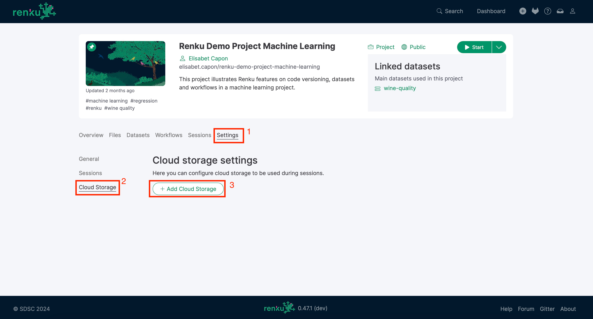

.. _external_storage:

External Storage in Renku Sessions
==================================

Renku supports accessing data from external storage services like
S3, Azure Blob, WebDAV, etc. in interactive sessions. Access to external 
storage can be configured via project settings. 

In the sections below we describe how to add and manage storage configuration to your projects
and highlight some current limitations:

.. contents::
  :local: 

.. note::

  Note that this feature is optional; it is enabled at
  `renkulab.io <http://renkulab.io>`_  but other Renku deployments might not
  support it. Contact your administrator for more details.

.. warning::

  We support both Read-only and Read/Write access modes.
  Please note that explicitly marking an attached storage as Read-only is
  **strongly** encouraged every time you don't have write permissions. This
  prevents unexpected error messages when trying to access the storage. Furthermore,
  please be aware that allowing write access to your data could result in data loss, data corruption or
  data being overwritten. Consult the documentation of your cloud storage provider to learn how to
  setup access controls and data versioning if you want to protect your data.

Adding external storage to a project
------------------------------------

Currently, we support configuring external storage access per project.
Under the project's  ``Settings`` tab, you can find the ``Cloud Storage``
section. From there, you can click on the ``Add Cloud Storage`` button and follow the
instructions to go through the guided procedure.

Step-by-step mode
~~~~~~~~~~~~~~~~~

This is the default mode. It will guide you through the process of adding an
external storage to use in your sessions.

Depending on the storage service, the list of options might be long, especially
when clicking the "Show full list" switch. Most of the time, the basic options
are sufficient. For more information, please refer to either
the `Rclone documentation <https://rclone.org/docs/>`_ or the documentation from
the storage provider you are using.

Advanced Mode
~~~~~~~~~~~~~

If you are familiar with `Rclone <https://rclone.org/>`_, you can switch to
the "Advanced mode" and copy/paste from any Rclone configuration file.

Mind that we require some additional information that cannot be inferred from
the configuration file, such as the storage name, the access mode, and the mount
point for the sessions. 

Specific storage providers
--------------------------

The backend supports a variety of storage providers. It is based on `Rclone <https://rclone.org/>`_ 
and we therefore support `most` of the storage services that Rclone supports, except for 
anything requiring the OAuth flow or virtual rclone providers. The experience is optimized for the
most commonly used services, such as S3 and WebDAV. Please let us know if you require access to another
service that is not covered by the currently-available options!

S3
~~

Here is an example of attaching an S3 bucket to your project.
We pick the public dataset
`Genome in a Bottle (GIAB) <https://registry.opendata.aws/giab/>`_ 
hosted on AWS and show how to attach it to a Renku interactive session:

- Navigate to the ``Settings: Cloud storage`` in one of your Renku projects.

- Click on the ``Add Cloud Storage`` button and select ``S3`` for the ``Storage Type``,
  then pick ``AWS`` on the provider list. Click on the ``Next`` button at the bottom.

  .. image:: ../../_static/images/cloud_storage_2.png
    :align: center
    :alt: Storage type and provider selection

- Fill in the form by using ``giab`` as the ``Source path``, and
  ``http://s3.amazonaws.com`` as the endpoint. We don't need any credentials, and
  the region is optional. Click on the ``"Next`` button.

  .. image:: ../../_static/images/cloud_storage_3.png
    :align: center
    :alt: GIAB bucket options configuration

- On the last page, pick any name for the storage (e.g. ``Giab``), then mark
  this as Read-only. You can change the ``Mount point`` too; that determines the
  virtual folder where this is mounted in the running sessions. 
  Click on the ``Add storage`` button.

  .. image:: ../../_static/images/cloud_storage_4.png
    :align: center
    :alt: GIAB bucket final steps

.. note::
  The ``mount point`` is relative to the root of the project path in the session.

You can now start a new session and access the ``giab`` bucket at the ``external_storage/giab`` path in your project.

Azure Blob
~~~~~~~~~~

For this example, we host some data files in the folder ``test-data``
hosted on Azure and show how to attach it to a Renku interactive session:

- Navigate to the ``Settings - Cloud storage`` in your project.

- Click on the ``Add Cloud Storage``  button and select ``azureblob`` for the
  ``Storage Type``. Click on the ``Next`` button at the bottom.

  .. image:: ../../_static/images/cloud_storage_5.png
    :align: center
    :alt: Azure blob storage selection

- Fill in the form by filling the ``Source path`` to mount (keep it blank to 
  mount the default root, or specify the folder) and the Account Name. Fill
  in the ``Shared Key``.  Click on the ``Next`` button.

  .. image:: ../../_static/images/cloud_storage_6.png
    :align: center
    :alt: Azure blob options configuration

- On the last page, pick any name for the storage (e.g: `blob_storage``).
  You can change the ``Mount point`` too; that determines the
  virtual folder where this is mounted in the running sessions.
  Click on the ``Add storage``  button.

  .. image:: ../../_static/images/cloud_storage_7.png
    :align: center
    :alt: Azure blob final steps

-  When you start your session, the blob storage will be available at the specified mount point. 

WebDAV
~~~~~~

Many storage services, offer access via the WebDAV protocol. Renku supports
mounting WebDAV resources in interactive sessions. 

.. warning::
  We strongly encourage you to generate a token for accessing your private 
  OwnCloud/Nextcloud WebDAV shares to avoid sharing your account password. To create the token, go to
  "Settings: Security" in your cloud storage application and generate a new 
  "Application pass-code" at the bottom of the page. 

Here we show an example of adding an `ETH Polybox <https://polybox.ethz.ch>`_ drive to
the session, but the procedure will be similar for any storage accessible via WebDAV. 

- Navigate to ``Settings - Cloud storage`` in your Renku project.
- Click on the "Add Cloud Storage"  button and select ``webdav`` for 
  the "Storage Type".  Click on the "Next" button at the bottom.

  .. image:: ../../_static/images/cloud_storage_8.png
    :align: center
    :alt: WebDAV storage selection

- Fill in the form by providing the ``Source path`` to mount (keep it blank to mount the 
  default root, or specify the folder), and the URL to specify the host to connect to
  (``https://polybox.ethz.ch/remote.php/webdav/`` for `ETH Polybox <https://polybox.ethz.ch>`_).
  Fill in the ``Username`` and the ``Token (or password)``. Click on the "Next" button.

  .. image:: ../../_static/images/cloud_storage_9.png
    :align: center
    :alt: WebDAV options configuration

- On the last page, pick any name for the storage (e.g: ``webdab_storage``).
  You can change the ``Mount point`` too; that determines the
  virtual folder where this is mounted in the running sessions.
  Click on the "Add storage"  button.

  .. image:: ../../_static/images/cloud_storage_10.png
    :align: center
    :alt: WebDAV final steps

- You will be able to access the cloud storage at the specified 
  mount point within your session.

  .. image:: ../../_static/images/cloud_storage_11.png
    :align: center
    :alt: Access to the mounted storage

Credentials
-----------

For the time being, you cannot persist storage credentials in RenkuLab. If you need to
provide credentials to access storage, you will be asked to provide them
when starting a new session. The storage can be optionally disabled when launching a 
session, if you do not wish to use it or if you do not have the required credentials. 
If you pause and resume your session, you do not need to enter credentials again.

Performance
-----------

Performance varies based on the specific storage service, the access mode,
and the available bandwidth. Consider caching data locally if large amounts of 
data need to be read or written repeatedly. 
