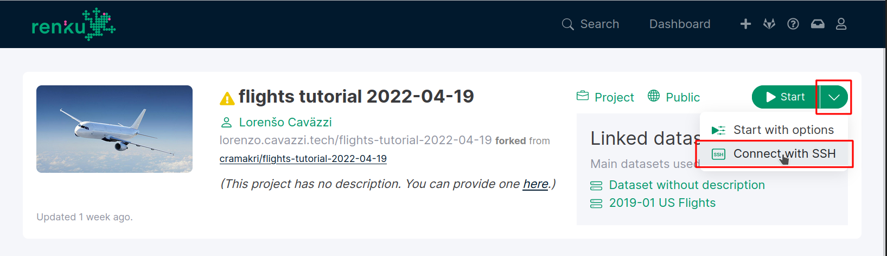
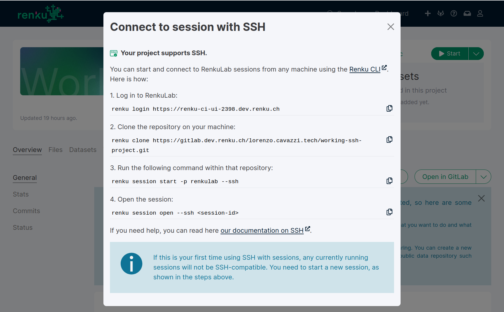
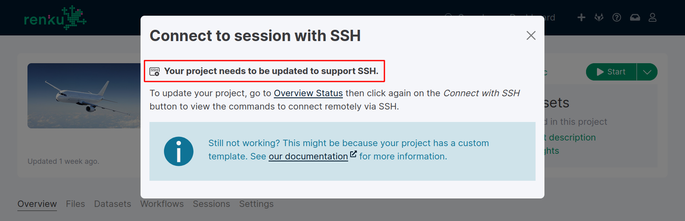
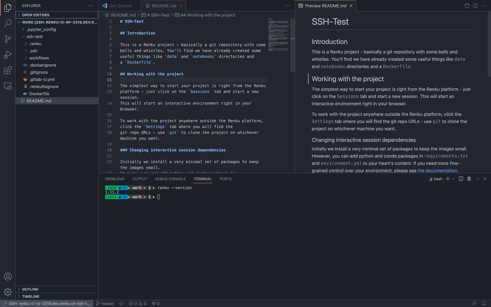
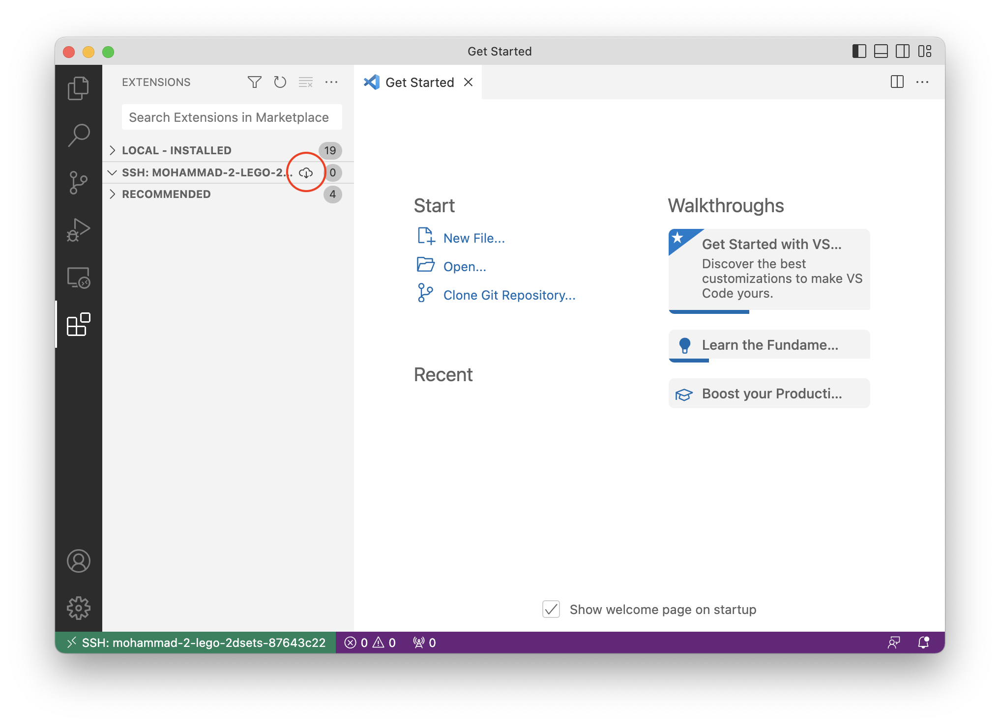
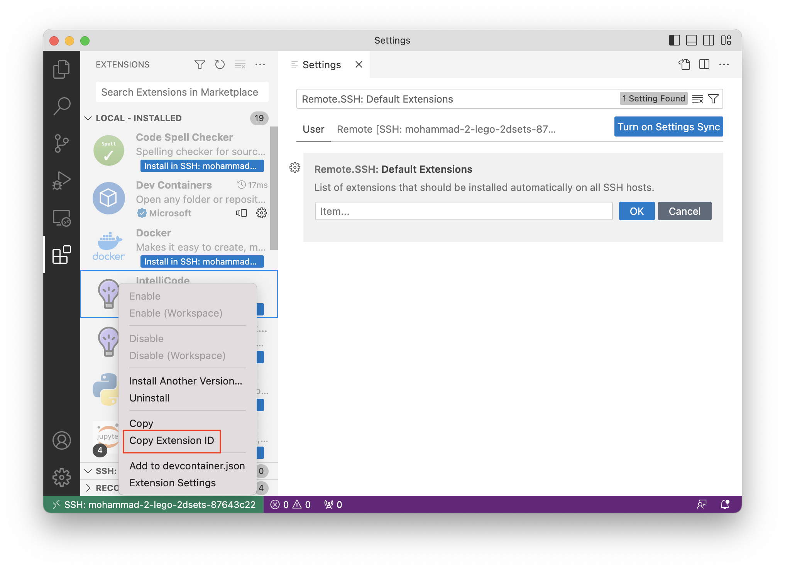

.. _ssh_into_sessions:

Connect to RenkuLab Sessions with SSH & Local IDE
=================================================

Would you prefer to work in a RenkuLab session from your local environment? Do
you prefer to edit code in your own IDE, rather than in a browser?

You can easily connect to the
remote session environment directly using SSH and work on it from your local machine. You can even
open the session with your favorite tools, such as VSCode.

Check if SSH is enabled in your project
---------------------------------------

You can check if your project supports SSH by clicking the drop down next to the
Session Start button and seeing if the "Connect with SSH" option is available,
and the dialog says your project supports SSH.

If you see "Your project supports SSH" as in the screenshot below, your project
is SSH-enabled, and you can skip down to the next section!

.. note::
    **Don't see an SSH option in the Session Start menu?** If you are working on
    a custom instance of RenkuLab (not renkulab.io), this may be because SSH
    needs to be enabled by your administrator. Contact your RenkuLab
    administrator to see if SSH can be enabled.

Enabling SSH for your project
~~~~~~~~~~~~~~~~~~~~~~~~~~~~~

If the SSH dialog says that SSH is not enabled for this project, this likely
means that your project is using an old project template.

To update your project template, click on "Overview Status" to open the project
status page. Find the "Template Version" section, and click "Update".

.. image:: ../../_static/images/ui_ssh_update_template.png
    :width: 85%
    :align: center
    :alt: Project status page showing a new template available.

Alternatively, you can manually enable SSH for your project by :ref:`upgrading your
base image <renku_base_image_upgrade>` to at least version 0.14.0. Then, run
``renku config set ssh_supported true`` to let Renku know that your project supports
SSH connections.

.. note::

    **Are you using a custom project template?** If you've updated your project
    template but your project still doesn't support SSH, ask the template
    maintainer to enable SSH in the template and perform the update again.

.. note::

    **Note for template maintainers:** See the documentation on the Template
    :ref:`manifest-yaml` for details on how to enable SSH support in your
    template, specifically the details on the ``ssh_supported`` flag.

Set up your local system for SSH access
---------------------------------------

Connecting to RenkuLab sessions via SSH requires 3 prerequisites to be setup on
your local machine (where you want to SSH from):

* OpenSSH ``>= 7.6`` is installed
* the Renku CLI ``>= 2.3.0`` is installed
* your Renku project is cloned

This section will guide you through setting up these prerequisites.

#.  To check whether ``ssh`` is installed, run ``ssh -V``. If you get a response
    like `OpenSSH_8.6p1, LibreSSL 3.3.6`, and the version number for OpenSSH is
    ``>= 7.6``, then you are good to go!

#.  Install the Renku CLI version ``>= 2.3.0``.

    If you do not already have the CLI installed, see :ref:`cli_installation`.

    To check the version of your Renku CLI, run ``renku --version``. If the
    version is less than ``2.3.0``, run ``pip install --upgrade renku>=2.3.0``.

#.  Clone your Renku Project. You can find the :meth:`renku clone <renku.ui.cli.clone>`
    command under your project's Settings tab. Or, form it yourself in the style
    of the following URL:

    .. code-block:: console

        $ renku login renkulab.io  # this step is required if your project is private or internal
        $ renku clone https://renkulab.io/gitlab/user/my-project.git

.. note::

    **Do you want to use password-protected ssh keys for your RenkuLab
    sessions?** By default, the first time you launch an SSH session, Renku will
    create a password-less key pair for use in authenticating with RenkuLab
    sessions. If you would prefer to have a password, you can do so by running
    (before launching a session) ``renku session ssh-setup -k
    <path_to_keypair>`` and providing a path to a password protected private key
    of your choice. If you've already launched a session and would like to
    switch to a different key pair, also include the ``--force`` option.

Launch an SSH-enabled Session
-----------------------------

#.  Navigate so your current working directory is the project you want to start
    a session in:

    .. code-block:: console

        $ cd my-project

#.  Log in to RenkuLab with :meth:`renku login <renku.ui.cli.login>`:

    .. code-block:: console

        $ renku login renkulab.io

#.  Pull any changes. This makes sure that the session you start is for the
    latest version of your project.

    .. code-block:: console

        $ git pull

#.  Start a session with :meth:`renku session start <renku.ui.cli.session>`,
    using the ``--ssh`` flag and ``-p renkulab`` to specify running the session
    remotely on RenkuLab:

    .. code-block:: console
        :emphasize-lines: 5-7

        $ renku session start --ssh -p renkulab
        Your system is not set up for SSH connections to Renku.
        Would you like to set it up? [y/N]: y
        [...]
        Session user-myproject-02a9e407 successfully started, use 'renku session
        open --ssh user-myproject-02a9e407' or 'ssh user-myproject-02a9e407' to
        connect to it

    .. note::

        **Curious what's happening under the hood?** This command starts a new
        session on RenkuLab. But first, it adds your local SSH keys to the
        ``allowed_keys`` in the project and pushes those changes to RenkuLab. If
        this is your first time using the SSH feature on RenkuLab, Renku creates
        an SSH key pair for you. Once the session is started, Renku creates an
        SSH connection entry in your local SSH config for that session id. This
        SSH config entry can be used with your SSH client or tools like VSCode.

Open an SSH Session via a Shell
-------------------------------

You can use :meth:`renku session open <renku.ui.cli.session>` to open an SSH
connection directly. This will open a terminal in your RenkuLab Project session
environment.

.. code-block:: console

    $ renku session open --ssh <session-id>
    venv ▶ ~ ▶ $

If prompted to accept host keys, confirm with ``yes``.

To exit the SSH shell, simply type ``exit``.

.. note::

    **How do I find my Session ID?** The ``id`` of the session is printed when
    the session is started by :meth:`renku session start
    <renku.ui.cli.session>`. In the example above, the session id is
    ``user-myproject-02a9e407``, so the command to open the SSH session is:
    ``renku session open --ssh user-myproject-02a9e407``.

    If you need to find your Session ID again, use
    :meth:`renku session ls <renku.ui.cli.session>`.

.. note::

    **Can I use the normal** ``ssh`` **command?** Yes! If you prefer, you can
    use the ``ssh`` command directly rather than the ``renku session open``
    command. You can again use the session ``id``, for example ``ssh
    user-myproject-02a9e407``.

Open an SSH Session in VSCode
-----------------------------

After starting an SSH session, follow these steps to open your session in
VSCode:

#.  Install the `Remote - SSH Extension <https://marketplace.visualstudio.com/items?itemName=ms-vscode-remote.remote-ssh>`_
    in VSCode if you don't have it already.

#.  In VSCode, open the "Remote Explorer" in the left bar and make sure "SSH
    Targets" is selected. Find the SSH connection for the session, e.g.
    ``user-myproject-02a9e407``, and click the "Connect to Host" button.

    .. image:: ../../_static/images/ssh_from_vscode.png
        :width: 85%
        :align: center
        :alt: Opening a RenkuLab SSH Session in VSCode.

#.  Open the "Explorer" in the left bar, and select "Open Folder". Enter
    ``/home/jovyan/work``.

You can now browse and edit your Renku Project files in VSCode, and run commands
in the RenkuLab session via the VSCode terminal!

For more details on the VSCode SSH extension see
`the official VSCode documentation <https://code.visualstudio.com/docs/remote/ssh>`_.

Set up VSCode Extensions on a Remote SSH Host
---------------------------------------------

When connecting to a remote SSH host in VSCode, some of its extensions might
not work out of the box. For example, the Python development assistant or
spell checker won't work. This is because the extensions are installed on your
local machine, but not on the remote host. You need to install them on the
remote host every time you connect to a session.

To install extensions that are already installed in your VS Code on the remote
host, click on the "Extensions" icon in the Primary Sidebar (or press
``Ctrl+Shift+X`` or ``Cmd+Shift+X``). In the "Extensions" panel, you can see
the list of all the extensions installed on your local machine or on the SSH
host in two separate lists. When expanding the local section, you can see
extensions that aren't in the remote host are grayed out. Note that there are
some local-only extensions that cannot be installed remotely.

To install an extension on the remote host, expand click on the "Install in
SSH: <host-name>" button next to the extension name. This will open a new
window where you need to click on the "Install in SSH: <host-name>" button to
finish the installation.

You can also install all extensions at once by clicking on the "Install Local
Extensions in SSH <host-name>" button (with a cloud icon) at the right of the
"SSH: <host-name>" title bar in the "Extensions" panel. This will show a list
of all available local extensions to select which one to install.

"Always installed" extensions
~~~~~~~~~~~~~~~~~~~~~~~~~~~~~

You need to re-install all extensions every time you connect to a session since
user setting changes are not persisted. To avoid doing that, you have the
possibility to select a list of extensions that will be installed automatically
every time you connect to a session.

To do so, open the VS Code settings and search for the "Remote.SSH: Default
Extensions" setting (or go to "Extensions" > "Remote - SSH" > "Default
Extensions"). This is a list of extension IDs that will be installed automatically
on each SSH host. Click on the "Add Item" button on the bottom of it and enter
the extension ID you want to add to the list. You can find the extension ID in
the "Extensions" panel, in "Local - Installed" title bar by right-clicking on
an extension and selecting "Copy Extension ID" in the context menu. Note that
you need to only install extensions that are grayed out.

FAQ
---

My shell environment in an SSH session isn't the same as when I'm in a session on RenkuLab - What's going on?
~~~~~~~~~~~~~~~~~~~~~~~~~~~~~~~~~~~~~~~~~~~~~~~~~~~~~~~~~~~~~~~~~~~~~~~~~~~~~~~~~~~~~~~~~~~~~~~~~~~~~~~~~~~~~

If you've made changes to your session environment via your Dockerfile, you may
need to change how these changes take effect in order to be consistent between
SSH and Jupyter terminals.

Since SSH opens a new terminal when connecting, any customization done in the
Dockerfile, such as adding to the ``$PATH`` environment variable, won't be picked
up, as those changes only apply to the Jupyter terminal.

To make the Jupyter and SSH terminal consistent, your Dockerfile should apply
such changes to ``/home/jovyan/.bash_profile`` (or similar, depending on your
image), where they get picked up when any new shell is opened.

For example, if you would like to modify your ``$PATH``, instead of encoding in
your Dockerfile ``RUN export $PATH=...``, use ``RUN echo 'export $PATH=...' >>
~/.bash_profile`` instead.
