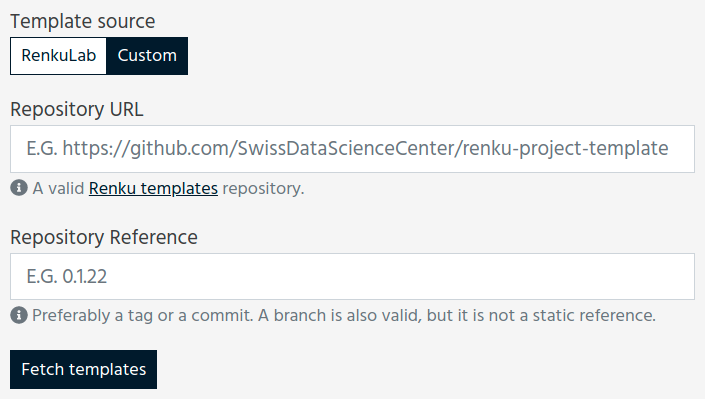
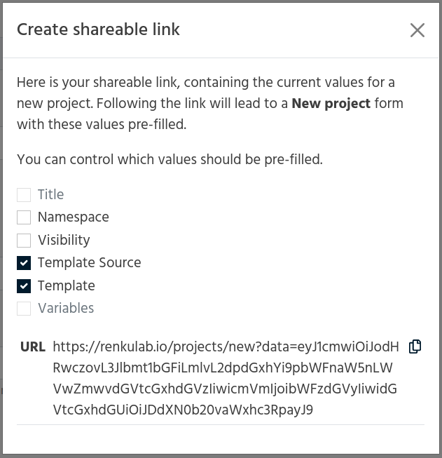

.. _templates:

Templates in Renku
==================

Templates come in handy when you want to be able to use the same kind
of high level project structure, dependencies, and/or scripts layouts over and
over. The two main aspects of the project that can be templated are:

* the directory structure & files
* the Docker image that builds your environment

When you create a project on the RenkuLab platform, you can choose between
a few templates. You should see at least a Python setup (Basic Python Project)
and a R setup (Basic R Project). In many cases, you can use these templates
as-is (see the :ref:`directory_structure` below). If you prefer another
language, you require a different IDE, or the base templates don't meet your
needs for any other reason, you can create new ones!

Note that you can create projects that are specifically intended to be templates
that others can use by adding to the base Renku template. If you're familiar
with `Cookiecutter <https://cookiecutter.readthedocs.io/en/latest/>`_, you can
also create a cookiecutter template as a Renku project.

.. contents:: :local:

.. _directory_structure:

Directory Structure
^^^^^^^^^^^^^^^^^^^

The default provided directory structure is the following.

``data`` and ``notebooks``
""""""""""""""""""""""""""

The ``data`` and ``notebooks`` directories are where you should keep your...
data (added via ``renku dataset``) and notebooks (by double-clicking on a
python3 or R kernel image from the JupyterLab instance while you're inside
the dir), respectively.
You can add further nesting of directories under these locations to keep your
project organized.

Moreover, you will probably want to create other top-level directories,
like ``src`` for keeping scripts that you create from your notebooks when
your analysis stabilizes, and ``docs`` if you wish to keep your documentation
separate from the analysis.

The ``.gitkeep`` files in these directories by default are a convention used to
git commit "empty" directories (where normal git behavior is to omit empty
directories).

``environment.yml`` and ``requirements.txt``
""""""""""""""""""""""""""""""""""""""""""""

These two files are where you write in your conda (``environment.yml``) and pip
(``requirements.txt``) library dependencies. This is so that when you kill a
notebook or anyone forks your project, (re)starting a session will pre-install your libraries.

To make it easy to remember to write your dependencies to this file, instead of
``pip install <library>`` in a terminal, for instance, you can get into the
habit of running ``pip install -r requirements.txt``.

``.gitignore``
""""""""""""""

This is your typical .gitignore file that you use for git projects. Write into
here any files that you don't want to be tracked.

.. _gitlab_ci_yml:

``.gitlab-ci.yml``
""""""""""""""""""

This yml file is for "continuous integration" in GitLab. It is configured so
that every time you make a commit, your project's docker image is rebuilt. In
most cases, this build should be successful. If, however, you are making
modifications to the ``Dockerfile``, you should pay attention to the CI/CD tab
in GitLab to check for failing builds. Take a look
at :ref:`customizing`.

``Dockerfile``
""""""""""""""

When you run the notebook server, a Docker image is built for your project as
defined by this ``Dockerfile``. The FROM line in this ``Dockerfile`` defines
which Renku Docker image sets up the base of your project; this includes
dependencies for the Renku CLI, JupyterLab, and maybe R kernels & RStudio,
depending on which template you selected upon project creation.

The lines following ``FROM`` define the installation of your own software
dependencies; they are the instructions for conda/pip installations of the
libraries in your ``requirements.txt`` file. If there's nothing special
about the libraries you're installing, you wont have to make changes to this
file. Else, check out :ref:`install_packages`.

``.dockerignore``
"""""""""""""""""

The ``.dockerignore`` file is just like a ``.gitignore`` file, in that it allows
you to specify which files to ignore in a docker build. If you are not making
changes to the docker build, you can .dockerignore this file.

``README.md``
"""""""""""""

The ``README.md`` file is shown on a project's home page. It's good to have at
least the name of the project and a brief overview of the project for your
intended audience.

.. _renku_ini:

``.renku``
""""""""""

The ``.renku`` directory includes a ``renku.ini`` file which contains
project-level configuration for renku, stored using the
`INI format <https://en.wikipedia.org/wiki/INI_file>`_. It can be used
to :ref:`store project setting <renku_project_config>` such as the threshold
for LFS files, or session specific settings (see next section).

Sessions
^^^^^^^^

If your project has specific resources requirements to run, or if it should
default to RStudio or anything other than JupyterLab, then you will want to
provide a configuration for the sessions.

You can modify the project setting both on the RenkuLab platform or using
the command line as described
:ref:`on the Renku project configurations page <renku_project_config>`.

Here is the list of properties that can be customized in a standard Renkulab
deployment:

* ``default_url [string]``: URL to use when starting a new session (``/lab``, ``/tree``, ...)
* ``cpu_request [float]``: CPUs quota (``0.5``, ``1``, ...)
* ``disk_request [string]``: disk storage quota (``1G``, ``4G``, ...)
* ``mem_request [string]``: memory quota (``1G``, ``2G``, ...)
* ``gpu_request [int]``: GPU quota (``0``, ``1``, ...)
* ``lfs_auto_fetch [bool]``: whether to automatically fetch lfs files or not
  (``true``, ``false``)
* ``image [string]``: optional pinned Docker image
  (``registry.renkulab.io/namespace/my-project:a1b2c3d``)

.. note::

    We use JupyterLab as the default web interface for sessions.
    If you work in R, you may prefer to have RStudio. This can be
    achieved by using `/rstudio` as the ``default_url`` instead of `/lab`.

    .. code-block:: console

      > renku config set interactive.default_url "/rstudio"

    Verify that your ``renku.ini`` file looks like the following.

    .. code-block:: console

      [renku "interactive"]
      default_url = /rstudio

    After running this command locally or in a session, you need to ``git push``,
    wait for a new Docker image to be available, and
    :ref:`start a new session <session_start_new>` to  have RStudio as the default
    web interface.
    This is necessary since the config command creates a new commit.

.. note::

  Using the same approach as above for RStudio, it is possible to switch the
  interface from JupyterLab to the classic Jupyter Notebook by using `/tree`
  as the ``default_url`` instead of `/lab`.

  .. code-block:: console

    > renku config set interactive.default_url "/tree"

.. _pin_docker_image:

Pin a Docker image
""""""""""""""""""

Every new commit triggers a Docker image creation once pushed back to RenkuLab.
This process uses the GitLab CI/CD pipelines as described above on the
`.gitlab-ci.yml` file section. The creation process may be time-consuming,
especially for images having many dependencies.

Unless you modify the Dockerfile or add dependencies, building a new image
may not be necessary. It is possible to pin a Docker image to skip this step
and even remove the ``image_build`` job from the `.gitlab-ci.yml` file.
Beware that this is risky since users won't be able to include further changes
to the Docker file or adding dependencies. Still, it's very
useful in many situations, especially when you expect many users to fork your
project in a short time span (all forks trigger the creation of a new Docker
image).
A typical case would be a presentation or a lecture where you plan to set up a
project ready to be forked and used.

Through :ref:`the Renku project configurations <renku_project_config>`, you can
pin any image coming from a local or remote
`Docker registry v2 <https://hub.docker.com/_/registry>`_. The easiest way would
be using an image built on RenkuLab. Once you settle on one, either in the
project you are setting up or in another one you keep pristine, you can start a
session to verify all works as expected. When the session is running, you can
check the image URL on the sessions list by clicking on the green icon.

.. image:: ../../_static/images/templates-pinned-image.png
  :width: 85%
  :align: center
  :alt: Get the Docker image URL

Copy the link, and paste it in the `Docker image` field in the advanced setting
section of the project sessions settings, or using
``renku config set interactive.image <URL_to_image>``.

.. note::

  The user experience for launching a new session won't change much when there
  is a pinned image. However, the impact of a missing image will be broader
  since it may impact multiple commits and forked projects. You should ensure
  your image works properly.

  You can verify it by launching a new session. After expanding the advanced
  settings, you should see a blue label next to `Docker image` saying ``pinned``.
  Mind that a red label means the image is not accessible. Click on `more info`
  to verify the URL is the correct one.

  .. image:: ../../_static/images/session-pinned-image.png
    :width: 85%
    :align: center
    :alt: Session with pinned image.

What can I touch? What should I not touch?
^^^^^^^^^^^^^^^^^^^^^^^^^^^^^^^^^^^^^^^^^^

What you should or should not touch depends on how well aligned your project is
with the defaults that Renku provides. Here are two example use cases:

User #1: Default everything
"""""""""""""""""""""""""""

You're a python developer and you're ok with JupyterLab and the version of
python provided by the base template. You install all of your libraries with
pip or conda. While you work on this project, you can feel comfortable
modifying the following (as well as creating your own directories and
subdirectories to match your project's structure):

* ``data`` and ``notebooks`` directories
* ``.gitignore``
* ``requirements.txt`` (pip) and ``environment.yml`` (conda)
* ``README.md``

User #2: Extra dependencies
"""""""""""""""""""""""""""

You want a different version of python than the one provided, you want to
install software that requires additional non-python/R dependencies, or you
want to make other changes, and you're comfortable editing Dockerfiles. In
addition to the files above, you might modify the following.
Consult :ref:`customizing`.

* ``Dockerfile``
* ``.dockerignore``
* ``.gitlab-ci.yml``

.. warning::

  Modifying these files can result in an image that does not build. Resetting to
  default values and killing and restarting the notebook should bring you back
  to a working state.

You can add any extra directories, sub-directories, and files anywhere without
a problem, but you probably want to leave the dotfiles in the level that
they're in in the default templates. Some of the integrated tools expect to
find these files in the top level of the project and will fail otherwise.

What else could be templated?
^^^^^^^^^^^^^^^^^^^^^^^^^^^^^

Here are some other aspects of a project that could make use of a template:

* documentation
* subdirectories for keeping different parts of a project (note that you'll
  want to add ``.gitkeep`` files into empty directories to be able to git
  commit them)
* python scripts with ``argparse`` set up for inputs and outputs
* ``Dockerfile`` with installation of alternate IDE

One way to write templates for these aspects of the project is to create them
with `Cookiecutter <https://cookiecutter.readthedocs.io/en/latest/>`_.
Cookiecutter is a CLI that creates projects from project templates. You can
define your own templates, or check out some of the
`curated cookiecutters <https://cookiecutter.readthedocs.io/en/latest/readme.html#data-science>`_.
Note that some of these clash with the `renku` templates (i.e. content in
`Dockerfile`, `.gitignore`, etc.). As long as you read the docs above to
understand which parts are required for `renku`, you should be able to merge
these manually.

.. _create_template_repo:

Create a template repository
^^^^^^^^^^^^^^^^^^^^^^^^^^^^

We maintain an
`official Renku template repository <https://github.com/SwissDataScienceCenter/renku-project-template>`_
that provides a few basic templates you can use to initiate your projects.
That should cover the most common use cases, but we assume users want to
create their own templates to speed up the bootstrap phase of a new project.

The easiest way to create your own templates is to clone our
`Renku template repository <https://github.com/SwissDataScienceCenter/renku-project-template>`_
and modify it as you need.

You can validate that everything is ok with your custom template repository
by running ``renku template validate`` in the repository root, which will
point out any potential issues with the templates.

.. _manifest-yaml:

``manifest.yaml``
"""""""""""""""""

The
`manifest file <https://github.com/SwissDataScienceCenter/renku-project-template/blob/master/manifest.yaml>`_
contains all the specifications needed by the ``renku init`` function to
create a new project. You can specify multiple templates in the same
repository. Each of them requires an entry with the following parameters:

* ``id``: the target directory inside the repository where the template files are stored.
  You must use a different id/directory for each template. Note that this field was called
  ``folder`` previously which is deprecated now. You can still use ``folder`` but
  when validating your templates, you'll get a warning to replace it with ``id``.
* ``name``: a short user-friendly name.
* ``description``: a brief description of your template. This will be
  presented to the user when choosing between templates.
* ``ssh_supported``: ``true`` or ``false``, indicating whether the template supports
  SSH connections. To support SSH, the Dockerfile has to use one of the Renku base
  images with version 0.14.0 or higher, or have a functioning SSH server running
  inside the image listening on port 2022 and reading client keys from
  ``$HOME/.ssh/authorized_keys``.
* ``aliases``: A list of ID aliases for the template. This is useful if you want to
  rename a template or move it to a different directory.
  See :ref:`renaming templates <rename-templates>` for more information.
* ``variables``: we support the
  `Jinja template engine <https://palletsprojects.com/p/jinja/>`_ in both
  file content and filenames. You can therefore ask users for specific values
  for any number of variables. The syntax is
  ``<variable_name>: <variable_specification>``, where the name will be used as
  the variable name provided to the engine and ``variable_specification`` is a
  dictionary defining the variable. A variables entry looks like

  .. code-block:: yaml

      variables:
        name:
          description: description of the variable
          type: string
        bool_var:
          description: description of the variable
          type: boolean
          default_value: True
        enum_var:
          description: description of the variable
          type: enum
          enum:
            - "yes"
            - "no"
            - maybe
            - ask again
          default_value: ask again
        number_var:
          description: description of the variable
          type: number

  where specifying a ``description`` is mandatory. ``default_value``
  determines the value that is used if a user doesn't provide a value.
  ``type`` determines the type of value that this variable expects, which can
  be one of ``string``, ``boolean``, ``number`` or ``enum``.
  ``boolean`` accepts most truthy/falsy values, such as ``true``, ``false``,
  ``0``, ``1``, ``"0"``, ``"1"``, ``"True"``, ``"False"``.
  ``number`` accepts numeric inputs like integers and floats.
  ``enum`` is a special type that restricts the accepted values to those
  set in the ``enum:`` list of values.
* ``allow_template_update``: This field is deprecated and will be ignored.
  It was used to indicates that the template supports being updated. All
  templates are updatable now. When the template gets updated, projects
  created from it will get updated with the new template files. Defaults to
  ``false``. Also see ``immutable_template_files``.
* ``immutable_template_files``: A list of file paths inside the template
  (relative to the project root) that should not be changed by users.
  Users changing any of these files will get a warning when trying to commit those
  changes if Renku CLI pre-commit hook is installed in a project. Template files not in
  this list won't get updated on template update if they were modified by a
  user. If a user does change one of these files, automated template update
  is no longer supported on that project, to prevent broken/inconsistent
  projects.
* ``icon``: A relative path to an image file inside the repository that is associated
  with the template. This icon is presented to users in the UI on the template
  selection screen. Valid formats are PNG, JPEG and BMP. Icons are limited to a
  resolution of 256x256, if the icon you provided is larger than this, it will
  be scaled down.

In addition to the custom variables mentioned above, we also provide some
renku-specific variables that are always available in templates, namely:

* ``name``: The name of the project.
* ``__template_source__``: The git repository the template originated from or
  ``renku`` if the template was distributed as a part of ``renku-python``.
* ``__template_ref__``: The branch/tag of the template repository.
* ``__template_id__``: The id of the template inside the repository.
* ``__repository__``: The repository where the project resides in (only set
  when creating a project online in renkulab).
* ``__namespace__``: The project namespace (only set when creating a project
  online in renkulab).
* ``__sanitized_project_name__``: Sanitized name of the project (without
  special characters) as used in Gitlab and URLs.
* ``__project_slug__``: The project slug (``<namespace>/<sanitized project
  name>``) (only set when creating a project online in renkulab).
* ``__renku_version__``: Renku version to be used for the project.

Use custom template repositories
^^^^^^^^^^^^^^^^^^^^^^^^^^^^^^^^

If you installed the renku command-line interface locally, you can specify a
template repository as an argument to the ``renku init`` command. If you do
this, we recommend that you **also** specify a tag (or a commit) when creating
a new project from a custom repository to ensure that the action is reproducible.
You can find further details in :ref:`renku init docs<cli-template>`.

If you are using a RenkuLab instance, you can use a custom template repository by
changing the `Template source` to ``Custom`` on the project creation page. There,
you will be able to insert a URL pointing to your template repository.

Fill in the reference and click on `Fetch templates`. This will parse and
validate the repository, showing the list of available templates.

An error may occur while fetching the templates for many reasons.
Most of the time, the template repository is invalid (in that case,
:ref:`double-check the manifest file<manifest-yaml>`), or the URL/reference
combination is wrong. The UI should show a meaningful error description.

.. note::

  Remember to provide the URL to the **git repository**. For GitHub and
  other code management systems, you can provide the link used to clone
  through ``https``, ending with ``.git``. You can usually leave the
  ``.git`` extension out, but pay particular attention when you try to
  copy-paste directly from your browser. Even an additional final slash can
  lead to an invalid URL, and the error may be confusing.
  This is what you get if you use
  `https://github.com/SwissDataScienceCenter/renku-project-template/` instead
  of `https://github.com/SwissDataScienceCenter/renku-project-template`:

  .. image:: ../_static/images/templates_url_error.png
    :width: 100%
    :align: center
    :alt: Error fetching custom templates

If you think your template may be useful for the broader community, you can
have more visibility by including it in the
`community-contributed project templates repository <https://github.com/SwissDataScienceCenter/contributed-project-templates>`_.
Feel free to open a pull request and we will validate it.

If you are working in a dedicated RenkuLab deployment and your local
community needs the templates, you should contact the administrators to
include your repository in the RenkuLab template source through the
`renku-values file <https://renku.readthedocs.io/en/latest/admin/index.html#create-a-renku-values-yaml-file>`_.

.. _rename-templates:

Renaming templates
^^^^^^^^^^^^^^^^^^

If you are the owner of a template repository, you can change the name of the
templates. To do this, edit the ``manifest.yaml`` file and put the new name
in the ``id`` (used instead of ``folder`` that is deprecated) field of the template you want to rename. You then
need to add the old name to the ``aliases`` field so that projects created
from the old name can be updated to use newer template versions. In addition,
template's directory must be renamed to match the new ``id``.

The following example shows contents of ``manifest.yaml`` files to rename the
``basic`` template to ``advanced``:

  .. code-block:: yaml

      - id: basic
        name: Basic Template
        description: Basic template for Renku projects

``manifest.yaml`` after renaming:

  .. code-block:: yaml

      - id: advanced
        name: Advanced Template
        description: Advanced template for Renku projects
        aliases:
          - basic

Create shareable project-creation links with pre-filled fields
^^^^^^^^^^^^^^^^^^^^^^^^^^^^^^^^^^^^^^^^^^^^^^^^^^^^^^^^^^^^^^

There are times where you may have many users that each need to create their
own repository, but some of the parameters are shared across all the
repositories. An example could be in a course where each student needs their
own repository, but all should use the same template and metadata.

For this case, it is possible to generate a project-creation link containing
metadata embedded in a query parameter. When that link is entered in a
web browser, the UI will  automatically fetch the required information and
pre-fill the fields.

To create a shareable link, start by filling in all the fields as you would
do when creating a new project. Instead of clicking on `Create project`,
click on the dropdown on the right side of the same button and then on
`Create link`.

You should see a modal dialog where you can select which fields to include
in the metadata. Some may not be clickable (no value provided), and others
are deselected by default. The URL updates in real-time and can be copied to
share with others.

.. note::

  You can include any of the listed fields in the link, but you should be
  careful when including namespace and visibility. Your user namespace cannot
  be available to any other users, and group namespaces may require specific
  permission. The visibility is generally tied to the namespace visibility,
  although ``private`` should always be available since it is the most
  restrictive one.

  It would be best to prefer fixed references for custom template
  repositories, especially when selecting a template and providing values for
  variables. This means commits and tags are a good choice, while branches
  are not. Otherwise, the template or the variables may change in a later
  version, resulting in a corrupted link.

Programmatically compute shareable links
^^^^^^^^^^^^^^^^^^^^^^^^^^^^^^^^^^^^^^^^

The shareable link generation process is trivial but not intuitive since the
base64 encoded string obfuscates the details (we do that to prevent problems
with special chars in the URL).

If you need to to compute the shareable links programmatically, all you need is
to create a dictionary with the necessary information, serialize it to a Json
string, and base64 encode it.

We use the ``stringify`` function from the
`JavaScript JSON object <https://developer.mozilla.org/en-US/docs/Web/JavaScript/Reference/Global_Objects/JSON>`_
to serialize the dictionary, and a minor variation of the
`JavaScript btoa function <https://developer.mozilla.org/en-US/docs/Web/API/WindowOrWorkerGlobalScope/btoa>`_
to base64 encode the string. You can use them as a reference. All the major
programming languages have a straight equivalent in their base packages.

The structure of the dictionary is the following:

.. code-block:: console

  {
    "title": <string>,
    "namespace": <string>,
    "visibility": <string>,
    "url": <string>,
    "ref": <string>,
    "template": <string>,
    "variables": {
      <variable_name>: <string>
    }
  }

Here is an example with Python:

.. code-block:: python

  # 1. Create a dictionary with all the required data

  raw_data = {
    "title":"test",
    "url":"https://github.com/SwissDataScienceCenter/renku-project-template",
    "ref":"0.1.17",
    "template":"Custom/python-minimal",
    "variables": {
      "description":"test description"
    }
  }

  # 2. Serialize to a string

  import json
  serialized_data = json.dumps(raw_data)

  # 3. Encode in base64
  import base64
  data = base64.b64encode(str.encode(serialized_data))

  # 4. Use the output to compose the URL
  print(data)

  > b'eyJ0aXRsZSI6ICJ0ZXN0IiwgInVybCI6ICJodHRwczovL2dpdGh1Yi5jb20vU3dpc3NEYX
    RhU2NpZW5jZUNlbnRlci9yZW5rdS1wcm9qZWN0LXRlbXBsYXRlIiwgInJlZiI6ICIwLjEuMT
    ciLCAidGVtcGxhdGUiOiAiQ3VzdG9tL3B5dGhvbi1taW5pbWFsIiwgInZhcmlhYmxlcyI6IH
    siZGVzY3JpcHRpb24iOiAidGVzdCBkZXNjcmlwdGlvbiJ9fQ=='

  # The link will be
  # https://<renkulab_url>/projects/new?data=eyJ0aXRs...biJ9fQ==

The final string may be slightly different based on the specific library
used or the local settings (E.G., including spaces in the serialized
object string, produces extra characters).
