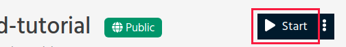

.. _teaching_with_renkulab:

Teaching with Renku
===================

We know that teaching data science and software engineering is a challenging
task for a variety of reasons, for both teachers and students. Teachers often
note that:

* getting students to install software is a long process;

* they may have differing operating systems, which complicates installation;

* they lose valuable time during class time trying to get students set up.

On the other hand, students, especially beginners, often find set up frustrating
too, for the same reasons. They may also find that:

* they get different answers to their peers or teachers even by running the same code;

* they cannot run a particular bit of code due to lack of computational resources on their local machine.

Renku solves many of those problems by building on containerized environments,
providing a simple package set-up for Python, R and Julia, free computing resources,
and a completely browser-based application to do your work.

Announce your courses!
----------------------

We want to give your course the best Renku experience, whether they are one-off
workshops or weekly lab sessions. This means ensuring adequate computational
resources for you and your sessions, with a Renku admin on hand if there are
problems with the platform. As such, we would very much appreciate if you could
*announce* your course using the following form: `Announce your Renku course
<https://form.jotform.com/213221777284356>`_.

Ways of using Renku to teach
----------------------------

There are many ways to use Renku to teach your class or course. We describe a few
of the most used ways and compare them.

Fork pattern
^^^^^^^^^^^^

Forking is one of the natural ways to share a teacher's project with students.
Once a teacher has set up the required dependencies in their ``Dockerfile``,
``requirements.txt``, ``install.R`` and/or ``environments.yml`` file, students
can use `fork` the project to their own account. This essentially copies the
files and dependencies at that point in time. Forking is available through both
the GitLab and Renku user interfaces.

An advantage of forks is that they are able to be tracked by both the original
repository author and people who have forked that project. It is also possible
to use some advanced features of GitLab's CI/CD to automate some tasks like
grading of assignments or homework.

Template pattern
^^^^^^^^^^^^^^^^

Another way of sharing material for a course is through templates. A teacher
would set up dependencies and materials as they would in the fork pattern, but
instead they would share instead a project initiation link to the template,
where students fill in their own metadata. In this case, student's fully own
the repository and there is no link from the template repository to the
instantiated one (except for its metadata). See
https://renku.readthedocs.io/en/latest/reference/templates.html for more details.

Hands on demos
^^^^^^^^^^^^^^

When you want students to access interactive sessions quickly without necessarily
saving outputs, it is possible to share a 'one-click' start link to a project
that you have prepared earlier.

In each project there is a one-click start button, as shown above. You can copy
the link of that button (it ends in ``/namespace/project-name/sessions/new?autostart=1``)
and share it with your audience. Here, there is no need to log in to Renku
if the project is public and is thus similar to Binder, if you are familiar with that.

Classroom automation
^^^^^^^^^^^^^^^^^^^^

Classroom management operations, such as inviting students to groups, sending feedback
through issues or cloning student repositories can be automated thanks to the Gitlab API.
Visit our `advanced teaching automation repository <https://renkulab.io/gitlab/learn-renku/teaching-on-renku/advanced-teaching-automation>`_ for more information.

Tips to optimize your teachings
-------------------------------

The default behavior of Renku is to build a new Docker image each time a commit
is pushed to a repository. When sharing projects by forking, a new environment
is built for each fork. However, this may be unnecessary and it would be better
to optimize this by *pinning* the Docker image beforehand. This means that the
trainer would have determined the Docker image for all of the students to use
and when these projects are forked, there is no need to build a new Docker image.
See the following Discourse post for the details:
https://renku.discourse.group/t/how-to-pin-a-docker-image/240
