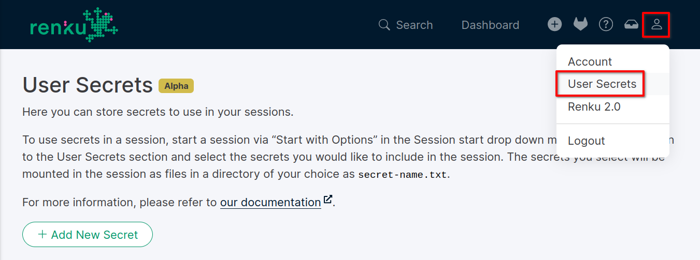
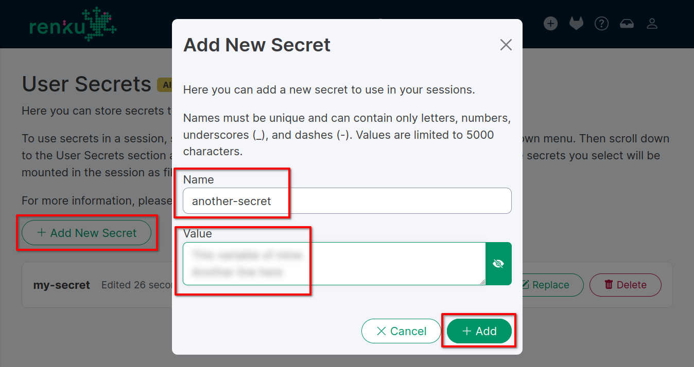
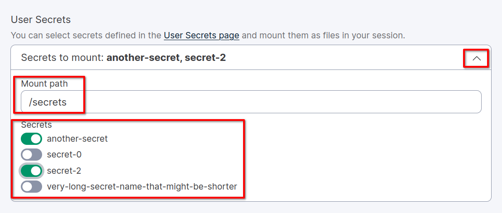

.. _secrets:

Secrets in RenkuLab
===================

What are secrets?
-----------------

Secrets are sensitive data that you need in sessions but should
not be stored in a repository.
This includes passwords you might need for accessing a database, API keys
for external services, or any other sensitive information.

You can create, replace, and delete secrets from the RenkuLab interface.
They are securely stored in our systems and are only available in sessions
that you launch. They will be mounted as files in the session container in
a path you can customize when starting a new session.
Each secret is stored with a unique name, which will be used for the
corresponding file name.

Keep in mind that secrets are currently defined per user. They cannot be
shared with other users, nor scoped down to a single project. You can select
which secrets to use in a session when starting it, so you don't need
to worry about accidentally mounting secrets into a session that you
do not need.

Add and change secrets
----------------------

To add a new secret, go to the User Secrets page in the RenkuLab interface.
You can find it in the user settings menu on the top right.

Click on the ``Add New Secret`` button and fill in the ``Name`` and
``Value`` fields.

The name is a unique identifier for the secret, used for the file name in
sessions. It cannot be empty and must follow these validation rules:
you can include only letters, numbers, dots (.), underscores (_),
and dashes (-).

Values can be any non-empty string, including special characters. The length
cannot exceed 5'000 characters. Should you need to store a longer value,
consider splitting it into multiple secrets.

Once you add a secret, you cannot see its value again for security
reasons. You can still change it by clicking on the ``Replace`` button,
or remove it by clicking on the ``Delete`` button. The name cannot be changed;
should you need to rename a secret, please delete it and create a new one
with the new name.

Use secrets in sessions
-----------------------

To use secrets in a session, you need to click on the Start dropdown menu and
select ``Start with options``. Quick-start sessions do not support secrets.

Once on the "Start with options" page, you can select the secrets you want to
include from the ``User Secrets`` section towards the bottom of the page.
Click on the chevron on the right to expand the secrets list and click on
every secret you want to include. You can customize the path where the
secrets will be mounted in the session container by adjusting the
``Mount path`` input. The default path is ``/secrets``. Mind that this is
an absolute path; if you leave the default value, you will not find the folder
in your repository and it might not be immediately accessible on the session
file browser (E.G. JupyterLab).

Click on the ``Start Session`` button to start the session with the selected
secrets. You can now access the secrets in the session container at the
specified path. The secrets will be stored in files with the same name.

.. note::

  Secrets will be mounted with the value stored at the session start time.
  If you change the value of a secret after starting the session, you will
  need to restart the session to apply the changes.

Security Model
--------------

Renku stores secrets in its database, doubly encrypted, ensuring that no part 
accessible from the internet other than the session has access to decrypted 
secrets. All secrets are encrypted at rest.

Threat models we address are:
- One of our public-facing services being breached
- A malicious actor getting a copy of our database (for instance from a backup)

We explicitly do not guard against:
- Someone stealing your login details or login token
- You starting a malicious session with secrets, as we can't control the code 
that runs within a session.

The Renku ``data service`` uses symmetric Fernet encryption with a key only it 
knows to ensure all data is encrypted at rest in its database.
For each user, a unique ``user key`` is generated. In addition, there is a 
dedicated ``secret storage service`` which has an RSA 2048 bit ``public key`` 
and a ``private key``, the latter of which is only known to this service. This 
service is not accessible to the public internet.

When a user stores a secret, it is first symmetrically encrypted with the 
``user key``, using Fernet. We then generate a random ``secret key`` that is 
encrypted using the ``public key`` and passed to the  ``secret storage 
service``, meaning only it can decrypt the ``secret key``. The users secret is 
then encrypted again using this ``secret key`` and stored in the database.
At this point, the ``data service`` can't decrypt the user's secret anymore, as 
it does not know the ``secret key``.

To decrypt a secret, ``secret storage service`` gets a request from ``notebooks 
service`` that a user would like to start a session with some secret mounted. 
It uses its ``private key`` to get the ``secret key`` and uses this to decrypt 
the outer layer of encryption of the secret. It then creates a Kubernetes 
secret with the (now encrypted once) user secret, which gets mounted in an
init container in the user session.
On session start, that init container reads the mounted secrets, and uses the 
``user key`` to undo the inner encryption. It then creates files inside the 
user session with the decrypted secret values.

Note that, although we take many precautions to decrypt secrets only when
necessary, they are in plaintext inside a session. This means that they are
visible to whoever has access to the infrastructure where the session is running.
If your data is extra sensitive, consider putting already encrypted values into 
Renku and manually decrypting them once inside the session, with 3rd party 
encryption.
