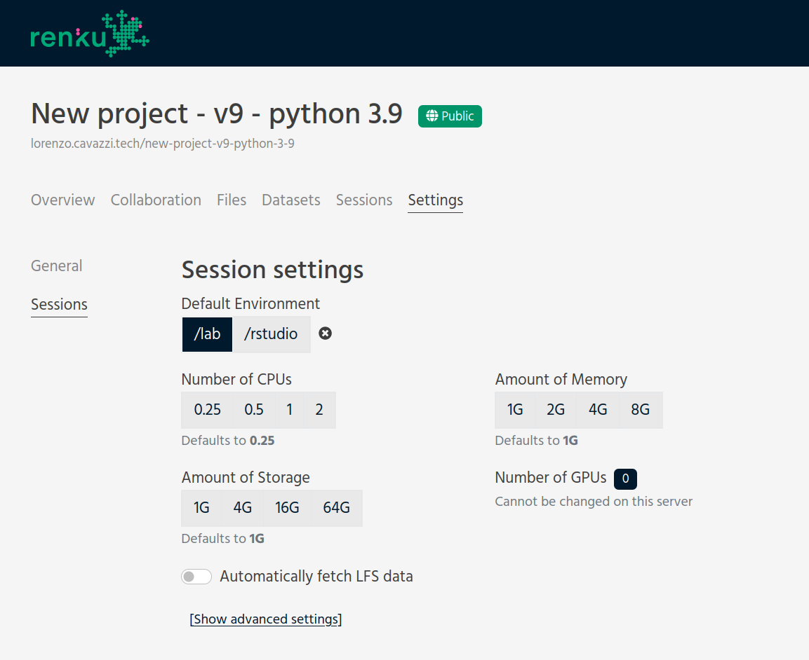

.. _customizing:

Customizing sessions
====================

Very soon, you will want to make changes to the default configuration of your
interactive sessions. The default environments we provide are pretty bare-bones.
If you want to have easy access to your preferred packages, some simple steps
at the start of your project will get you on the way quickly.

Important files
---------------

The launch is enabled by the content in the following files in your project:

* ``Dockerfile``: defines the type of session and other software
  installed in the environment, including the ``renku`` command-line installation.

* ``.gitlab-ci.yml``: controls the docker build of the image based on the project's
  ``Dockerfile``.

* ``requirements.txt``, ``install.R``, or ``environment.yml``: language-specific files controlling the
  libraries. See :ref:`install_packages` for how to add packages to your environment.

* ``.renku/renku.ini``: renku project configurations containing a
  ``[renku "interactive"]`` section.

.. _renku_project_config:

Customizing your RenkuLab Project Configurations
------------------------------------------------

When starting a new Session, most of the options can be manually
changed by the user. Depending on the specific RenkuLab deployment, you can select
more RAM, more storage space, a higher CPU quota, etc.

Your project may even include a package with an advanced UI (like
`Streamlit <https://renku.discourse.group/t/how-to-deploy-streamlit-in-renku/169>`_)
and you probably want to choose it as default.

It's possible to set a default value for all these options, either using the
:ref:`cli-config` locally or in a session, or directly on RenkuLab project
page.

To do that, you can go into the project `Settings` section and click on the
`Sessions` tab. The interface shows the available project settings. Mind that you
can only select values valid to the specific RenkuLab instance. You can still use
the CLI to set any custom value, but that may not work as expected.

If no default value is defined for a resource at the project level, the session
will likely use the default for the RenkuLab instance. Picking a specific value
is helpful if you know the project requires more resources than the standard.
Mind that users can always manually select different values when starting a
session if they want to, even if you set a default.

These configurations are stored in the  ``.renku/renku.ini`` file, so they are
preserved even if you move the project to another RenkuLab instance.

.. note::

  Sometimes you may want to add a non-default value, typically to select a custom
  default environment. You can use the :ref:`cli-config` from a session,
  for example:

  .. code-block:: bash

    renku config set interactive.default_url "/tree"

**What are the specific options?**

You can find a comprehensive list of options :ref:`on this page <renku_ini>`. Most
commonly, you may want to change the `Default Environment`, define the required resources,
or :ref:`pin a specific Docker image <pin_docker_image>` that your session will use.

The first case is useful when you prefer to show a different default UI, like the standard
Jupyter interface ``/tree``, or when you need support for a different interface,
like R studio ``/rstudio`` or  ``/streamlit`` (not included in the standard Python template).

The resources should be set when you know the lower values may not be enough for the project
requirements. The storage is particularly important since the session may not be able to
start without sufficient disk space. You should consider *not* fetching LFS data
automatically if those may fill up the disk space.

The ``image`` is useful when you settle on a Docker image and you don't need to change it
anymore. The benefit is particularly evident when building a new image takes a lot of time
(e.g. you added big packages) or when you expect the project to be used by a lot of people
over a short period of time (e.g. you use it in a presentation or a lecture and you expect
the participants to fork the project).

.. warning::

  You need to :ref:`start a new session <session_start_new>` after any change to the project
  configuration since the changes are applied as a new commit. That does not affect any
  running session or any new session started from an older commit.

.. note::

  Mind that not all the RenkuLab instances have the same set of options or allow to choose
  the same values. If no GPUs are available, setting the default number to ``1`` can't work.
  Should this be the case, a warning will show before starting a new environment and on
  the project settings page.

Getting Help
------------

If you are stuck with a specific modification you'd like to make, do reach out to the
`Renku community forum <https://renku.discourse.group>`_!
