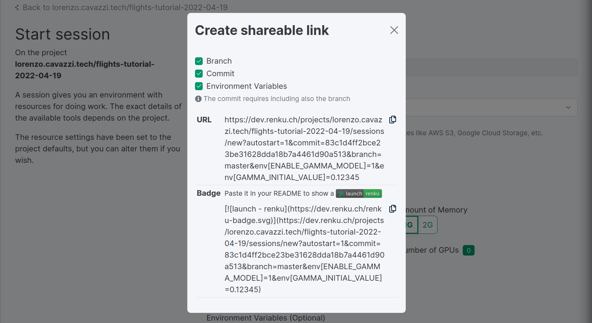

.. _session_basics:

Session Basics
==============================

What is a Session?
-----------------------------------

Sessions on RenkuLab are web-based user interfaces (like JupyterLab
and RStudio) that you can launch to develop and run your code and data workflows.
They're commonly used for exploratory analysis because you can try out short blocks
of code before combining everything into a (reproducible) workflow.

You can run JupyterLab or RStudio within a project independently from RenkuLab,
but RenkuLab offers the following advantages:

* Environments hosted in the cloud with a configurable amount of resources
  (memory, CPU, and sometimes GPU).

* Environments are defined using Docker, so they can be shared and reproducibly re-created.

* Auto-saving of work back to RenkuLab, so you can recover when your environment is shut down
  (this happens automatically after 24 hours of inactivity).

* A git client pre-configured with your credentials to easily push your changes
  back to the server.

* The functionality provided by the renku-python_ command-line interface (CLI)
  is automatically available.

What's in my Session?
-------------------------------------

* Your project, which is cloned into the environment on startup.

* Your data files (if the option ``Automatically fetch LFS data`` is selected)
  that are stored in git LFS*.

* All the software required to launch the environment and common tools for
  working with code (``git``, ``git LFS``, ``vim``, etc.).

* Any dependencies you specified via conda (``environment.yml``), using
  language-specific dependency-management facilities (``requirements.txt``,
  ``install.R``, etc.) or installed in the ``Dockerfile``. An exception to
  this is if project has :ref:`a pinned Docker image <pin_docker_image>`.

* The renku command-line interface renku-python_.

* The amount of CPUs, memory, and (possibly) GPUs that you configured before launch.

For adding or changing software installed into your project's session,
check out :ref:`customizing`

Which Session will launch?
------------------------------------------

The template you choose when you create a project on RenkuLab (or locally call
``renku init`` on your project) determines the kind of session
that is available to launch. Once it is initialized, your project can easily be
modified, for example to install additional libraries into the environment - see
:ref:`customizing`. We provide templates for basic Python, R, and Julia
projects. If you wish to use custom templates for your projects, you can build
your own! Please refer to the :ref:`templating <templates>` documentation.

Starting a new Session
-----------------------

You can start a session from RenkuLab in 3 different ways:

* Click on the project quick start button. That's available as a play icon on the
  project cards, both on the landing and search pages. Or on the top right of the
  project header on project pages.
  This action will automatically identify the most recent contribution on the
  default branch and start a new session there. Should anything be wrong
  (E.G. missing Docker images, running CI jobs, etc.), you will be redirected
  to the :ref:`"Start with options" <start_with_options_anchor>` page.
  If a session is already running, you will see a "Connect" button instead of the
  "Start" button.

* Click on the "Start with options" link in
  the "Start/Connect" dropdown menu available on the top right of the project
  page header. Or on the "New session" button on the project sessions tab.
  This action will bring you to a
  lengthy :ref:`"Start Session" <start_with_options_anchor>` page with many
  more options to configure your session before starting.

* Use an :ref:`"Autostart Session" <create_autostart_links_anchor>` link.
  The user experience is very similar to the quick start button. You can easily
  :ref:`generate and share links <create_autostart_links_anchor>` that start
  on the latest version of any branch or specify references and
  environmental variables to tailor the session to specific needs.

.. _start_with_options_anchor:

Start with options
~~~~~~~~~~~~~~~~~~

When starting a new session through the "Start with options" button from the
project page header or the "New session" button on the project sessions tab,
you will be able to completely control the parameters for the session that will start.
In general, the default values should work well. But there are situations where using
the extended options are indispensable. Examples include:

* Picking a non-default branch.

* Increasing resource limits (processing power, memory, or disk space) if you know it
  is necessary or if the session crashes when starting or complains that there is not
  enough space.

Here's the rundown of the configuration options.

+------------------------------+-------------------------------------------------------------------------------------------+
| Option                       | Description                                                                               |
+==============================+===========================================================================================+
| Branch                       | This is the default branch (typically ``master`` or ``main``). You can switch if you      |
|                              | are working on another branch.                                                            |
+------------------------------+-------------------------------------------------------------------------------------------+
| Commit                       | Typically the most recent commit, but could be different if there is a running session or |
|                              | uncommitted work from a recent session.                                                   |
|                              | Selecting a different commit can be useful to see the state of the project at a specific  |
|                              | point in time, to avoid a commit in which the image does not build, or to ignore          |
|                              | autosaved work.                                                                           |
+------------------------------+-------------------------------------------------------------------------------------------+
| Docker Image                 | This provides information about the Docker image used by the Session.                     |
|                              | When it fails, you can try to rebuild it, or you can check the GitLab job logs.           |
|                              | An :ref:`image can also be pinned <pin_docker_image>` so that new commits will not        |
|                              | require a new image each time.                                                            |
+------------------------------+-------------------------------------------------------------------------------------------+
| Default environment          | Default is ``/lab``, it loads the JupyterLab interface. If you are working with ``R``,    |
|                              | you may want to use ``/rstudio`` for RStudio. Mind that the corresponding packages need   |
|                              | to be installed in the image. If you're using a python template, the ``rstudio`` endpoint |
|                              | will not work.                                                                            |
+------------------------------+-------------------------------------------------------------------------------------------+
| Number of CPUs               | The number of CPUs available, or the quota. Resources are shared, so please select the    |
|                              | lowest amount that will work for your use case. Usually, the default value works well.    |
+------------------------------+-------------------------------------------------------------------------------------------+
| Amount of Memory             | The amount of RAM available. Resources are shared, so please select the lowest amount     |
|                              | that will work for your use case. Usually, the default value works well.                  |
+------------------------------+-------------------------------------------------------------------------------------------+
| Number of GPUs               | The number of GPUs available. If you can't select any number, no GPUs are available in    |
|                              | RenkuLab deployment you are using. If you request any, you might need to wait for GPUs    |
|                              | to free up in order to be able to launch an environment.                                  |
+------------------------------+-------------------------------------------------------------------------------------------+
| Automatically fetch LFS data | Default is off. All the lfs data will be automatically fetched in if turned on. This is   |
|                              | convenient, but it may considerably slow down the start time if the project contains a    |
|                              | lot of data. Refer to :ref:`Data in Renku <data>` for further information                 |
+------------------------------+-------------------------------------------------------------------------------------------+

.. _create_autostart_links_anchor:

Create autostart links
~~~~~~~~~~~~~~~~~~~~~~

Autostart links are a good way to give others access to sessions, since they bring the
visitor directly into a session without having to search for projects or provide any
information.  The standard behavior is for the autostart link to use the default branch
on the target project; if any session is already running, the user is taken there there.
Otherwise, a session is started either from the previously unsaved work (if any) or the
latest commit.

You can :ref:`customize this behavior <customize_autostart_behavior_anchor>` to match specific
needs.

To create an autostart link from a RenkuLab deployment, you can open a project, go to
the :ref:`"Start session with options" <start_with_options_anchor>` page, and click on the
dropdown menu on the `Start session` button on the bottom right, and select the `Create link`
option.

A modal will open where you can change some default values and copy the URL as text or markdown.

.. _customize_autostart_behavior_anchor:

Autostart links can be configured to refer to a specific branch and/or commit, and can
specify environment variables. Mind that the configuration can affect the starting flow.

* Set a branch: the default sequence is followed, but the target branch will be used instead
  of the project default. This is useful when working on different branches to prevent accidentally
  starting sessions on the default branch.

* Set a commit: in this case, the session is started from the target commit. Running sessions
  on other commits are ignored, and any unsaved work previously done on different commits is
  deleted. This is useful for sharing a specific version of an application with third parties
  (E.G. when publishing results on a paper, sharing a working application, etc.). Mind that
  contributing to the project might be tricky when starting from a specific commit since it
  might not point to the HEAD of any branch.

* Set environment variables: if you frequently need to set environment variables for your
  sessions, this might spare you time; you can embed those variables and their values in an
  autostart link. Mind that storing secrets or sensitive values in the URL is not a good idea.

Programmatically compute autostart links
~~~~~~~~~~~~~~~~~~~~~~~~~~~~~~~~~~~~~~~~
Generating autostart links from the RenkuLab interface is the simplest option. You can follow
these guidelines to set the query parameters correctly if you need to create links
programmatically or manually.

The default autostart URL has the following
structure: https://renkulab.io/projects/<namespace>/<project>/sessions/new?autostart=1

You can add the following:

* branch: `&branch=<branch-name>`

* commit: `&commit=<full-commit-sha>`. Mind that the commit will only work if you also specify
  a branch.

* environment variables: for each variable `&env[<variable-name>]=<variable-value>`

What if the Docker image is not available?
------------------------------------------

Sessions are backed by Docker images. When launching a new session, a container is created
from the image that matches the selected ``branch`` and ``commit``, or
:ref:`the pinned image <pin_docker_image>` if the project's settings specify any.

A GitLab's CI/CD pipeline automatically builds a new image using the project's
``Dockerfile`` when any of the following happens:

  * Creating of a project.
  * Forking a project (in which the new build happens for the fork).
  * Pushing changes to the project.

The pipeline is defined in the project's :ref:`.gitlab-ci.yml file <gitlab_ci_yml>`.
If the project's settings include a pinned image, there is no need to run the `image_build`
job. The image needs to be accessible anyway to the user. This may not be the case if it is
set private.

It may take a long time to build an image for various reasons, but if you've just created the
project on RenkuLab from one of the templates, it generally takes less than a minute or two.

The Docker image is still building
~~~~~~~~~~~~~~~~~~~~~~~~~~~~~~~~~~

If the Docker image has a "still building" message, you can either wait patiently,
or watch it build by clicking the associated link to see the streaming log messages
on GitLab. This can be useful if you've made changes to the ``Dockerfile`` or added
lines to ``requirements.txt``, ``environment.yml``, or ``install.R``, where something
might have gone wrong.

The Docker image build failed
~~~~~~~~~~~~~~~~~~~~~~~~~~~~~

If this happens, it's best to click the link to view the logs on GitLab so you
can see what happened. Here are some common reasons for build failure:

Software installation failure
*****************************

**Problem:** You added a new software library to ``requirements.txt``, ``environment.yml``,
or ``install.R``, but something was wrong with the installation (e.g. typo in
the name, extra dependencies required for the library but unavailable).

**How to fix this:**
You can use the GitLab editor or clone your project locally to fix the installation,
possibly by adding the extra dependencies it asks for into the ``Dockerfile``
(the commented out section in the file explains how to do this). As an alternative,
you can start a session from an earlier commit.

**How to avoid this:** First try installing into your running session,
e.g. by running ``pip install -r requirements.txt`` in the terminal on JupyterLab.
You might not have needed to install extra dependencies when installing on your
local machine, but the operating system (OS) defined in the ``Dockerfile`` has
minimal dependencies to keep it lightweight.

The build timed out
*******************

By default, image builds are configured to time out after an hour. If your build
takes longer than that, you might want to check out the section on :ref:`customizing`
sessions before increasing the timeout.

Your project could not be cloned
********************************

If you accidentally added 100s of MBs or GBs of data to your repo and didn't
specify that it should be stored in git LFS, it might take too long to clone. In
this case, read the docs on how to rewrite history and move these files into
git LFS.

Another potential cause is if the project has submodules that are private.

The Docker image is not available
~~~~~~~~~~~~~~~~~~~~~~~~~~~~~~~~~

RenkuLab uses its internal instance of GitLab to build and store an image in the
registry each time you create a project, push changes, or use the RenkuLab UI to
fork a project. Thus, the image might be unavailable if you manage to get into
a state that skips any of these steps.

On forked projects, images for old commits are typically unavailable. It may
be a problem when working on non-default branches too. When RenkuLab detects the
image is missing, it will guide you to fix the problem (given you have enough
permissions to run pipelines for the project).
This works well for the latest commit in any branch, but it may be trickier for
older commits.

As a workaround, the easiest way to trigger a new image build would be adding a
new trivial commit through the GitLab instance, like editing the ``README.md``
file.

.. _renku-python: https://renku-python.readthedocs.org
