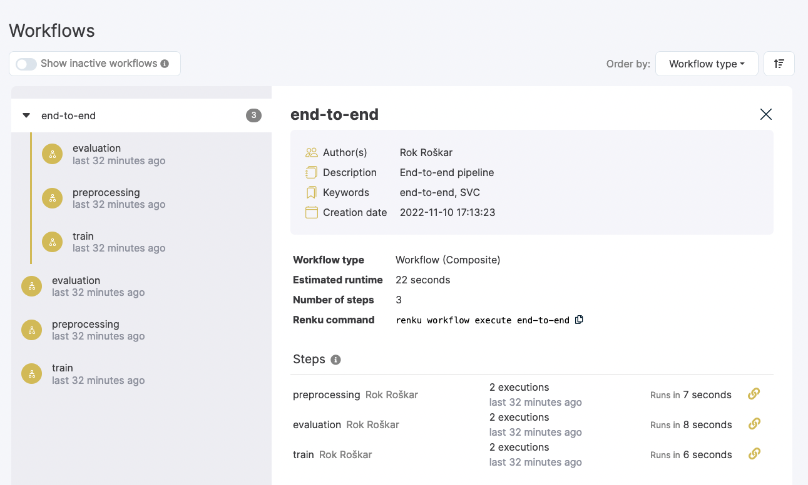
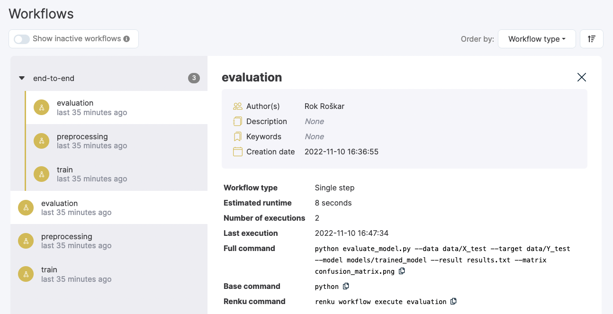

.. _workflows:

Renku Workflows and Provenance
==============================

One of the most important ideas behind Renku is the concept of capturing the
**provenance** of the analysis process. Lets assume we are working with ``input
data``, ``code``, and ``results``:

.. graphviz::
    :align: center

    graph foo {
        rankdir="LR"
        nodesep=0.01
        node [fontname="Raleway"]
        _results [color="white", label="", image="../_static/icons/scatter_plot.svg"]
        results [color="white"]
        _code [color="white", label="", image="../_static/icons/electronics.svg"]
        code [color="white"]
        data [color="white", label="", image="../_static/icons/data_sheet.svg"]
        "input data" [color="white"]

        _results--results [color="white"]
        _code--code [color="white"]
        data--"input data" [color="white"]
    }

If you write a piece of code that takes some input data, processes it and
writes some output to disk, the **provenance graph** would look something like
this:

.. graphviz::
    :align: center

    digraph foo {
        rankdir="LR"
        edge [fontname="Raleway"]
        data [color="white", label="", image="../_static/icons/data_sheet.svg"]
        code [color="white", label="", image="../_static/icons/electronics.svg"]
        results [color="white", label="", image="../_static/icons/scatter_plot.svg"]
        data->code [label="used by"]
        code->results [label="generated"]
    }

Naturally, a ``result`` may also be used as ``input data`` to a subsequent step:

.. graphviz::
    :align: center

    digraph foo {
        edge [fontname="Raleway"]
        rankdir="LR"
        data [color="white", label="", image="../_static/icons/data_sheet.svg"]
        data2 [color="white", label="", image="../_static/icons/data_sheet2.svg"]
        code [color="white", label="", image="../_static/icons/electronics.svg"]
        code2 [color="white", label="", image="../_static/icons/electronics2.svg"]
        results [color="white", label="", image="../_static/icons/scatter_plot.svg"]
        results2 [color="white", label="", image="../_static/icons/scatter_plot2.svg"]
        data->code
        code->results
        results->code2
        data2->code2
        code2->results2
    }

In Renku, we provide tools for building such `workflows` to record and show how
data and code are connected. By encoding these relationships, your project is
easier for you to manage and faster for others to read and reuse! No more
reading through multiple files to understand how they are connected - workflows
make the connections between code and data files easy to understand by listing
each workflow step and its inputs and outputs.

Each time you track an execution with Renku, you create a workflow step.
Encoding a workflow step makes it easier for you to rerun it without retyping
long commands. Recording workflow steps in Renku also records metadata that you
and others can use to understand how an output was generated.

To take full advantage of workflows, join individual steps together into
multi-step workflows. When your code pipeline is encoded as a workflow, you can
easily re-run all or portions of your workflow with simple commands, test your
code with different parameters and compare the results, or send it to different
execution backends.

Working with Workflows on the Command Line
------------------------------------------

To track your code execution as a Renku workflow, simply prepend :meth:`renku
run <renku.ui.cli.run>` in front of your command. You may also identify the
workflow step's inputs and outputs via the ``-i`` and ``-o`` flags, as shown
here:

.. code-block:: console

    $ renku run --name run-analysis -- python run_analysis.py -i input_file.csv -o output_file.csv

This command creates a workflow step called `run-analysis`. You can inspect the
workflow with :meth:`renku workflow show <renku.ui.cli.workflow>`:

.. code-block:: console

    $ renku workflow show run-analysis
    Id: /plans/76d73efb94964e9aac3635176ea57a36
    Name: run-analysis
    Creators: John Doe <example@renku.ch>
    Command: python run_analysis.py -i input_file.csv -o output_file.csv
    Success Codes:
    Inputs:
            - input-1:
                    Default Value: run_analysis.py
                    Position: 1
            - i-2:
                    Default Value: input_file.csv
                    Position: 2
                    Prefix: -i
    Outputs:
            - o-3:
                    Default Value: output_file.csv
                    Position: 3
                    Prefix: -o

Once the workflow is recorded, you can execute it again :meth:`renku workflow execute <renku.ui.cli.workflow>`:

.. code-block:: console

    $ renku workflow execute run-analysis

Similarly, you can re-execute the workflow with modified parameters, for example:

.. code-block:: console

    $ renku workflow execute run-analysis --set i-2=other_input_file.csv

which would run it on the file ``other_input_file.csv`` instead of the original
``input_file.csv`` file. You could also specify an execution backend with
``--provider``, e.g. ``toil`` for execution in an HPC cluster (You need to
install ``renku`` with the ``toil`` extra for this to be available).

Composing workflows on the command line
^^^^^^^^^^^^^^^^^^^^^^^^^^^^^^^^^^^^^^^

To create a workflow ``my-workflow`` out of multiple steps use :meth:`renku workflow compose <renku.ui.cli.workflow>`:

.. code-block:: console

    $ renku workflow compose --link-all my-workflow run-analysis process-output

If you had two steps named ``run-analysis`` and ``process-output``. ``--link-all``
tells Renku to automatically infer dependencies between steps for you. The newly
created ``my-workflow`` can also be executed with :meth:`renku workflow execute <renku.ui.cli.workflow>`.

The Renku Worfklow File
-----------------------

If your workflow has many steps, you might find it most convenient to create a
workflow definition file.

To create a workflow definition file in your project, create a file called
``workflow.yml``. You may have more than one workflow file in your project, and
they can be named however you like (not just ``workflow.yml``).

There are a few options for how you may define your workflow.

In the simplest version of the Renku workflow file, the command, inputs and
outputs are simply listed, as in the example below:

.. code-block:: yaml

    name: Flights Processing Pipeline
    steps:
        filter:
            command: python src/filter_flights.py data/flight-data/2019-01-flights.csv.zip data/output/flights-filtered.csv
            inputs:
                - src/filter_flights.py
                - data/flight-data/2019-01-flights.csv.zip
            outputs:
                - data/output/flights-filtered.csv

This workflow file defines the workflow's name and a sequence of steps. This
file only includes one step, which is named ``filter``. Within the ``filter``
step, list the ``command`` to run, and then we tell Renku which parts of this
command are ``inputs`` and ``outputs`` by copying those paths into the relevant
sections.

To run this workflow file, run:

.. code-block:: console

        $ renku run workflow.yml

Using Templating in a Workflow File
~~~~~~~~~~~~~~~~~~~~~~~~~~~~~~~~~~~

Renku provides a templating feature so that you never have to type the same path
twice. To take advantage of templating, instead of listing the inputs, assign
each input and output a name (such as ``raw-flights``) and a ``path``. Then, we
reference those names in the ``command`` using ``$``.

.. code-block:: yaml

    name: Flights Processing Pipeline
    steps:
        filter:
            command: python $filter-py $raw-flights $filtered-flights
            inputs:
                filter-py:
                    path: src/filter_flights.py
                raw-flights:
                    path: data/flight-data/2019-01-flights.csv.zip
            outputs:
                filtered-flights:
                    path: data/output/flights-filtered.csv

A Multi-Step Workflow File
~~~~~~~~~~~~~~~~~~~~~~~~~~

Below, you can see what the a workflow file looks like for the two-step
workflow.

.. code-block:: yaml

    name: Flights Processing Pipeline
    steps:
        filter:
            command: python $filter-py $raw-flights $filtered-flights
            inputs:
                filter-py:
                    path: src/filter_flights.py
                raw-flights:
                    path: data/flight-data/2019-01-flights.csv.zip
            outputs:
                filtered-flights:
                    path: data/output/flights-filtered.csv

        count:
            command: python $count-py $filtered-flights $flight_count
            inputs:
                count-py:
                    path: src/count_flights.py
                filtered-flights:
                    path: data/output/flights-filtered.csv
            outputs:
                flight_count:
                    path: data/output/flights-count.csv

Executing a workflow file
^^^^^^^^^^^^^^^^^^^^^^^^^

Running `renku run workflow.yml` will execute all steps in the workflow file.

Renku also helps you run only portions of your workflow at a time. For example,
you can execute just one step of the workflow by referencing that step's name:

.. code-block:: console

        $ renku run workflow.yml filter

If we had a longer workflow, perhaps with 10 or more steps, we could specify a
subset of steps to run.

.. code-block:: console

        # runs the step 'filter' and every step after it.
        $ renku run workflow.yml filter:

        # runs every step before 'count', and the 'count' step
        $ renku run workflow.yml :count

        # runs every step between 'filter' and 'count', including 'filter' and 'count' themselves
        $ renku run workflow.yml filter:count

Adding more metadata to a workflow file
^^^^^^^^^^^^^^^^^^^^^^^^^^^^^^^^^^^^^^^

You may provide further details in your workflow definition, such as a
`description` of each paramteter, and `keywords` that describe your workflow.

.. code-block:: yaml

    name: Flights Processing Pipeline
    description: The workflow in the Renku Tutorial
    keywords:
        - tutorial
    steps:
        filter:
            command: python $filter-py $raw-flights $filtered-flights
            description: Filter the raw flights data to only flights to the destination of interest
            inputs:
                filter-py:
                    path: src/filter_flights.py
                raw-flights:
                    description: The raw flights data
                    path: data/flight-data/2019-01-flights.csv.zip
            outputs:
                filtered-flights:
                    description: Flights to the destination of interest
                    path: data/output/flights-filtered.csv

        count:
            command: python $count-py $filtered-flights $flight_count
            description: Count the number of flights
            inputs:
                count-py:
                    path: src/count_flights.py
                filtered-flights:
                    description: Flights to the destination of interest
                    path: data/output/flights-filtered.csv
            outputs:
                flight_count:
                    description: Number of flights to the destination of interest
                    path: data/output/flights-count.csv

Viewing Workflows in RenkuLab
-----------------------------

You can see workflows on RenkuLab by going to a project and opening the
`Workflows` tab:

.. image:: ../_static/images/ui_workflows_list.png
    :align: center
    :alt: Workflows list

There you can view, filter and navigate all workflows and steps used in the
project. Selecting a workflow or step shows you its details (parameters,
dependent steps etc.) and allows you to navigate between steps.

The step detail page shows the command used, the inputs and outputs, the
parameters, and other related metadata:

When an input or an output is available in the project's latest commit, you will
notice a link icon that will bring you to the file browser to get a preview or
download the content.

.. image:: ../_static/images/ui_workflows_file_links.png
    :align: center
    :alt: Workflow step details
