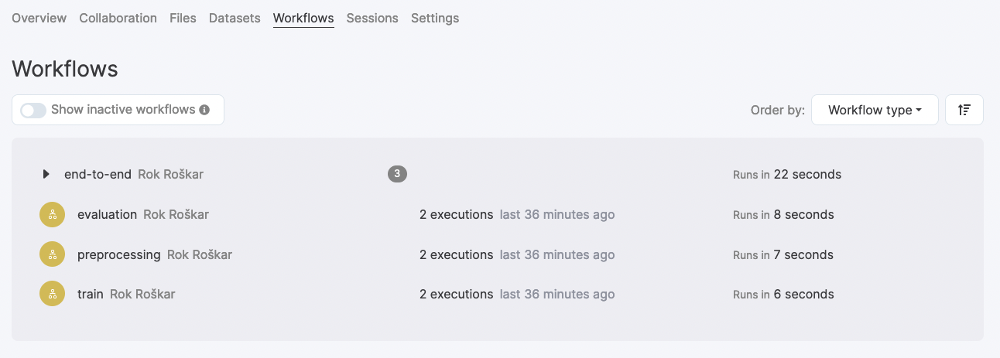
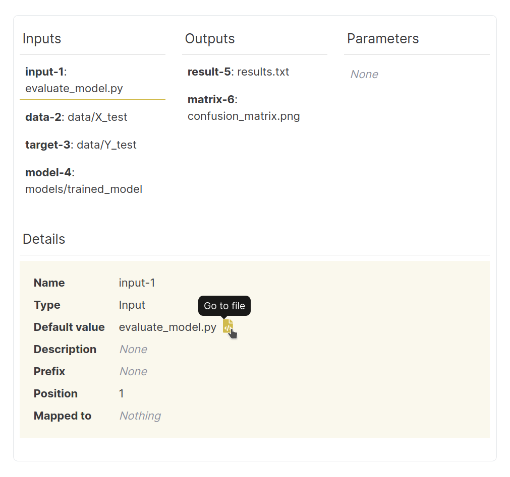

.. _workflow-browser:

Viewing Workflows in RenkuLab
=============================

You can see workflows on RenkuLab by going to a project and opening the
`Workflows` tab:

There you can view, filter and navigate all workflows and steps used in the
project. Selecting a workflow or step shows you its details (parameters,
dependent steps etc.) and allows you to navigate between steps.

.. image:: ../../_static/images/ui_workflows_composite_details.png
    :align: center
    :alt: Workflow details

The step detail page shows the command used, the inputs and outputs, the
parameters, and other related metadata:

.. image:: ../../_static/images/ui_workflows_details.png
    :align: center
    :alt: Workflow step details

When an input or an output is available in the project's latest commit, you will
notice a link icon that will bring you to the file browser to get a preview or
download the content.

