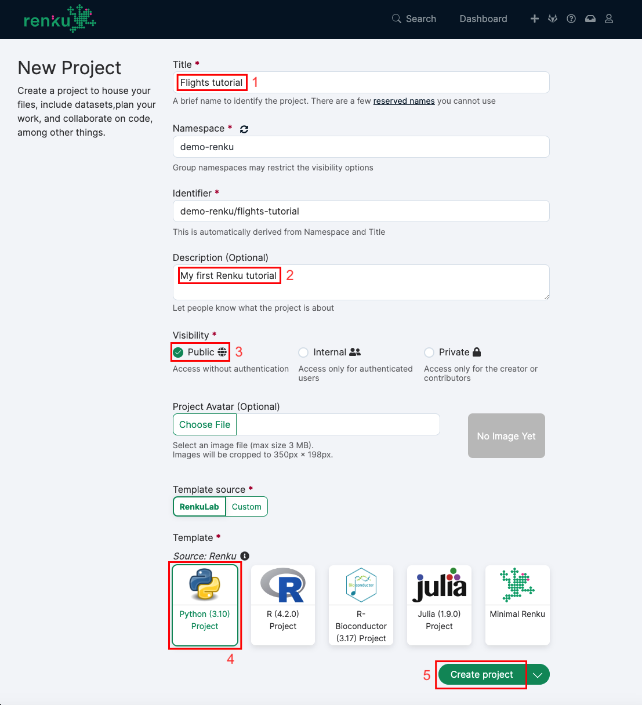

.. _create_project:

Create a new project
--------------------

First, head to renkulab.io_ (or your own instance of
Renku) and click on the **Login** button located on the top right corner of
the Renku web interface.

On renkulab.io_ you can create an account or sign in with your GitHub
identity by clicking on the corresponding button.

Once logged in, create a new project by going to the **Projects** (1) page
and clicking on the **New Project** (2) button.

.. image:: ../../_static/images/ui_01_create-project.png
    :width: 100%
    :align: center
    :alt: Head to new project page

Enter **Flights Tutorial** as your project title (1); if you wish, change
the visibility (or leave it *public*) (2); select the "Basic Python Project"
template (3); fill in an optional description (4) and any other parameters
appearing after selecting the template.
Click on the **Create project** button (5).

Now that we have a project, we can start working on it by starting a
new JupyterLab notebook server. Click on **Environments** (1),
then on **New** (2).

.. image:: ../../_static/images/ui_03.1_notebook-servers.png
    :width: 100%
    :align: center
    :alt: Head to environments page

The Docker image takes some time to build, it's possible that the
status is still **building**. It will automatically refresh when
it's ready. Sit tight and wait for it to become **available**

.. image:: ../../_static/images/ui_03.2_notebook-servers.png
    :width: 100%
    :align: center
    :alt: Start new environment

The default settings are fine for this tutorial: just click on
**Start environment** (3). You will see a table with the  status
of the environment launch (initially in yellow) on the right.
Wait until its color has turned to green and the status from
*Pending* to *Running*.

.. note::

    Please be patient, the first time you start a server it may require
    some time to launch.

You can now connect to the server by clicking on the **Connect** button (1).

.. image:: ../../_static/images/ui_04_connect-to-server.png
    :width: 100%
    :align: center
    :alt: Connect to environment

.. _renkulab.io: https://renkulab.io
.. _documentation: https://renku.readthedocs.io/
.. _papermill: https://papermill.readthedocs.io/en/latest/
