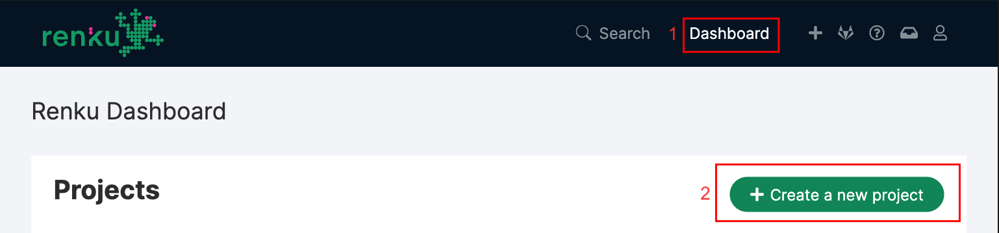

.. _create_project:

Create a new project
--------------------

First, head to renkulab.io_ (or your own instance of
Renku) and click on the **Login** button located on the top right corner of
the Renku web interface.

On renkulab.io_ you can create an account or sign in with your GitHub
identity by clicking on the corresponding button.

Once logged in, create a new project by going to the **Dashboard** (1) page
and clicking on the **Create a new project** (2) button.

On the project creation page:

* Enter **Flights Tutorial** as your project title (1).
* Fill in an optional description (2).
* If you wish, change the visibility (or leave it *public*) (3).
* Select an appropriate Renku template (in this tutorial, either Python, R or Julia) (4).
* Fill in any required parameters appearing after selecting the template.
* Click on the **Create project** button (5).

.. image:: ../../_static/images/ui_02_new-project.png
    :width: 100%
    :align: center
    :alt: Create a new project

.. _renkulab.io: https://renkulab.io
