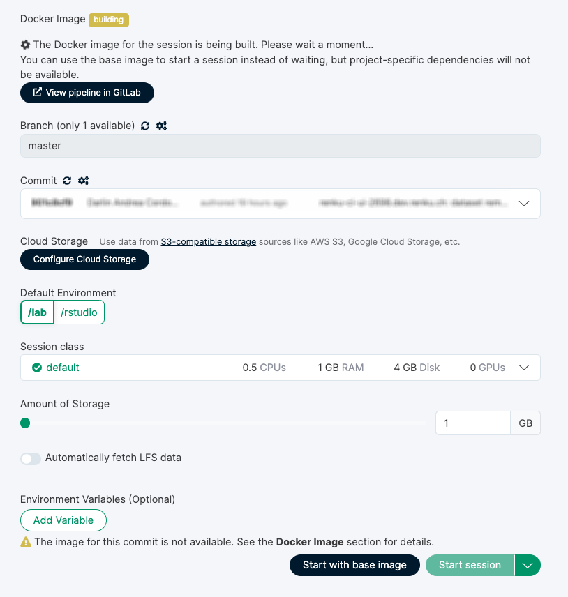
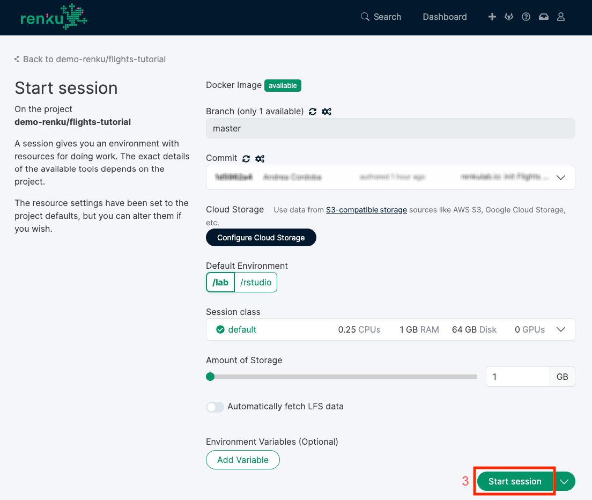
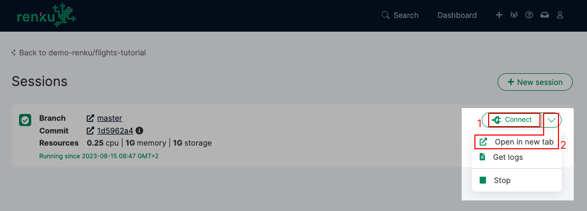

.. _start_session:

Start a session
--------------------------------

One of the main collaborative features of the Renku platform are hosted
sessions. These sessions are fully-featured Jupyter notebook
servers running either JupyterLab, RStudio, VSCode or a fully-featured Linux
desktop using VNC. We will use JupyterLab and RStudio for this tutorial.

In the previous step we :ref:`created a new project <create_project>` using
the Python, Julia or R template; we can start working with the project right from the
browser by starting a session in end-points mentioned above.

There are a few ways of initiating a session. The one-click **Start** button
(1) uses all the default settings to initiate a session. 

.. image:: ../../_static/images/ui_03_start-session.png
    :width: 100%
    :align: center
    :alt: Head to sessions page

This is sufficient for this tutorial, however you may also click on
**New session** (2) to customize the settings with which to start a session. 
For example, you can select the computational requirements and commit to launch from. 

The Docker image takes some time to build, it's possible that the
status is still **building**. It will automatically refresh when
it's ready. Sit tight and wait for it to become **available**.

The default settings are fine for this tutorial. Choose either */lab* or */rstudio* depending on your
project type and then click on **Start session** (3). You will see a table with the status
of the environment launch (initially in yellow) on the right.
Wait until its color has turned to green and the status from
*Pending* to *Running*.

.. note::

    Please be patient, the first time you start a server it may require
    some time to launch.

You can now connect to your session by clicking on the **Open** button (1),
which will open the session in the same browser tab, or you can **Open in new tab**
(2) which will open the session in a new tab. You can have both of these open
at the time time too, so you do not need to worry about choosing between the two.

