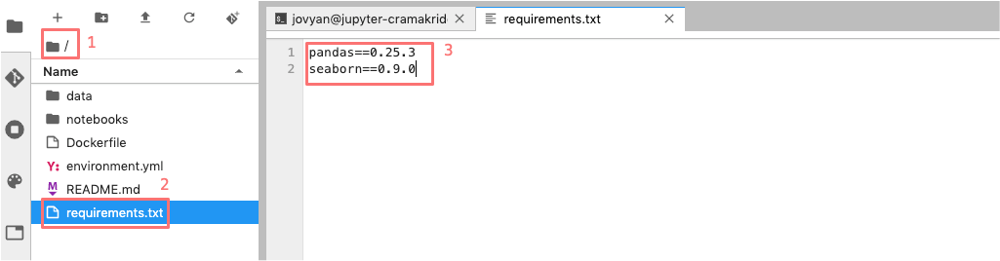

.. _python_environment:

Install and manage Python packages
----------------------------------

Defining your runtime environment is critical if you would like others to be
able to reuse your work. To achieve this, it is necessary to manage the
software libraries that are needed for your code to execute.

In Renku, we rely on existing conventions for specifying the execution
environment. In Python, the ``requirements.txt`` file is a standard way to
specify the required libraries. When you created your project, an empty
``requirements.txt`` was also created --- find it in the file browser of your
JupyterLab session by clicking on the **root** button (1), then double-click
the file (2) to open the editor. For the tutorial, we will need the ``pandas``
and ``seaborn`` libraries. We will require specific versions to ensure that the
same environment can be recreated in the future. Enter the following into the
``requirements.txt`` file on the right (3)

.. code-block:: console

    pandas==0.25.3
    seaborn==0.9.0

and **save** it:

Going back to the same terminal session as before, we can now
install these packages with ``pip``:

.. code-block:: console

    pip install -r requirements.txt

    # Collecting pandas==0.25.3
    # Downloading https://files.pythonhosted.org/packages/63/e0/a1b39cdcb2c391f087a1538bc8a6d62a82d0439693192aef541d7b123769/pandas-0.25.3-cp37-cp37m-manylinux1_x86_64.whl (10.4MB)
    #     |████████████████████████████████| 10.4MB 3.1MB/s
    # Collecting seaborn==0.9.0
    # Downloading https://files.pythonhosted.org/packages/a8/76/220ba4420459d9c4c9c9587c6ce607bf56c25b3d3d2de62056efe482dadc/seaborn-0.9.0-py3-none-any.whl (208kB)
    #     |████████████████████████████████| 215kB 20.0MB/s
    # Collecting pytz>=2017.2
    # Downloading https://files.pythonhosted.org/packages/e7/f9/f0b53f88060247251bf481fa6ea62cd0d25bf1b11a87888e53ce5b7c8ad2/pytz-2019.3-py2.py3-none-any.whl (509kB)
    #     |████████████████████████████████| 512kB 14.1MB/s
    # Collecting numpy>=1.13.3
    # Downloading https://files.pythonhosted.org/packages/63/0c/0261693cc3ad8e2b66e66dc2d2676a2cc17d3efb1c58a70db73754320e47/numpy-1.18.1-cp37-cp37m-manylinux1_x86_64.whl (20.1MB)
    #     |████████████████████████████████| 20.1MB 37.4MB/s
    # Requirement already satisfied: python-dateutil>=2.6.1 in /opt/conda/lib/python3.7/site-packages (from pandas==0.25.3->-r requirements.txt (line 1)) (2.8.1)
    # Collecting matplotlib>=1.4.3
    # Downloading https://files.pythonhosted.org/packages/61/42/3e92d7aa64295483fbca20a86c89b34d0cb43cffaadaffe028793902d790/matplotlib-3.1.2-cp37-cp37m-manylinux1_x86_64.whl (13.1MB)
    #     |████████████████████████████████| 13.1MB 16.0MB/s
    # Collecting scipy>=0.14.0
    # Downloading https://files.pythonhosted.org/packages/dd/82/c1fe128f3526b128cfd185580ba40d01371c5d299fcf7f77968e22dfcc2e/scipy-1.4.1-cp37-cp37m-manylinux1_x86_64.whl (26.1MB)
    #     |████████████████████████████████| 26.1MB 105kB/s
    # Requirement already satisfied: six>=1.5 in /opt/conda/lib/python3.7/site-packages (from python-dateutil>=2.6.1->pandas==0.25.3->-r requirements.txt (line 1)) (1.13.0)
    # Collecting cycler>=0.10
    # Downloading https://files.pythonhosted.org/packages/f7/d2/e07d3ebb2bd7af696440ce7e754c59dd546ffe1bbe732c8ab68b9c834e61/cycler-0.10.0-py2.py3-none-any.whl
    # Collecting kiwisolver>=1.0.1
    # Downloading https://files.pythonhosted.org/packages/93/f8/518fb0bb89860eea6ff1b96483fbd9236d5ee991485d0f3eceff1770f654/kiwisolver-1.1.0-cp37-cp37m-manylinux1_x86_64.whl (90kB)
    #     |████████████████████████████████| 92kB 827kB/s
    # Collecting pyparsing!=2.0.4,!=2.1.2,!=2.1.6,>=2.0.1
    # Downloading https://files.pythonhosted.org/packages/5d/bc/1e58593167fade7b544bfe9502a26dc860940a79ab306e651e7f13be68c2/pyparsing-2.4.6-py2.py3-none-any.whl (67kB)
    #     |████████████████████████████████| 71kB 232kB/s
    # Requirement already satisfied: setuptools in /opt/conda/lib/python3.7/site-packages (from kiwisolver>=1.0.1->matplotlib>=1.4.3->seaborn==0.9.0->-r requirements.txt (line 2)) (41.6.0.post20191101)
    # Installing collected packages: pytz, numpy, pandas, cycler, kiwisolver, pyparsing, matplotlib, scipy, seaborn
    # Successfully installed cycler-0.10.0 kiwisolver-1.1.0 matplotlib-3.1.2 numpy-1.18.1 pandas-0.25.3 pyparsing-2.4.6 pytz-2019.3 scipy-1.4.1 seaborn-0.9.0

And we need to capture this change in git.

.. code-block:: console

    git add requirements.txt
    git commit -m "Installed pandas and seaborn"
    git push

    # [master 1772863] Installed pandas and seaborn
    # 1 file changed, 2 insertions(+)
    # Counting objects: 3, done.
    # Delta compression using up to 8 threads.
    # Compressing objects: 100% (2/2), done.
    # Writing objects: 100% (3/3), 313 bytes | 313.00 KiB/s, done.
    # Total 3 (delta 1), reused 0 (delta 0)
    # To https://dev.renku.ch/gitlab/john.doe/flights-tutorial.git
    #     91b226b..c1dcfe4  master -> master

.. warning::

  Make sure that you update the *requirements.txt* file after you install
  new packages. This ensures that the packages needed to work on your project
  will be available to your peers when collaborating on a project.

When an updated *requirements.txt* file is pushed to renkulab, renkulab will
rebuild the software stack used for the interactive environments. If you shut
down an interactive environment, the next time you start a new one,
the packages specified in ``requirements.txt`` will already be
available in the new environment.

.. _renkulab.io: https://renkulab.io
.. _documentation: https://renku.readthedocs.io/
.. _papermill: https://papermill.readthedocs.io/en/latest/
