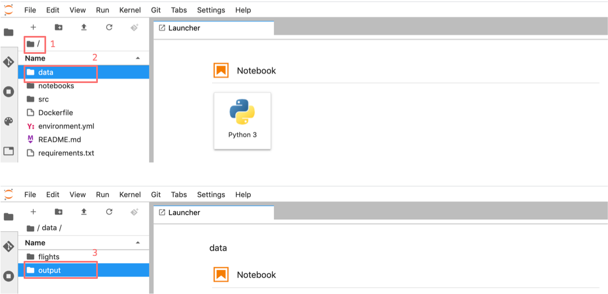
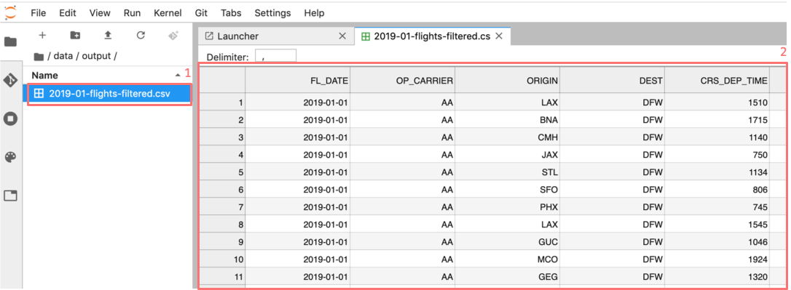

.. _create_workflow:

Build a reproducible workflow
-----------------------------

Create a workflow step
^^^^^^^^^^^^^^^^^^^^^^

Now we will use ``renku`` to create a reproducible, reusable "workflow". A
workflow consists of a series of steps, each of which may consume some input
files, execute code, and produce output files. The outputs of one step are
frequently the inputs of another --- this creates a connection between the code
execution and results. When workflows become more complex, the bookkeeping can
be tedious. That is where Renku comes in --- it is designed to keep
track of these dependencies for you. We will illustrate some of these concepts
with a simple example (see also the :ref:`workflows` in the documentation).

Start with a clean project
~~~~~~~~~~~~~~~~~~~~~~~~~~

First, let us make sure the project repository is clean. Run:

.. code-block:: console

    $ git status

    On branch master
    Your branch is up-to-date with 'origin/master'.
    nothing to commit, working directory clean

Make sure the output ends with ``nothing to commit, working tree clean``.
Otherwise, you have to clean up your project repository by either removing
the changes or committing them to the repository.

.. note::

    You can undo your changes with:

    .. code-block:: console

        $ git checkout .
        $ git clean -fd

    Or, if you want to keep your changes, commit with:

    .. code-block:: console

        $ renku save -m "My changes"

Run and record a workflow step
~~~~~~~~~~~~~~~~~~~~~~~~~~~~~~

The ``filter_flights.\*`` script takes two input parameters:

1. a file to process as an input
2. a path for storing the output.

So to run it, we would normally execute the following:

.. tab-set::

    .. tab-item:: Python
        :sync: python

        .. code-block:: console

            # Here for comparison -- do not run these lines
            $ # mkdir -p data/output
            $ # python src/filter_flights.py data/flight-data/2019-01-flights.csv.zip data/output/flights-filtered.csv

    .. tab-item:: Julia
        :sync: julia

        .. code-block:: console

            # Here for comparison -- do not run these lines
            $ # julia src/FilterFlights.jl data/flight-data/2019-01-flights.csv.zip data/output/flights-filtered.csv

    .. tab-item:: R
        :sync: R

        .. code-block:: console

            # Here for comparison -- do not run these lines
            $ # Rscript src/RunFilterFlights.R data/flight-data/2019-01-flights.csv.zip data/output/flights-filtered.csv

For renku to capture information about the execution, we need to make a small
change: we prepend ``renku run`` to relevant command:

.. tab-set::

    .. tab-item:: Python
        :sync: python

        .. code-block:: console

            # Create the output directory
            $ mkdir -p data/output
            $ renku run --name filter-flights -- python src/filter_flights.py data/flight-data/2019-01-flights.csv.zip data/output/flights-filtered.csv

            Info: Adding these files to Git LFS:
                data/output/flights-filtered.csv

    .. tab-item:: Julia
        :sync: julia

        .. code-block:: console

            $ renku run --name filter-flights -- julia src/FilterFlights.jl data/flight-data/2019-01-flights.csv.zip data/output/flights-filtered.csv

            Info: Adding these files to Git LFS:
                data/output/flights-filtered.csv

    .. tab-item:: R
        :sync: R

        .. code-block:: console

            $ renku run --name filter-flights -- Rscript src/RunFilterFlights.R data/flight-data/2019-01-flights.csv.zip data/output/flights-filtered.csv

            Info: Adding these files to Git LFS:
                data/output/flights-filtered.csv

Go ahead and run this command: it will create the preprocessed data file,
including the specification of *how* this file was created, and commit all the
changes to the repository.

The ``--name`` option allows you to name the workflow that's created by
``renku run`` to make it easier to reuse it later.

Workflows created in this way don't just track past executions, but also define
workflow templates (Called ``Plans`` in Renku) that can be executed with
arbitrary parameters on different workflow backends and exported to other
workflow languages.
See the `renku command line docs <https://renku.readthedocs.io/en/latest/renku-python/docs/reference/commands.html>`_
for more information on this and other commands.

.. note::

    Did you get an error like this?

    .. code-block:: console

        Error: The repository is dirty. Please use the "git" command to clean it.
        On branch master
        Your branch is up to date with 'origin/master'.
        Untracked files:
        (use "git add <file>..." to include in what will be committed)
                data/output/

    This may be because you accidentally ran the plain Python/Julia/R command first.

    Remove the untracked files and this time execute `only` the renku command

    .. code-block:: console

        $ rm data/output/*
        $ renku run --name filter-flights -- X src/filterFlights.X data/flight-data/2019-01-flights.csv.zip data/output/flights-filtered.csv

    where X stands for the particular language you are using.

.. note::

    Did you get an error like this instead?

    .. code-block:: console

        Traceback (most recent call last):
        File "src/filter_flights.py", line 26, in <module>
            df.to_csv(output_path, index=False)
        File "/opt/conda/lib/python3.7/site-packages/pandas/core/generic.py", line 3228, in to_csv
            formatter.save()
        File "/opt/conda/lib/python3.7/site-packages/pandas/io/formats/csvs.py", line 183, in save
            compression=self.compression,
        File "/opt/conda/lib/python3.7/site-packages/pandas/io/common.py", line 399, in _get_handle
            f = open(path_or_buf, mode, encoding=encoding, newline="")
        FileNotFoundError: [Errno 2] No such file or directory: 'data/output/flights-filtered.csv'
        Error: Command returned non-zero exit status 1.

    If in the process of working through the tutorial, you stopped the
    session and started a new one along the way, this may
    happen. Why?
    `Under the hood <https://renku.readthedocs.io/en/latest/user/data.html>`_,
    we use
    `git-lfs <https://git-lfs.github.com/>`_
    to save large files, and these files may not be fetched when a new
    environment is started. We try to retrieve them automatically when needed
    for a Renku command, but that may not always work.

    If you check the ``data/flight-data/2019-01-flights.csv.zip`` file you
    will see only a few lines of metadata starting with
    ``version https://git-lfs.github.com/spec/v1``. You can easily
    fetch the data manually from the console by running

    .. code-block:: console

      $ git lfs pull

      Downloading LFS objects: 100% (1/1), 66MB | 22 MB/s

    Another way to verify that your lfs files have been fetched is running the
    ``ls-files`` command and check if every file has a "*" (pulled) or a "-"
    (not pulled)

    .. code-block:: console

      $ git lfs ls-files

      2b1851ab60 * data/flight-data/2019-01-flights.csv.zip

.. warning::

   Do *not* make any edits to the code before the ``renku run``
   command is finished. In order to keep track of the outputs of
   your script, Renku will automatically add the changes to
   ``git``. If you want to modify your project while a ``renku`` command
   is executing, you should create a new branch.

**Aside: looking at data in JupyterLab**

The original zip file is not easy to visualize in Jupyter,
but the csv output of filtering can be opened from JupyterLab by navigating to
the **File** tab on the top left (1), then clicking ``data``
folder (2) and ``output`` (3).

Opening the file
``flights-filtered.csv`` (1),
we can see its contents (2).

Add a second workflow step
^^^^^^^^^^^^^^^^^^^^^^^^^^

We will now use a second script to count the flights in the filtered data file.
As before, we will fast-forward through this step by downloading the solution.

The respective interactive versions can be found below and you can copy them
to your project as before if you wish to play with the data interactively.
We also provide the script versions to be run with the ``renku run`` command.

.. tab-set::

    .. tab-item:: Python
        :sync: python

        For the next step you must download the script from `here
        <https://renkulab.io/projects/renku-tutorials/renku-tutorial-flights-material/files/blob/src/count_flights.py>`_,
        and then drop it into the ``src`` directory as with the ``filter_flights.py`` script.

    .. tab-item:: Julia
        :sync: julia

        `Download Julia script
        <https://renkulab.io/projects/renku-tutorial/flights-tutorial-julia/files/blob/.tutorial/meta/templates/CountFlights.jl>`_
        and drop it in the ``src`` directory.

    .. tab-item:: R
        :sync: R

        `Download R script
        <https://renkulab.io/projects/renku-tutorial/flights-tutorial-r/files/blob/.tutorial/meta/templates/CountFlights.R>`_,
        and drop it in the ``src`` directory.

After uploading the script to your project, make sure you save your work:

.. code-block:: console

    $ renku save -m 'added the script to count flights'

Now we are ready to create a second step of our workflow. First,
make sure your repository is "clean":

.. code-block:: console

    $ git status

    On branch master
    Your branch is up-to-date with 'origin/master'.

    nothing to commit, working directory clean

If the output does not end with ``nothing to commit, working tree clean``,
cleanup the project repository by either removing the changes or
committing them.

.. note::

    You can undo your changes with:

    .. code-block:: console

        git checkout .
        git clean -fd

    Or, if you want to keep your changes, commit with:

    .. code-block:: console

        $ renku save

We can now use ``renku run`` to generate the second step of our workflow:

.. tab-set::

    .. tab-item:: Python
        :sync: python

        .. code-block:: console

            $ renku run --name count-flights -- python src/count_flights.py data/output/flights-filtered.csv data/output/flights-count.txt

            There were 23078 flights to Austin, TX in Jan 2019.
            $ renku save

    .. tab-item:: Julia
        :sync: julia

        .. code-block:: console

            $ renku run --name count-flights -- julia src/CountFlights.jl data/output/flights-filtered.csv data/output/flights-count.txt

            There were 23078 flights to Austin, TX in Jan 2019.
            $ renku save

    .. tab-item:: R
        :sync: R

        .. code-block:: console

            $ renku run --name count-flights -- Rscript src/CountFlights.R data/output/flights-filtered.csv data/output/flights-count.txt

            There were 23078 flights to Austin, TX in Jan 2019.
            $ renku save
