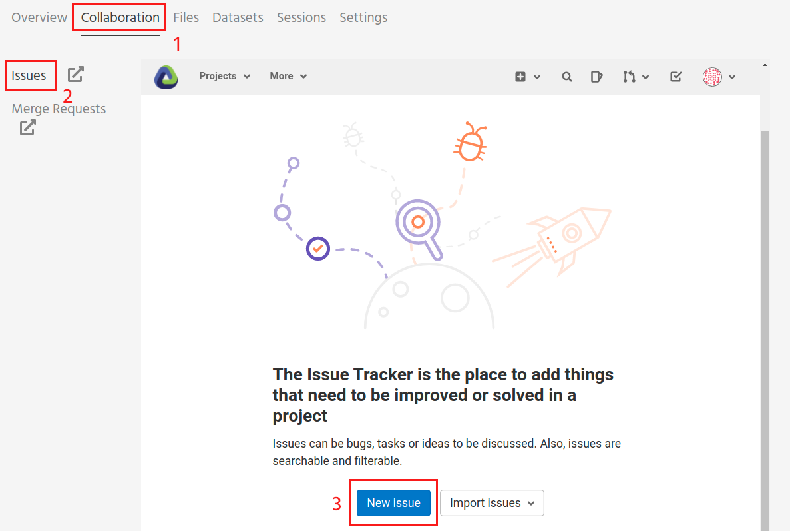
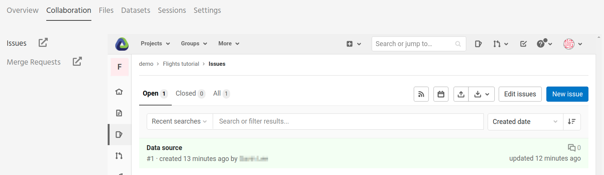
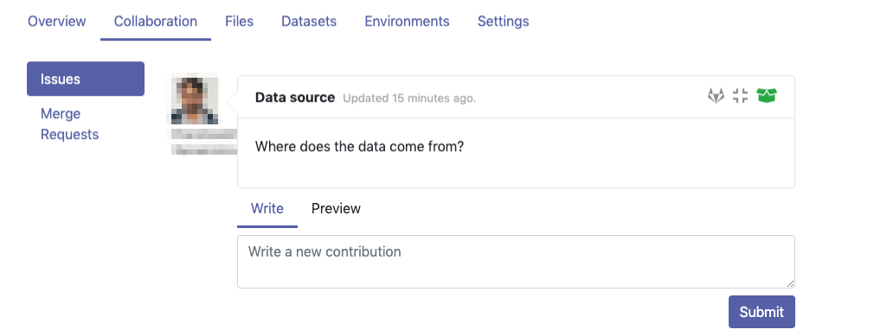
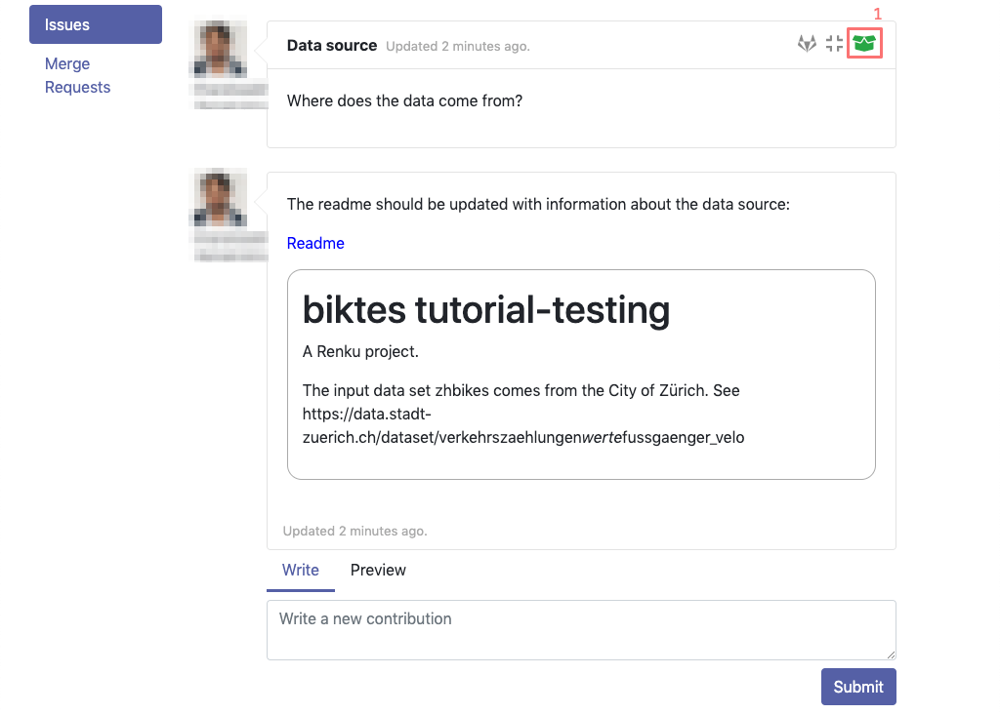
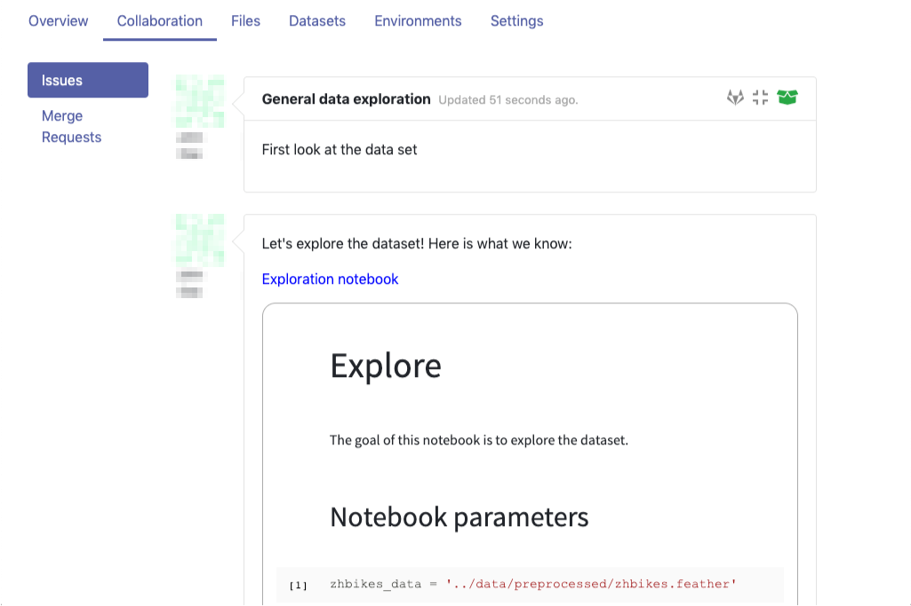

.. _sharing_is_caring:

Share your results and collaborate with your peers
--------------------------------------------------

In this section, we will see how to use Renku to collaborate on projects. For
an overview on collaboration, see :ref:`collaborating`.

Discussions with Issues
^^^^^^^^^^^^^^^^^^^^^^^

Let us start by going back to the Renku web interface on renkulab.io_ or
whichever instance you are using for this tutorial. Make sure you are logged
in, so you can see your projects list by clicking on ``Projects`` in the top
navigation bar.

Click on your ``flights-tutorial`` project to open it and then go to the
**Issues** sub tab (2) of the **Collaboration** tab (1). It is probably empty
at the moment, so let us start a new discussion by clicking on the
**New Issue** button (3).

In the **New Issue** form, fill in the **Title** and **Description**
as follows.

* Title: Data source
* Description: Where does the data come from?

Do not change the **Visibility** and click on **Create**.

The **Issues** sub tab should now list the newly created issue.

In Renku, issues are media-rich discussions you can use to help keep track of
your work and to collaborate with others.

To participate in a given issue and add comments, click on the title.

This will display the thread of comments from the selected issue.
To write something and add it to the discussion, use the text
box and click submit.

The comments are entered using the Markdown format (`cheatsheet here <https://github.com/adam-p/markdown-here/wiki/Markdown-Cheatsheet>`_). You can also embed notebook files
and markdown files to have them rendered in-line in the issue body or comment.
The syntax is as follows:

.. code-block:: console

    

Let us try this with our question about where the data is coming from.
Copy and paste the following text in the text box and hit **Submit**.

.. code-block:: console

    The readme should be updated with information about the data source:

    

.. image:: ../../_static/images/ui_08_issue-comment-1.png
    :width: 85%
    :align: center
    :alt: Issue example 1 in Renku UI

Now, you can use **Launch JupyterLab** to open and edit the ``README.md`` file.
You can mention that the data comes from the *US Dept. of Transportation,
Bureau of Transportation Statistics*, with a link to its home page:
https://www.transtats.bts.gov

To update the repository after changing the ``README.md`` file, open a console
by clicking on the '+' button and then selecting **Terminal**.

Use ``git`` to save your changes:

.. code-block:: console

    git add README.md
    git commit -m"Added data source information to the Readme"
    git push

Now that the ``README.md`` file has been updated, we can **Close**
the issue (1).

Doing so indicates that the corresponding discussion is closed.
This can be useful to sort discussions and find out what is currently
work-in-progress and what has been completed within the project.

Now, let us create another issue and embed a notebook in the discussion.

* Title: General data exploration
* Description: First look at the dataset

Add a comment with the following content:

.. code-block:: console

    Let's explore the dataset! Here is what we know:

    

After creating the issue, you will see the contents of the notebook displayed
in the comment. You can collapse/expand the notebook display by clicking on its
title in blue.

.. _renkulab.io: https://renkulab.io
.. _documentation: https://renku.readthedocs.io/
.. _papermill: https://papermill.readthedocs.io/en/latest/
