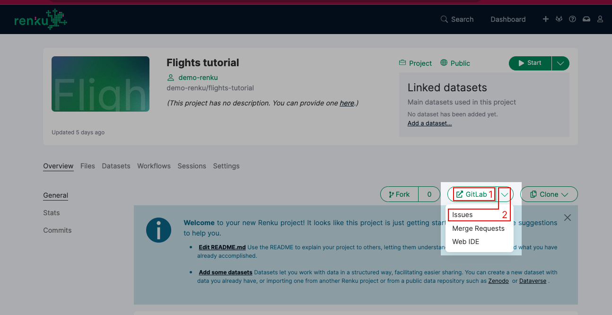
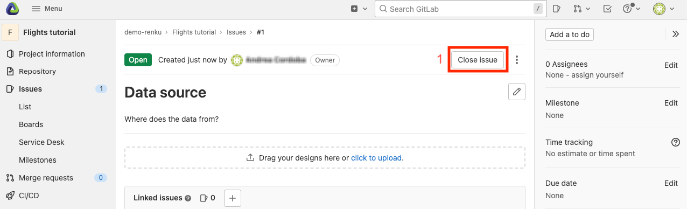

.. _sharing_is_caring:

Share your results and collaborate with your peers
--------------------------------------------------

In this section, we will see how to use Renku to collaborate on projects. For
an overview on collaboration, see :ref:`collaborating`.

A view of Issues and Merge Requests
^^^^^^^^^^^^^^^^^^^^^^^^^^^^^^^^^^^

Let us start by going back to the Renku web interface on renkulab.io_ or
whichever instance you are using for this tutorial. Make sure you are logged
in, so you can see your projects list by clicking on ``Dashboard`` in the top
navigation bar.

Click on your ``Flights-tutorial`` project to open it and then locate and click on the **GitLab** button (1).
This button serves as a convenient shortcut to access the GitLab **Issues** (2) and **Merge Requests** view.
This action will take you to the GitLab page, allowing you to both observe existing Issues and Merge Requests
and initiate new ones. Since the current state might show no content, you can begin a fresh discussion
by clicking the **New Issue** button (3).

.. image:: ../../_static/images/ui_05_new-issue.png
    :width: 85%
    :align: center
    :alt: New issue in Renku UI

In the **New Issue** form, fill in the **Title** and **Description**
as follows.

* Title: Data source
* Description: Where does the data come from?

Click on **Submit issue**. The **Issues** sub tab should now list the newly created issue.

The issues can be viewed directly in this window.

.. image:: ../../_static/images/ui_06_issues-list.png
    :width: 85%
    :align: center
    :alt: Issues in Gitlab view

Once the issue has been resolved, it can be closed in the same way (1).

.. _renkulab.io: https://renkulab.io
.. _documentation: https://renku.readthedocs.io/
.. _papermill: https://papermill.readthedocs.io/en/latest/
