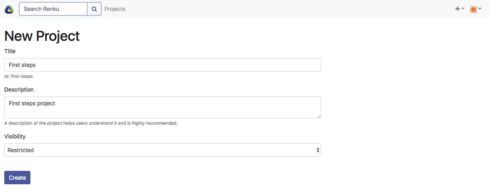
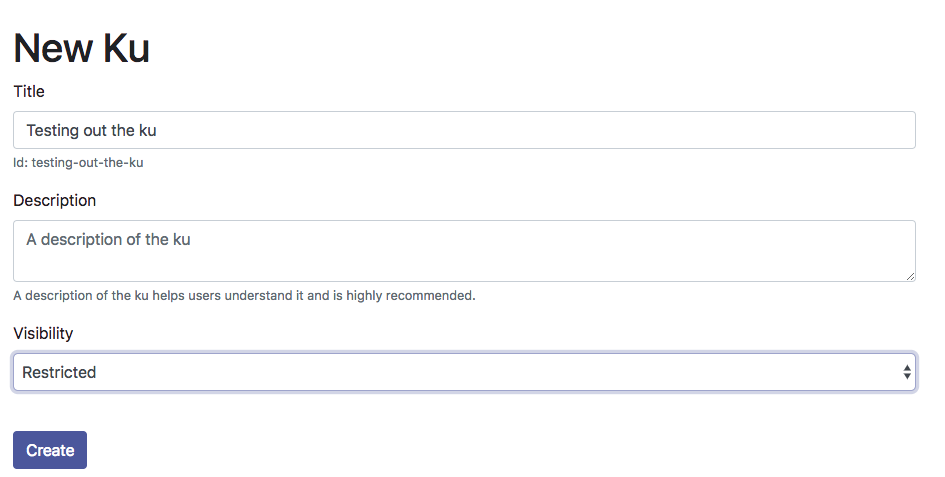
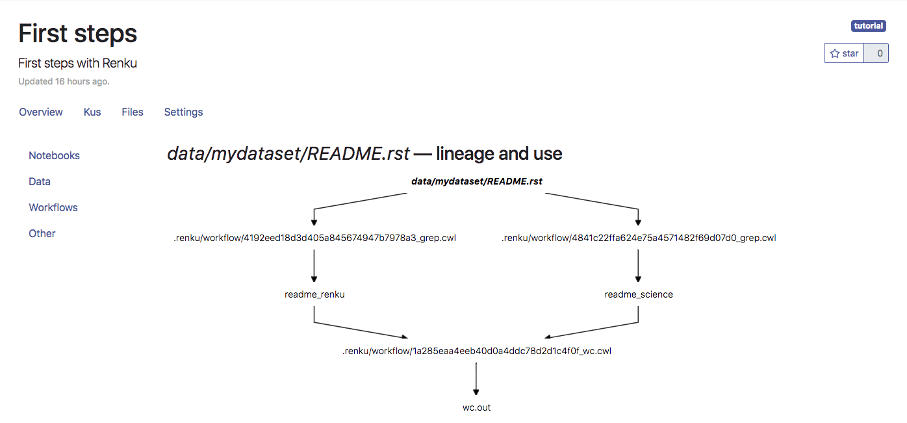

.. _first_steps:

First Steps
===========

.. meta::
    :description: First steps with Renku
    :keywords: hello world, first steps, starter, primer

This hands-on tutorial will lead you through the creation of a data science
project using Renku. Along the way, you will execute familiar data analysis
tasks, but capturing the lineage of your progress with Renku along the way.
Finally, if you have access to a running Renku platform, you will use the web
user interface to inspect the captured lineage and spin up an interactive
environment.

Before continuing with this tutorial, please make sure you have
:ref:`installed the command-line client <cli_installation>`.

Our first Renku project
---------------------------

First, create a project directory:

.. code-block:: console

    mkdir -p ~/renku-projects/myproject
    cd ~/renku-projects/myproject

Initialize the project as a Renku project:

.. code-block:: console

    renku init

This command created a git repository for your project and an additional
`.renku` sub-directory:

.. code-block:: console

    ls -la .renku

    total 8
    drwxr-xr-x  3 rok  staff  102 May 22 17:23 .
    drwxr-xr-x  8 rok  staff  272 May 22 17:23 ..
    -rw-r--r--  1 rok  staff  308 May 22 17:23 metadata.yml

Create a dataset and import data
--------------------------------

Creating datasets is useful to group pieces of data together for e.g. sharing
or publication.

.. code-block:: console

    renku dataset create mydataset

    Creating a dataset ... OK
    ls -l data

    total 0
    drwxr-xr-x  3 rok  staff  102 May 22 17:30 mydataset

At this point, our dataset just consists of metadata in JSON-LD format:

.. code-block:: console

    cat data/mydataset/metadata.yml

    '@context':
      added: http://schema.org/dateCreated
      affiliation: scoro:affiliate
      authors:
        '@container': '@list'
      created: http://schema.org/dateCreated
      dcterms: http://purl.org/dc/terms/
      dctypes: http://purl.org/dc/dcmitypes/
      email: dcterms:email
      files:
        '@container': '@index'
      foaf: http://xmlns.com/foaf/0.1/
      identifier:
        '@id': dctypes:Dataset
        '@type': '@id'
      name: dcterms:name
      prov: http://www.w3.org/ns/prov#
      scoro: http://purl.org/spar/scoro/
      url: http://schema.org/url
    '@type': dctypes:Dataset
    authors:
    - '@type': dcterms:creator
      affiliation: null
      email: roskarr@ethz.ch
      name: Rok Roskar
    created: 2018-05-22 15:30:06.071631
    files: {}
    identifier: 6a354882-8308-42c0-9516-0b3c55b81f53
    name: mydataset

We can import data from a variety of sources: local directories, remote URLs,
local or remote git repositories or other renku project. Here, we will import the
`README` file of this repo from the web:

.. code-block:: console

    renku dataset add mydataset https://raw.githubusercontent.com/SwissDataScienceCenter/renku/master/README.rst

Until now, we have created a Renku project and populated it with a dataset and
some data. Next, we will see how to use Renku to create a repeatable workflow.

Running a reproducible analysis
-------------------------------

For the purpose of the tutorial, we will count the number of lines the words
"science" and "renku" appear on in our `README` document by using standard
UNIX commands `grep` and `wc`.

First, get all occurrences of "science" and "renku":

.. code-block:: console

    renku run grep -i science data/mydataset/README.rst > readme_science
    renku run grep -i renku data/mydataset/README.rst > readme_renku

Now, combine these intermediate outputs into our final calculation:

.. code-block:: console

    renku run wc readme_science readme_renku > wc.out

For each of our invocations of `renku run`, Renku recorded the command we
executed into a `Common Workflow Language <http://www.commonwl.org/>`_ (CWL)
step. Renku uses this information to keep track of the lineage of data. For
example, we can see the full lineage of `wc.out` using the `renku log`
command:

.. code-block:: console

    renku log wc.out

    *  c53dbfa0 wc.out
    *    c53dbfa0 .renku/workflow/80a3f98ede2346f6bc686200016b17d6_wc.cwl
    |\
    * |  18bb2c64 readme_science
    * |  18bb2c64 .renku/workflow/edb4c0b1b4b44d2fb2aff45a8960f905_grep.cwl
    | *  faa4f82a readme_renku
    | *  faa4f82a .renku/workflow/3b454003c5884ee8b5b8a943665447fe_grep.cwl
    |/
    @  c7b5f922 data/mydataset/README.rst

This sequence represents the basic building blocks of a reproducible
scientific analysis workflow enabled by Renku. Each component of the workflow
we produced is bundled with metadata that allows us to continue to track
its lineage and therefore to reuse it as a building block in other projects
and workflows.

Updating results based on new input data
----------------------------------------

Suppose our input data changes -- what are the consequences for the downstream
analysis? Renku gives you some simple tools to inspect the state of your
project and, if necessary, update results in response to new data or even
changed source code.

Lets modify one of the two files we are using here -- open a text editor and
simply remove the first few lines from ``data/mydataset/README.rst``. When you
are done, commit your change with this command:

.. code-block:: console

    git commit -am 'modified README.rst'

To see what effect this has on the steps we have done so far, use the ``renku status`` command:

.. code-block:: console

    renku status

    On branch master
    Files generated from outdated inputs:
      (use "renku log <file>..." to see the full lineage)
      (use "renku update <file>..." to generate the file from its latest inputs)

          readme_renku: data/mydataset/README.rst#42a770ef
          readme_science: data/mydataset/README.rst#42a770ef
          wc.out: data/mydataset/README.rst#42a770ef, data/mydataset/README.rst#42a770ef

    Input files used in different versions:
      (use "renku log --revision <sha1> <file>" to see a lineage for the given revision)

          data/mydataset/README.rst: 998dd21c, 42a770ef

There is a lot of information here - first of all, we know that our outputs
are out of date. Renku tells us that ``readme_renku``, ``readme_science`` and
``wc.out`` are all outdated, and that the reason is that ``README.rst`` used
to create those outputs is different from the one currently in the repository.

Updating our result is simple -- since we recorded all of the steps along the
way, Renku can generate a workflow to repeat the analysis on the new data. For
this, we can use the ``update`` command:

.. code-block:: console

    renku update
    ...
    Resolved '.renku/workflow/55e02a7b49c645b1add0fe29f3378cd1.cwl' to 'file://.../.renku/workflow/55e02a7b49c645b1add0fe29f3378cd1.cwl'
    [workflow 55e02a7b49c645b1add0fe29f3378cd1.cwl] start
    [step step_2] start
    [job step_2] /private/var/folders/wz/myhc0xj14n5585p3mmqhdn_c0000gn/T/tmpuxz7xqbm$ grep \
        -i \
        renku \
        /private/var/folders/wz/myhc0xj14n5585p3mmqhdn_c0000gn/T/tmpf6x9prix/stg88c26013-0326-4de2-bd74-945d27f26761/README.rst > /private/var/folders/wz/myhc0xj14n5585p3mmqhdn_c0000gn/T/tmpuxz7xqbm/readme_renku
    [job step_2] completed success
    [step step_2] completed success
    [step step_1] start
    [job step_1] /private/var/folders/wz/myhc0xj14n5585p3mmqhdn_c0000gn/T/tmpncblg93r$ grep \
        -i \
        science \
        /private/var/folders/wz/myhc0xj14n5585p3mmqhdn_c0000gn/T/tmp0h4e10tl/stg01f29fae-88f7-41d1-857b-7e47e8df78f6/README.rst > /private/var/folders/wz/myhc0xj14n5585p3mmqhdn_c0000gn/T/tmpncblg93r/readme_science
    [job step_1] completed success
    [step step_1] completed success
    [step step_3] start
    unrecognized extension field `http://commonwl.org/cwltool#generation`.  Did you include a $schemas section?
    foreign properties set()
    unrecognized extension field `http://commonwl.org/cwltool#generation`.  Did you include a $schemas section?
    foreign properties set()
    [job step_3] /private/var/folders/wz/myhc0xj14n5585p3mmqhdn_c0000gn/T/tmp6x9s0bsp$ wc \
        /private/var/folders/wz/myhc0xj14n5585p3mmqhdn_c0000gn/T/tmpuqh5otb2/stg6fa92377-d930-4ec0-baa0-10b4402a0295/readme_science \
        /private/var/folders/wz/myhc0xj14n5585p3mmqhdn_c0000gn/T/tmpuqh5otb2/stg01109c83-b886-4e2a-b195-2b60c619f02a/readme_renku > /private/var/folders/wz/myhc0xj14n5585p3mmqhdn_c0000gn/T/tmp6x9s0bsp/wc.out
    [job step_3] completed success
    [step step_3] completed success
    [workflow 55e02a7b49c645b1add0fe29f3378cd1.cwl] completed success
    Moving outputs  [                                    ]  3/3

All the outputs that depended on `README.rst` are now updated.

Making your project live on the Renku platform
----------------------------------------------

So far, the project we have created exists only on your machine. When you want
to share the project with others, it is necessary to upload it to a server. To
get started, navigate to the Renku platform URL in your browser -- if you spun
up your own platform for testing purposes following e.g. `the quickstart
instructions <setup.rst>`_, this will be at http://renku.build.

The first page allows you to explore public data. You can log in by clicking
in the upper-right of the frame:

.. image:: ../_static/images/renku-login.png

After you log in, create a new project by clicking the "+" in the upper right.
Call it "First steps" and enter a brief description. Set the project to have
restricted visibility:

In Renku, the primary means of exchanging information between your machine and
the server is via your project repository. Under the hood, we are using  the
`git version control system <https://git-scm.com/>`_ - if you are not
familiar with it yet, we strongly recommend that you read some of the
`excellent available documentation <https://git-scm.com/doc/ext>`_ -- it will
definitely come in handy not only for working with Renku but working with any
projects requiring version control.

To link the project on your machine to the project we just created, you need
to create a "remote", which is basically a pointer to a server that will host
your project on-line. Once you create the project, navigate to the
``Settings`` tab and copy the text next to the ``SSH`` box:

.. image:: ../_static/images/project-settings.png

Behind the scenes, Renku is using a GitLab server to manage the repositories.
In order to push to the server you need to add a valid ssh key to your account.
To do this, log in to gitlab (e.g. http://gitlab.renku.build) and follow
[the GitLab instructions](https://docs.gitlab.com/ce/ssh/).

Once you have an ssh key added, you may return to your terminal and run the
following commands in your project directory:

.. code-block:: console

    git remote add origin <copied text from SSH box above>
    git push --set-upstream origin master

You now have a version of your project hosted on-line on the Renku platform.

Basic components of the web user interface
------------------------------------------

The Renku platform provides you with a simple user interface where you can
initiate discussions (Ku) about any aspect of your project, view interactive
notebooks and even initiate new computations.

Kus
^^^

A "Ku" is a basic building block of a Renku poem - in our case, it is the
essential  component of a data analytics process. It is the primary way to
communicate about results, code, and data with collaborators. Once inside a
project, you can start a Ku by clicking on the "+" in the upper right and
selecting "ku":

Once the Ku is created you can completing it by creating "contributions" -
these might be questions you want to ask of the data, descriptions of a
solution to a problem or anything in between.

The Ku contributions support full markdown formatting and even embedded media
elements such as images, code files or jupyter notebooks. To embed a file from
your repository, simply follow the syntax

.. code-block:: console

    

Note that as you start to type the ``location``, you will automatically be
shown a mini file-browser with which you can navigate to the file you need.

File lineage viewer
^^^^^^^^^^^^^^^^^^^

Navigate to the ``Files`` tab and click on ``Data``. Recall that we used
``README.rst`` as the basic starting point in the workflow we created earlier.
Clicking on it will show you the *lineage graph*:

This shows you the dependencies between inputs and outputs as well as the
execution steps that connect them.

Notebooks
^^^^^^^^^

In Renku, all of the changes to your code and data are recorded and versioned
automatically. In addition, you have the option to spawn a jupyter notebook to
interactively work with your project. To start a notebook server, navigate to
``Notebooks`` under the ``Files`` tab. If you have any notebooks saved in the
``notebooks`` directory in your project (which at this point of the tutorial
we do not), they will appear there. Otherwise, you are presented a ``Launch
Notebooks Server`` button which you can use to create a new (blank) notebook.

Where to go from here
^^^^^^^^^^^^^^^^^^^^^
To understand in a bit more detail what is happening behind the scenes in this
short tutorial, you can read through the :ref:`Renku concepts <concepts>` pages.

For documentation of the Renku command-line interface, follow the `renku
python CLI docs <http://renku-python.readthedocs.io/en/latest/cli.html>`_.
