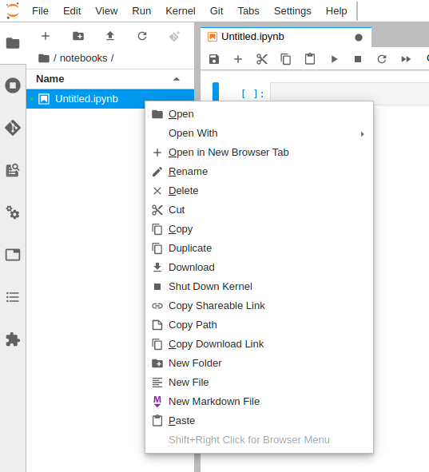

.. _first_steps:

Getting Started with Renku
==========================

This tutorial will help you get started working on the Renku platform. Feel
free to use  `renkulab.io <https://renkulab.io>`_ or any other instance of
Renku that you can access. Following the steps below, you will  learn how to
use Renku for:

1. `Creating a new project <Create a new project>`_
2. `Adding data to your project <Add input data to your project>`_
3. `Installing and managing Python packages <Install and manage Python packages>`_
4. `Working with Renku within JupyterLab <Work using JupyterLab>`_
5. `Sharing your results and collaborating with your peers <Share your results and collaborate with your peers>`_

Create a new project
^^^^^^^^^^^^^^^^^^^^

First, head to `renkulab.io <https://renkulab.io>`__ (or your own instance of
Renku) and click on the **Login** button located on the top right corner of
the Renku web interface.

You can sign in using with your GitHub or LinkedIn account by
clicking on the corresponding button.

Once logged in, create a new project by going to the **Projects** (1) page
and clicking on the **New Project** button (2).

.. image:: ../_static/images/ui_create_project.png
    :width: 85%
    :align: center
    :alt: Create a new project in UI

Set **tutorial-zhbikes** as your project title, fill-in a short description
and set the project visibility to **Public**.
Click on the **Create** button.

.. warning::

  Be sure to not leave the description field empty. The form will fail
  silently otherwise.

To more easily find your project later, you can give it a star:

.. image:: ../_static/images/ui_star_project.png
    :width: 85%
    :align: center
    :alt: Star a project

Now that we have a project, we can start working on it by clicking
on **Launch JupyterLab**.

Add input data to your project
^^^^^^^^^^^^^^^^^^^^^^^^^^^^^^

In the JupyterLab interface, we can see that a few files already exist.
Let's start by adding data using the `Renku CLI <http://renku-python.readthedocs.io/>`_.

From JupyterLab, start a terminal.

.. image:: ../_static/images/jupyterlab-open-terminal.png
    :width: 85%
    :align: center
    :alt: Open terminal in JupyterLab

.. note::

  To paste commands to the JupyterLab console, use ``Cmd+V`` on MacOS or
  ``Ctrl+Shift+V`` on Linux.

When you start the terminal, you will already be inside your project
directory.  Use the following commands to add data to your project.

.. code-block:: console

    renku dataset create zhbikes
    # Output:
    # Creating a dataset ... OK

    renku dataset add zhbikes https://data.stadt-zuerich.ch/dataset/verkehrszaehlungen_werte_fussgaenger_velo/resource/d17a0a74-1073-46f0-a26e-46a403c061ec/download/2017_verkehrszaehlungen_werte_fussgaenger_velo.csv
    # Output:
    # Adding data to dataset  [                                    ]  1/1  https://data.stadt-zuerich.ch/dataset/verkehrszaehlungen_werte_fussgaenger_velo/resource/d17a0a74-
    # Adding data to dataset  [                                    ]  1/1

Let's take the time to see what happened there. Opening the terminal puts
you inside the project directory with ``git`` already configured.

Next we created a dataset named ``zhbikes`` using the  `Renku CLI <http
://renku-python.readthedocs.io/>`__ and lastly we added a file to the
``zhbikes`` data set. Here, we can see the preferred method of referencing a
file to be added which is to use a permanent URL. By doing so, we create a
reference to the source of the file in the metadata of the project.

The data file we added is about bike traffic in the City of Zürich, and its
description can be found `here <https://data.stadt-
zuerich.ch/dataset/verkehrszaehlungen_werte_fussgaenger_velo>`_. As the file
name suggests, this file covers the year of 2017.

We can see that the two ``renku`` commands make use of the underlying git
repository:

.. code-block:: console

    git log
    # Output similar to:
    # commit ef542b5ec5a44fdbb16afc3de413308a7daff32f
    # Author: John Doe <john.doe@example.com>
    # Date:   Thu Aug 23 11:58:34 2018 +0000
    #
    #     renku dataset add zhbikes https://data.stadt-zuerich.ch/dataset/verkehrszaehlungen_werte_fussgaenger_velo/resource/d17a0a74-1073-46f0-a26e-46a403c061ec/download/2
    # 017_verkehrszaehlungen_werte_fussgaenger_velo.csv
    #
    # commit 38ac3261e8b2964c4608a6ca6d30a4f907dc6930
    # Author: John Doe <john.doe@example.com>
    # Date:   Thu Aug 23 11:58:30 2018 +0000
    #
    #     renku dataset create zhbikes
    #
    # commit 3f74a2dfdf5e27c1dc124f6455931089023253b8
    # Author: John Doe <john.doe@example.com>
    # Date:   Thu Aug 23 11:55:41 2018 +0000
    #
    #     init renku repository

    git status
    # Expected output:
    # On branch master
    # Your branch is ahead of 'origin/master' by 2 commits.
    #   (use "git push" to publish your local commits)
    # nothing to commit, working directory clean

Let's push the two fresh commits by running:

.. code-block:: console

    git push

The data file can be opened from JupyterLab by going to the **Files** tab
and traversing the ``data`` folder.

Opening the file, we can see it contains some data in CSV format.

.. image:: ../_static/images/jupyterlab-data-open-csv.png
    :width: 85%
    :align: center
    :alt: Files tab and notebooks folder in JupyterLab

Install and manage Python packages
^^^^^^^^^^^^^^^^^^^^^^^^^^^^^^^^^^

Continuing in the same terminal session as in last step, we can install python
packages as usual with ``pip``:

.. code-block:: console

    pip install papermill pandas feather-format seaborn
    pip freeze > requirements.txt
    git add requirements.txt
    git commit -m"Installed papermill, pandas, feather-format, seaborn"
    git push

.. warning::

  Make sure that you update the ``requirements.txt`` file after you install
  new packages. This ensures that the packages needed to work on your project
  will be available to your peers when collaborating on a project.

When updating and pushing the ``requirements.txt`` file to your project
repository, the Renku platform will update the Python stack used to launch
your JupyterLab instance. If you shut down your notebook server, the next time
you use the **Launch JupyterLab** button, the packages will come already
pre-installed in the new server's environment.

Work using JupyterLab
^^^^^^^^^^^^^^^^^^^^^

Create new notebooks
""""""""""""""""""""

On the JupyterLab interface, use the left-hand bar to go to the **Files** (1)
tab. You can see the list of files and folders from your project.

First, create a folder by clicking on the new folder button (2) and name it
``notebooks`` (3).

.. image:: ../_static/images/jupyterlab-files-notebooks.png
    :width: 85%
    :align: center
    :alt: Files tab and notebooks folder in JupyterLab

To create a new notebook, first double click on the **notebooks** folder (3),
then on the '+' button (4). Select 'Python 3' to create a new notebook (5).

.. image:: ../_static/images/jupyterlab-new-notebook.png
    :width: 85%
    :align: center
    :alt: New notebook in JupyterLab

To rename the notebook, right click on its name (``Untitled.ipynb``) and
select rename.

If you are not familiar with JupyterLab, you can read more on their
`documentation <https://jupyterlab.readthedocs.io/en/latest/>`_. You can take
the time to play with the JupyterLab interface and new notebooks before
continuing.

If you want to save your new notebook(s), go to the console and use ``git`` to
add your work to the repository.

For example, if you want to keep the new notebook(s), run the following.

.. code-block:: console

    git add notebooks # track everything inside the notebooks folder
    git commit -m "Added some notebooks"
    git push

Record you work and make it repeatable
""""""""""""""""""""""""""""""""""""""

First, let's make sure the project repository is clean.
Run:

.. code-block:: console

    git status
    # Expected output:
    # On branch master
    # Your branch is up-to-date with 'origin/master'.
    # nothing to commit, working directory clean

Make sure the output ends with ``nothing to commit, working tree clean``.
Otherwise, use ``git add``, ``git commit`` and ``rm`` to cleanup your project repository.

In this section, we will use two pre-existing notebooks to demonstrate how you can
use the `Renku CLI <http://renku-python.readthedocs.io/>`__ to record you work and make it repeatable.
You can view the content of the notebooks, use the following links: `DataPreprocess.ipynb <http://example.com>`_
and `Explore.ipynb <http://example.com>`_. (TODO: link to github)

Use the commands below to add the two notebooks to your project.

.. warning::

  TODO: use master branch before merging below.

.. code-block:: console

    mkdir -p notebooks
    wget -O "notebooks/DataPreprocess.ipynb" https://raw.githubusercontent.com/SwissDataScienceCenter/renku/getting-started-renkulab/docs/_static/zhbikes/DataPreprocess.ipynb
    wget -O "notebooks/Explore.ipynb" https://raw.githubusercontent.com/SwissDataScienceCenter/renku/getting-started-renkulab/docs/_static/zhbikes/Explore.ipynb
    git add notebooks
    git commit -m"Added Data Preprocess and Explore notebooks"
    git push

You can inspect and run the two notebooks as you would any other Jupyter
notebook inside the JupyterLab session. However, with the `Papermill
<https://papermill.readthedocs.io/en/latest/>`_  utility, we can also run the
notebooks as if they were python scripts.

``Papermill`` creates rendered notebooks and to keep things tidy we will make
a separate directory for these:

.. code-block:: console

    mkdir -p notebooks/papermill

To run the notebooks, you can now execute:

.. code-block:: console

    renku run papermill notebooks/DataPreprocess.ipynb notebooks/papermill/DataPreprocess.ipynb \
        -p input_folder data/zhbikes \
        -p output_file data/preprocessed/zhbikes.feather
    renku run papermill notebooks/Explore.ipynb notebooks/papermill/Explore.ipynb \
        -p zhbikes_data data/preprocessed/zhbikes.feather
    git push

Here you can see that we wrapped our command line with ``renku run``. By doing
so, you have automatically created and recorded recipes which will help
everyone (including you!) to rerun and reuse your work.

Reuse your own work
"""""""""""""""""""

Here, we will quickly see one of the advantages of using the ``renku`` command
line tool.

Let's begin by adding some more data to the ``zhbikes`` data set:

.. code-block:: console

    renku dataset add zhbikes https://data.stadt-zuerich.ch/dataset/verkehrszaehlungen_werte_fussgaenger_velo/resource/ed354dde-c0f9-43b3-b05b-08c5f4c3f65a/download/2016_verkehrszaehlungen_werte_fussgaenger_velo.csv

This new file corresponds to the year of 2016 and is part of the same bike data set as above.

We can now see that ``renku`` recognizes that output files like
``data/preprocessed/zhbikes.feather`` are outdated:

.. code-block:: console

    renku status
    # Expected output similar to:
    # On branch master
    # Files generated from newer inputs:
    #   (use "renku log [<file>...]" to see the full lineage)
    #   (use "renku update [<file>...]" to generate the file from its latest inputs)
    #
    #         data/preprocessed/zhbikes.feather: data/zhbikes#ef542b5e
    #         notebooks/papermill/DataPreprocess.ipynb: data/zhbikes#ef542b5e
    #         notebooks/papermill/Explore.ipynb: data/zhbikes#ef542b5e

To update all the outputs, we can run the following.

.. code-block:: console

    renku update

That's it! The intermediate data file ``data/preprocessed/zhbikes.feather`` and the
output notebooks ``notebooks/papermill/DataPreprocess.ipynb``, ``notebooks/papermill/Explore.ipynb``
are recreated by re-running the ``papermill`` command.

Lastly, let's not forget to push our work:

.. code-block:: console

    git push

Share your results and collaborate with your peers
^^^^^^^^^^^^^^^^^^^^^^^^^^^^^^^^^^^^^^^^^^^^^^^^^^

In this section, we will see how to use Renku to collaborate on projects.

Discussions with Kus
""""""""""""""""""""

Let's start by going back to the `Renku web interface <https://renkulab.io>`__.
Make sure you are logged in, so you can see the list of projects you starred.

Click on your ``tutorial-zhbikes`` project to open it and then go to the
**Kus** tab (1).

As you can see it's empty at the moment, so let's start a new discussion by clicking
on the **New Ku** button (2).

.. image:: ../_static/images/renku-ui-new-ku.png
    :width: 85%
    :align: center
    :alt: New Ku in Renku UI

In the **New Ku** form, fill in the **Title** and **Description** as follows.

* Title: Data source
* Description: Where does the data come from?

Do not change the **Visibility** and click on **Create**.

The **Kus** tab should now list the newly created Ku.

In Renku, Kus are media-rich discussions you can use to help keep track of your work
and to collaborate with others.

To participate in a given Ku and add comments, click on the title.

.. image:: ../_static/images/renku-ui-kus-list.png
    :width: 85%
    :align: center
    :alt: Kus list in Renku UI

This will display the thread of comments from the selected Ku.
To write something and add it to the discussion, use the text
box and click submit.

.. image:: ../_static/images/renku-ui-new-ku-comment.png
    :width: 85%
    :align: center
    :alt: Participate in a Ku in Renku UI

The comments are displayed using the Markdown format (`cheatsheet here <https://github.com/adam-p/markdown-here/wiki/Markdown-Cheatsheet>`_),
with the powerful addition that you can embed notebook files and markdown files.
The syntax is as follows:

.. code-block:: console

    

Let' try this with our question about where the data is coming from.
Copy and paste the following text in the text box and hit **Submit**.

.. code-block:: console

    The readme should be updated with information about the data source:

    

.. image:: ../_static/images/renku-ui-comment-1.png
    :width: 85%
    :align: center
    :alt: Ku example 1 in Renku UI

Now, you can use **Launch JupyterLab** to open and edit the ``README.md`` file.
You can mention that the data comes from the city of Zürich, with the following
link to the `bike data set <https://data.stadt-zuerich.ch/dataset/verkehrszaehlungen_werte_fussgaenger_velo>`__.

To save the changes to the ``README.md`` file, open a console by click on the '+' button
and then selecting **Terminal**.

Use ``git`` to save your changes:

.. code-block:: console

    cd work
    git add README.md
    git commit -m "Added data information in the Readme"
    git push

Now that the ``README.md`` file has been updated, we can **Close** the Ku (1).

.. image:: ../_static/images/renku-ui-close-ku.png
    :width: 85%
    :align: center
    :alt: Close Ku in Renku UI

Doing so indicates that the corresponding discussion is closed.
This can be useful to sort discussions and find out what is currently work in progress
within the project.

Now, let's create another Ku and embed a notebook in the discussion.

* Title: General data exploration
* Description: First look at the data set

Add a comment with the following content.

.. code-block:: console

    Let's explore the dataset! Here is what we know:

    

As you can see, the content of the notebook is being displayed in the
comment. You can collapse/expand it by clicking on its corresponding title
in blue.

.. image:: ../_static/images/renku-ui-embed-notebook.png
    :width: 85%
    :align: center
    :alt: Embedded notebook in Renku UI

Where to go from here?
^^^^^^^^^^^^^^^^^^^^^^

* Explore the documentation
* Read more about the `Renku CLI <http://renku-python.readthedocs.io/>`_
* `Join us on Gitter <https://gitter.im/SwissDataScienceCenter/renku>`_
