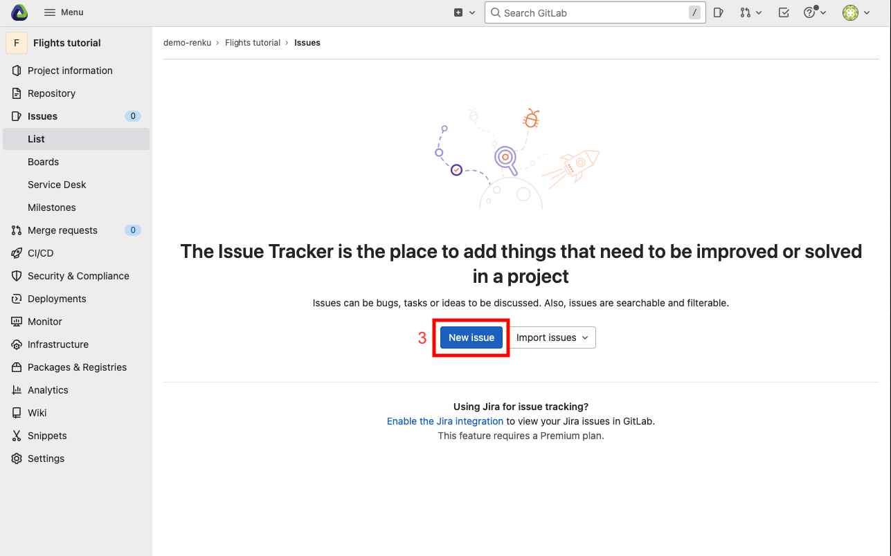
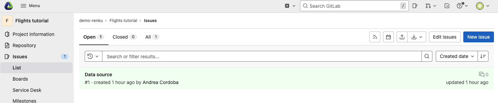

.. _first_steps:

Getting Started with Renku
==========================

This tutorial will help you get started working on the Renku platform. We will
use Renku to realize a very small data science project: counting the
number of flights to Austin-Bergstrom International Airport in January, 2019.

Following the steps below, you will learn how to use Renku for:

1. `Creating a new project <create_project_>`_
2. `Adding data to your project <add_data_>`_
3. `Installing and managing Python packages <python_environment_>`_
4. `Working with Renku within JupyterLab <jupyterlab_>`_
5. `Interactively exploring the bicycle counting data <interactive_exploration_>`_
6. `Producing a repeatable analysis <create_workflow_>`_
7. `Sharing your results and collaborating with your peers <sharing_is_caring_>`_
8. `Where to go from here? <where_to_go_>`_

.. _create_project:

Create a new project
^^^^^^^^^^^^^^^^^^^^

First, head to renkulab.io_ (or your own instance of
Renku) and click on the **Login** button located on the top right corner of
the Renku web interface.

On renkulab.io_ you can create an account or sign in with your GitHub
identity by clicking on the corresponding button.

Once logged in, create a new project by going to the **Projects** (1) page
and clicking on the **New Project** (2) button.

.. image:: ../_static/images/ui_01_create-project.png
    :width: 100%
    :align: center
    :alt: Head to new project page

Enter **Flights Tutorial** as your project title (1); fill in a short
description (2); if you wish, change the visibility (or leave it *public*) (3).
Click on the **Create** button (4).

.. image:: ../_static/images/ui_02_new-project.png
    :width: 100%
    :align: center
    :alt: Create a new project

Now that we have a project, we can start working on it by starting a
new JupyterLab notebook server. Click on **Environments** (1),
then on **New** (2).

.. image:: ../_static/images/ui_03_notebook-servers.png
    :width: 100%
    :align: center
    :alt: Head to environments page

The default settings are fine for this tutorial: just click on
**Start environment** (3). You will see a table with the  status
of the environment launch (initially in yellow) on the right.
Wait until its color has turned to green and the status from
*Pending* to *Running*.

.. note::

    Please be patient, the first time you start a server it may require
    some time to launch.

You can now connect to the server by clicking on the **Connect** button (1).

.. image:: ../_static/images/ui_04_connect-to-server.png
    :width: 100%
    :align: center
    :alt: Connect to environment

.. _add_data:

Add data to your project
^^^^^^^^^^^^^^^^^^^^^^^^

In the JupyterLab interface, we can see that a few files already exist.
Let's start by adding data using the `Renku CLI <https://renku-python.readthedocs.io/en/latest/commands.html>`__.

From JupyterLab, start a terminal by clicking the **Terminal** icon (1)
on the bottom right of the **Launcher** page.

.. image:: ../_static/images/jupyterlab-open-terminal.png
    :width: 85%
    :align: center
    :alt: Open terminal in JupyterLab

If your JupyterLab interface does not have the launcher tab open, you can
find it in the top bar menu in *File* > *New Launcher*.

.. note::

  To paste commands to the JupyterLab console, use ``Cmd+V`` on MacOS or
  ``Ctrl+Shift+V`` on Linux.

When you start the terminal, you will already be inside your project
directory. So you are ready to create a dataset.

Renku can create datasets containing data from a variety of sources. Renku
supports adding data from the local file system or a URL. Renku can also
import data from a data repository like the
`Dataverse <https://dataverse.harvard.edu>`_ or `Zenodo <https://zenodo.org>`_.
The advantage of data in a data repository is that it can contain metadata that
can be used to help interpret it. Another advantage is that data repositories
assign `DOIs <https://www.doi.org>`_ to data which can be used to
succinctly identify it and guarantee that the data will be findable and
accessible for a longer period of time (usually at least 20 years).

The DOI for the
dataset we want to import is `10.7910/DVN/WTZS4K <https://www.doi.org/10.7910/DVN/WTZS4K>`_.

Execute the following line and when prompted if you really want to download the
data, answer yes.

.. code-block:: console

    renku dataset import 10.7910/DVN/WTZS4K

    # Output:
    # CHECKSUM    NAME                       SIZE (MB)  TYPE
    # ----------  -----------------------  -----------  ---------------
    #             2019-01-flights.csv.zip       7.9301  application/zip
    # Do you wish to download this version? [y/N]: y
    # OK

Let us take a moment to understand what happened there. Opening the terminal
puts you inside the project directory with ``git`` already configured.

Then we imported a dataset  using the  `Renku CLI <http
://renku-python.readthedocs.io/>`__, Here, we can see the method of
referencing a dataset in a data repository by DOI. By doing so,
we capture a reference to the source of the data in the metadata of the
project.

You can list the datasets in a project by running the following:

.. code-block:: console

        renku dataset

        # ID                                    DISPLAY_NAME         VERSION    CREATED              CREATORS
        # ------------------------------------  -------------------  ---------  -------------------  ---------------
        # c5c74efd-5982-4c75-a1eb-4be870c51cc5  201901_us_flights_1  1          2020-01-16 16:51:12  [your name]

The file we added contains data on flight take-offs and landings at US airports, and it
comes originally from `here <https://www.transtats.bts.gov>`_. As the file
name suggests, this file covers data for January, 2019.

We can see that the two ``renku`` commands make use of the underlying git
repository:

.. code-block:: console

    git log

    # Output similar to:
    # commit ef542b5ec5a44fdbb16afc3de413308a7daff32f
    # Author: John Doe <john.doe@example.com>
    # Date:   Mon Apr 29 11:58:34 2019 +0000
    #
    #     renku dataset import 10.7910/DVN/WTZS4K
    #
    # commit 3809ce796933bd554ec65df0737b6ecf00b069e1
    # Author: John Doe <john.doe@example.com>
    # Date:   Mon Apr 29 11:58:33 2019 +0000
    #
    #     renku dataset: committing 1 newly added files
    #
    # commit 3f74a2dfdf5e27c1dc124f6455931089023253b8
    # Author: John Doe <john.doe@example.com>
    # Date:   Mon Apr 29 11:53:41 2019 +0000
    #
    #     init renku repository

.. code-block:: console

    git status

    # Output similar to:
    # On branch master
    # Your branch is ahead of 'origin/master' by 3 commits.
    #   (use "git push" to publish your local commits)
    #
    # nothing to commit, working directory clean

Let us push the three fresh commits by running:

.. code-block:: console

    git push

    # Output similar to:
    # Locking support detected on remote "origin". Consider enabling it with: [...]
    # Counting objects: 19, done. (1/1), 66 MB | 0 B/s
    # Delta compression using up to 8 threads.
    # Compressing objects: 100% (15/15), done.
    # Writing objects: 100% (19/19), 2.26 KiB | 463.00 KiB/s, done.
    # Total 19 (delta 3), reused 0 (delta 0)
    # To https://renkulab.io/gitlab/john.doe/flights-tutorial.git
    #     b55aea9..91b226b  master --> master

.. _python_environment:

Install and manage Python packages
^^^^^^^^^^^^^^^^^^^^^^^^^^^^^^^^^^

Defining your runtime environment is critical if you would like others to be
able to reuse your work. To achieve this, it is necessary to manage the
software libraries that are needed for your code to execute.

In Renku, we rely on existing conventions for specifying the execution
environment. In Python, the ``requirements.txt`` file is a standard way to
specify the required libraries. When you created your project, an empty
``requirements.txt`` was also created --- find it in the file browser of your
JupyterLab session by clicking on the **root** button (1), then double-click
the file (2) to open the editor. For the tutorial, we will need the ``pandas``
and ``seaborn`` libraries. We will require specific versions to ensure that the
same environment can be recreated in the future. Enter the following into the
``requirements.txt`` file on the right (3)

.. code-block:: console

    pandas==0.25.3
    seaborn==0.9.0

and **save** it:

.. image:: ../_static/images/ui_04.1_jupyterlab-setup-requirements.png
    :width: 85%
    :align: center
    :alt: Configuring package dependencies

Going back to the same terminal session as before, we can now
install these packages with ``pip``:

.. code-block:: console

    pip install -r requirements.txt

    # Collecting pandas==0.25.3
    # Downloading https://files.pythonhosted.org/packages/63/e0/a1b39cdcb2c391f087a1538bc8a6d62a82d0439693192aef541d7b123769/pandas-0.25.3-cp37-cp37m-manylinux1_x86_64.whl (10.4MB)
    #     |████████████████████████████████| 10.4MB 3.1MB/s
    # Collecting seaborn==0.9.0
    # Downloading https://files.pythonhosted.org/packages/a8/76/220ba4420459d9c4c9c9587c6ce607bf56c25b3d3d2de62056efe482dadc/seaborn-0.9.0-py3-none-any.whl (208kB)
    #     |████████████████████████████████| 215kB 20.0MB/s
    # Collecting pytz>=2017.2
    # Downloading https://files.pythonhosted.org/packages/e7/f9/f0b53f88060247251bf481fa6ea62cd0d25bf1b11a87888e53ce5b7c8ad2/pytz-2019.3-py2.py3-none-any.whl (509kB)
    #     |████████████████████████████████| 512kB 14.1MB/s
    # Collecting numpy>=1.13.3
    # Downloading https://files.pythonhosted.org/packages/63/0c/0261693cc3ad8e2b66e66dc2d2676a2cc17d3efb1c58a70db73754320e47/numpy-1.18.1-cp37-cp37m-manylinux1_x86_64.whl (20.1MB)
    #     |████████████████████████████████| 20.1MB 37.4MB/s
    # Requirement already satisfied: python-dateutil>=2.6.1 in /opt/conda/lib/python3.7/site-packages (from pandas==0.25.3->-r requirements.txt (line 1)) (2.8.1)
    # Collecting matplotlib>=1.4.3
    # Downloading https://files.pythonhosted.org/packages/61/42/3e92d7aa64295483fbca20a86c89b34d0cb43cffaadaffe028793902d790/matplotlib-3.1.2-cp37-cp37m-manylinux1_x86_64.whl (13.1MB)
    #     |████████████████████████████████| 13.1MB 16.0MB/s
    # Collecting scipy>=0.14.0
    # Downloading https://files.pythonhosted.org/packages/dd/82/c1fe128f3526b128cfd185580ba40d01371c5d299fcf7f77968e22dfcc2e/scipy-1.4.1-cp37-cp37m-manylinux1_x86_64.whl (26.1MB)
    #     |████████████████████████████████| 26.1MB 105kB/s
    # Requirement already satisfied: six>=1.5 in /opt/conda/lib/python3.7/site-packages (from python-dateutil>=2.6.1->pandas==0.25.3->-r requirements.txt (line 1)) (1.13.0)
    # Collecting cycler>=0.10
    # Downloading https://files.pythonhosted.org/packages/f7/d2/e07d3ebb2bd7af696440ce7e754c59dd546ffe1bbe732c8ab68b9c834e61/cycler-0.10.0-py2.py3-none-any.whl
    # Collecting kiwisolver>=1.0.1
    # Downloading https://files.pythonhosted.org/packages/93/f8/518fb0bb89860eea6ff1b96483fbd9236d5ee991485d0f3eceff1770f654/kiwisolver-1.1.0-cp37-cp37m-manylinux1_x86_64.whl (90kB)
    #     |████████████████████████████████| 92kB 827kB/s
    # Collecting pyparsing!=2.0.4,!=2.1.2,!=2.1.6,>=2.0.1
    # Downloading https://files.pythonhosted.org/packages/5d/bc/1e58593167fade7b544bfe9502a26dc860940a79ab306e651e7f13be68c2/pyparsing-2.4.6-py2.py3-none-any.whl (67kB)
    #     |████████████████████████████████| 71kB 232kB/s
    # Requirement already satisfied: setuptools in /opt/conda/lib/python3.7/site-packages (from kiwisolver>=1.0.1->matplotlib>=1.4.3->seaborn==0.9.0->-r requirements.txt (line 2)) (41.6.0.post20191101)
    # Installing collected packages: pytz, numpy, pandas, cycler, kiwisolver, pyparsing, matplotlib, scipy, seaborn
    # Successfully installed cycler-0.10.0 kiwisolver-1.1.0 matplotlib-3.1.2 numpy-1.18.1 pandas-0.25.3 pyparsing-2.4.6 pytz-2019.3 scipy-1.4.1 seaborn-0.9.0

And we need to capture this change in git.

.. code-block:: console

    git add requirements.txt
    git commit -m"Installed pandas and seaborn"
    git push

    # [master 1772863] Installed pandas and seaborn
    # 1 file changed, 2 insertions(+)
    # Counting objects: 3, done.
    # Delta compression using up to 8 threads.
    # Compressing objects: 100% (2/2), done.
    # Writing objects: 100% (3/3), 313 bytes | 313.00 KiB/s, done.
    # Total 3 (delta 1), reused 0 (delta 0)
    # To https://dev.renku.ch/gitlab/john.doe/flights-tutorial.git
    #     91b226b..c1dcfe4  master -> master

.. warning::

  Make sure that you update the *requirements.txt* file after you install
  new packages. This ensures that the packages needed to work on your project
  will be available to your peers when collaborating on a project.

When an updated *requirements.txt* file is pushed to renkulab, renkulab will
rebuild the software stack used for the interactive environments. If you shut
down an interactive environment, the next time you start a new one,
the packages specified in ``requirements.txt`` will already be
available in the new environment.

.. _jupyterlab:

Use Renku from within JupyterLab
^^^^^^^^^^^^^^^^^^^^^^^^^^^^^^^^

Create new notebooks
""""""""""""""""""""

In the JupyterLab interface, use the file navigator in the left sidebar to go
to the **Files** (1) tab. Here, you see a listing of files and folders from
your project. To create a new notebook, first double-click on the **notebooks**
folder (2), then on the **'+'** button (3). Select *Python 3* to create a new
notebook (4).

.. image:: ../_static/images/jupyterlab-files-notebooks.png
    :width: 85%
    :align: center
    :alt: Files tab and notebooks folder in JupyterLab

To rename the notebook, right-click on its name (``Untitled.ipynb``) and
select rename.

.. image:: ../_static/images/jupyterlab-rename.png
    :width: 85%
    :align: center
    :alt: Rename notebook in JupyterLab

If you are not familiar with JupyterLab, you can read more in the
`JupyterLab documentation <https://jupyterlab.readthedocs.io/en/latest/>`_. You may want to take some time to play with the JupyterLab
interface before continuing.

If you want to save your new notebook(s), you can go to the console and use
``git`` to add your work to the repository. For example, if you want to keep
the new notebook(s), run the following in the terminal:

.. code-block:: console

    git add notebooks # track everything inside the notebooks folder
    git commit -m "Added some notebooks"
    git push

    # [master 0fb9ac1] Added some notebooks
    #     1 file changed, 32 insertions(+)
    #     create mode 100644 notebooks/MyNewNotebook.ipynb
    # Counting objects: 4, done.
    # Delta compression using up to 8 threads.
    # Compressing objects: 100% (4/4), done.
    # Writing objects: 100% (3/3), 639 bytes | 639.00 KiB/s, done.
    # Total 4 (delta 1), reused 0 (delta 0)
    # To https://dev.renku.ch/gitlab/john.doe/flights-tutorial.git
    #     c1dcfe4..0fb9ac1  master -> master

If you prefer to use a UI, an extension providing access to the basic git
commands is built into JupyterLab. Click on the git icon on the left sidebar of
JupyterLab (1) to open the git panel. Here, you can add untracked files by
selecting them and clicking the up arrow (2). Finally, you can enter a commit
message in (3) and click the check mark to make a commit.

.. image:: ../_static/images/jupyterlab-git-panel.png
    :width: 85%
    :align: center
    :alt: Commit notebook in JupyterLab

.. _interactive_exploration:

Interactively explore the flights data
""""""""""""""""""""""""""""""""""""""

At this point in a data-science project, you would normally start by looking at
the data, trying to understand its structure, and see how to go about answering
our question: *how many flights had Austin, TX as their destination.*

In this tutorial, we will jump-start the process by using some notebooks that
have already been prepared.

Use the commands below to add the first notebook to your project.

.. code-block:: console

    wget -O notebooks/00-FilterFlights.ipynb https://renkulab.io/gitlab/renku-tutorial/renku-tutorial-flights/raw/master/.tutorial/meta/templates/00-FilterFlights-doi.ipynb

    # Output similar to:
    # --2019-04-29 14:38:02--  https://renkulab.io/gitlab/renku-tutorial/renku-tutorial-flights/raw/master/.tutorial/meta/templates/00-FilterFlights-doi.ipynb
    # Resolving renkulab.io (renkulab.io)... 86.119.40.77
    # Connecting to renkulab.io (renkulab.io)|86.119.40.77|:443... connected.
    # HTTP request sent, awaiting response... 200 OK
    # Length: 1909 (1.9K) [text/plain]
    # Saving to: ‘notebooks/00-FilterFlights.ipynb’
    #
    # notebooks/00-FilterFlights.ipynb        100%[==============================================================================>]   1.86K  --.-KB/s    in 0s
    #
    # 2019-04-29 14:38:03 (105 MB/s) - ‘notebooks/00-FilterFlights.ipynb’ saved [1909/1909]

.. code-block:: console

    git add notebooks
    git commit -m"Created notebook to filter flights to AUS, TX."
    git push

    # [...]
    # To https://dev.renku.ch/gitlab/john.doe/flights-tutorial.git
    #     0fb9ac1..d0c4d1f  master -> master

You should look at the notebook by navigating to
*notebooks/00-FilterFlights.ipynb*. The logic is not complex to understand, but
you should feel free to execute it to see what it does.

Refactor the notebook
"""""""""""""""""""""

To make our filtering step easier to reuse and easier to maintain, we will
refactor what we have written in the notebook into a Python script. To do this
we convert the code in the notebook into a regular Python *.py* file.

Again, for the tutorial, we have already done the refactoring work for you,
and you can just download the script. We will save it in the `src` folder
because it is source code.

.. code-block:: console

    mkdir src
    wget -O src/00-FilterFlights.py https://renkulab.io/gitlab/renku-tutorial/renku-tutorial-flights/raw/master/.tutorial/meta/templates/00-FilterFlights.py

    # [...]
    # 2019-04-29 14:56:52 (114 MB/s) - ‘src/00-FilterFlights.py’ saved [1823/1823]

You can inspect the code in the file viewer in your JupyterLab session.

Again, the code needs to be added to the repository:

.. code-block:: console

    git add src
    git commit -m"Extracted logic from FilterFlights notebook into script."
    git push

    # [...]
    # To https://dev.renku.ch/gitlab/john.doe/flights-tutorial.git
    #     a40f192..7922ee1  master -> master

.. _create_workflow:

Build a reproducible workflow
^^^^^^^^^^^^^^^^^^^^^^^^^^^^^

Create a workflow step
""""""""""""""""""""""

Now we will use ``renku`` to create a reproducible, reusable "workflow". A
workflow consists of a series of steps, each of which may consume some input
files, execute code, and produce output files. The outputs of one step are
frequently the inputs of another --- this creates a dependency between the code
execution and results. When workflows become more complex, the bookkeeping can
be tedious. That is where Renku comes in --- it is designed to keep
track of these dependencies for you. We will illustrate some of these concepts
with a simple example (see also the :ref:`lineage` in the documentation_).

First, let us make sure the project repository is clean. Run:

.. code-block:: console

    git status

    # On branch master
    # Your branch is up-to-date with 'origin/master'.
    #
    # nothing to commit, working directory clean

Make sure the output ends with ``nothing to commit, working tree clean``.
Otherwise, you have to clean up your project repository by either removing
the changes or committing them to the repository.

.. note::

    You can undo your changes with:

    .. code-block:: console

        git checkout .
        git clean -fd

    Or, if you want to keep your changes, commit with:

    .. code-block:: console

        git add -A
        git commit -m "My own changes"
        git push

The ``00-FilterFlights.py`` script takes two input parameters: 1. a file to
process as an input 2. a path for storing the output. So to run it, we would
normally execute the following:

.. code-block:: console

    mkdir -p data/output        # Create the output directory
    python src/00-FilterFlights.py data/201901_us_flights_1/2019-01-flights.csv.zip data/output/2019-01-flights-filtered.csv

For renku to capture information about the execution, we need to make a small
change: we prepend ``renku run`` to the python command.

.. code-block:: console

    mkdir -p data/output        # Create the output directory
    renku run python src/00-FilterFlights.py data/201901_us_flights_1/2019-01-flights.csv.zip data/output/2019-01-flights-filtered.csv

Go ahead and run this command: it will create the preprocessed data file,
including the specification of *how* this file was created, and commit all the
changes to the repository. See the `renku command line docs <https://renku-
python.readthedocs.io/en/latest/commands.html>`_ for more information on this
and other commands.

.. note::

    Did you get an error like this?

    .. code-block:: console

        # Traceback (most recent call last):
        # File "src/00-FilterFlights.py", line 16, in <module>
        #   df = pd.read_csv(input_path)
        # File "/opt/conda/lib/python3.7/site-packages/pandas/io/parsers.py", line 685, in parser_f
        #   return _read(filepath_or_buffer, kwds)
        # File "/opt/conda/lib/python3.7/site-packages/pandas/io/parsers.py", line 457, in _read
        #   parser = TextFileReader(fp_or_buf, **kwds)
        # File "/opt/conda/lib/python3.7/site-packages/pandas/io/parsers.py", line 895, in __init__
        #   self._make_engine(self.engine)
        # File "/opt/conda/lib/python3.7/site-packages/pandas/io/parsers.py", line 1135, in _make_engine
        #   self._engine = CParserWrapper(self.f, **self.options)
        # File "/opt/conda/lib/python3.7/site-packages/pandas/io/parsers.py", line 1917, in __init__
        #   self._reader = parsers.TextReader(src, **kwds)
        # File "pandas/_libs/parsers.pyx", line 382, in pandas._libs.parsers.TextReader.__cinit__
        # File "pandas/_libs/parsers.pyx", line 635, in pandas._libs.parsers.TextReader._setup_parser_source
        # File "/opt/conda/lib/python3.7/zipfile.py", line 1222, in __init__
        #   self._RealGetContents()
        # File "/opt/conda/lib/python3.7/zipfile.py", line 1289, in _RealGetContents
        #   raise BadZipFile("File is not a zip file")
        # pfile.BadZipFile: File is not a zip file

    If in the process of working through the tutorial, you stopped the
    interactive environment and started a new one along the way, this may
    happen. Why?
    `Under the hood <https://renku-python.readthedocs.io/en/latest/api.html>`_,
    we use
    `git-lfs <https://git-lfs.github.com/>`_
    to save large files, and these files may not be fetched when a new
    environment is started. We try to retrieve them automatically when needed
    for a renku command, but that may not always work.

    If you check the ``data/201901_us_flights_1/2019-01-flights.csv.zip`` file you
    will see only a few lines of metadata starting with
    ``version https://git-lfs.github.com/spec/v1``. You can easily
    fetch the data manually from the console by running

    .. code-block:: console

      git lfs pull

      # Downloading LFS objects: 100% (1/1), 66MB | 22 MB/s

.. warning::

   Do *not* make any edits to the code before the ``renku run``
   command is finished. In order to keep track of the outputs of
   your script, renku will automatically add the changes to
   ``git``. If you want to modify your project while a ``renku`` command
   is executing, you should create a new branch.

**Aside: looking at data in JupyterLab**

The original zip file is not easy to visualize in Jupyter,
but the csv output of filtering can be opened from JupyterLab by navigating to
the **File** tab on the top left (1), then clicking ``data``
folder (2) and ``output`` (3).

.. image:: ../_static/images/ui_04.2_jupyterlab-file-data.png
    :width: 85%
    :align: center
    :alt: File tab and data folder

Opening the file
``2019-01-flights-filtered.csv`` (1),
we can see its contents (2).

.. image:: ../_static/images/ui_04.3_jupyterlab-data-open-csv.png
    :width: 85%
    :align: center
    :alt: Files tab and notebooks folder in JupyterLab

Add a second workflow step
""""""""""""""""""""""""""

We will now develop a notebook to count the flights in the filtered data file.
As before, we will fast-forward through this step by downloading the solution.

.. code-block:: console

    wget -O notebooks/01-CountFlights.ipynb https://renkulab.io/gitlab/renku-tutorial/renku-tutorial-flights/raw/master/.tutorial/meta/templates/01-CountFlights.ipynb

    # --2019-04-29 14:45:31--  https://renkulab.io/gitlab/renku-tutorial/renku-tutorial-flights/raw/master/.tutorial/meta/templates/01-CountFlights.ipynb
    # Resolving renkulab.io (renkulab.io)... 86.119.40.77
    # Connecting to renkulab.io (renkulab.io)|86.119.40.77|:443... connected.
    # HTTP request sent, awaiting response... 200 OK
    # Length: 1909 (1.9K) [text/plain]
    # Saving to: ‘notebooks/01-CountFlights.ipynb’
    #
    # notebooks/01-CountFlights.ipynb        100%[==============================================================================>]   1.86K  --.-KB/s    in 0s
    #
    # 2019-04-29 14:38:03 (105 MB/s) - ‘notebooks/01-CountFlights.ipynb’ saved [1909/1909]

Whenever we make changes, we need to record our work in git.

.. code-block:: console

    git add notebooks
    git commit -m"Created notebook to count flights"
    git push

    # [...]
    # To https://dev.renku.ch/gitlab/john.doe/flights-tutorial.git
    #     0fb9ac1..d0c4d1f  master -> master

You can look at the notebook to see how the logic works:
notebooks/01-CountFlights.ipynb.

We want to use this notebook to make a second step in the workflow.
For this, we are going to use papermill_.

Though Jupyter notebooks are very useful tools for interactively working with
data, they create some difficulties for reproducibility. A notebook that has
been manually executed may not be reproducible because the cells are not
required to be run in a fixed order. And notebooks are difficult to reuse
and apply to new data because they cannot be easily parametrized.

The tool papermill_ solves both these problems, and we will use it to create
the second step of our workflow.

First, let us make sure the project repository is clean. Run:

.. code-block:: console

    git status

    # On branch master
    # Your branch is up-to-date with 'origin/master'.
    #
    # nothing to commit, working directory clean

If the output does not end with ``nothing to commit, working tree clean``,
cleanup the project repository by either removing the changes or
committing them.

.. note::

    You can undo your changes with:

    .. code-block:: console

        git checkout .
        git clean -fd

    Or, if you want to keep your changes, commit with:

    .. code-block:: console

        git add -A
        git commit -m "My own changes"
        git push

Using papermill, we can run the notebook in a reproducible and
parameterizable way. Running a notebook with papermill produces
a new notebook containing the executed cells as output.

.. code-block:: console

    renku run papermill \
        notebooks/01-CountFlights.ipynb \
        notebooks/01-CountFlights.ran.ipynb \
        -p input_path data/output/2019-01-flights-filtered.csv  \
        -p output_path data/output/2019-01-flights-count.txt
    git push

    # Output similar to:
    # Input Notebook:  notebooks/01-CountFlights.ipynb
    # Output Notebook: notebooks/01-CountFlights.ran.ipynb
    # Executing: 100%|█████████████████████████████████████████████████████| 11/11 [00:01<00:00,  5.70cell/s]

Update your results
"""""""""""""""""""

Here, we will quickly see one of the advantages of using the ``renku`` command
line tool.

Open the notebook `notebooks/01-CountFlights.ran.ipynb`, which contains the
output of running the notebook in the last step. In it, you should see that
there were 23078 flights to Austin, TX in Jan 2019.

.. image:: ../_static/images/ui_04.4_jupyterlab-results_1.png
    :width: 85%
    :align: center
    :alt: First run results

This does not seem quite right. Austin, TX is not a very large airport, but
that number would mean that it had a flight landing on average
every two minutes, around the clock, during the entire month of January 2019.

Go back and take a look at the file ``src/00-FilterFlights.py`` file: it
contains an error! In the code block

.. code-block:: console

    # Select only flights to Austin (AUS)
    df = df[df['DEST'] == 'DFW']

we want to select flights to Austin-Bergstrom (AUS), but mistakenly select
flights to a different airport, ``DFW``. This would explain the discrepancy
we found. Dallas/Fort Worth is a much larger airport.

Let us fix this. Change ``DFW`` to ``AUS`` and save the file. Now when you
execute ``git status`` you should see something like the following:

.. code-block:: console

    git status

    # Output:
    # On branch master
    # Your branch is up to date with 'origin/master'.
    #
    # Changes not staged for commit:
    #   (use "git add <file>..." to update what will be committed)
    #   (use "git checkout -- <file>..." to discard changes in working directory)
    #
    #         modified:   src/00-FilterFlights.py
    #
    # no changes added to commit (use "git add" and/or "git commit -a")

Since we have made a change to our code, we need to commit the updated file to
the repository.

.. code-block:: console

    git add src/00-FilterFlights.py
    git commit -m"Fixed filter to use AUS, not DFW."
    git push

    # [...]
    # To https://dev.renku.ch/gitlab/john.doe/flights-tutorial.git
    #     a40f192..7922ee1  master -> master

**Reflection**

Now that we have made this change, how would you update everything *without*
Renku? Without Renku, you would need to think back and remember what files
would be affected by this change and what commands were run to initially
create them. To effect an update, you would manually carry out those steps
again, while being careful to do so in the correct order.

So without Renku, updating a project in response to a change can be tedious and
error-prone. But *with* Renku, it is very easy. We can just ask the system
what changed and what needs to be updated.

.. code-block:: console

    renku status

    # On branch master
    # Files generated from newer inputs:
    #   (use "renku log [<file>...]" to see the full lineage)
    #   (use "renku update [<file>...]" to generate the file from its latest inputs)
    #
    #         data/output/2019-01-flights-count.txt: src/00-FilterFlights.py#10d92afb
    #         data/output/2019-01-flights-filtered.csv: src/00-FilterFlights.py#10d92afb
    #         notebooks/01-CountFlights.ran.ipynb: src/00-FilterFlights.py#10d92afb
    #
    # Input files used in different versions:
    #   (use "renku log --revision <sha1> <file>" to see a lineage for the given revision)
    #
    #         src/00-FilterFlights.py: 10d92afb, 9630da17

Renku is telling us that ``src/00-FilterFlights.py`` was changed and
``data/output/2019-01-flights-filtered.csv``, ``01-CountFlights.ran.ipynb``,
``data/output/2019-01-flights-count.txt`` all need to be updated as a result.
We do not need to remember how to update them: Renku already knows this. We can
just ask it to make the update by running ``renku update``.

.. code-block:: console

    renku update

    # Resolved '.renku/workflow/2fd4341a00c945fbaf00cb3f0942c674.cwl' to 'file:///work/flights-tutorial/.renku/workflow/2fd4341a00c945fbaf00cb3f0942c674.cwl'
    # [workflow ] start
    # [workflow ] starting step step_2
    # [step step_2] start
    # [job step_2] /tmp/tmpawwugtz3$ python \
    #     /tmp/tmpawwugtz3/src/00-FilterFlights.py \
    #     /tmp/tmpawwugtz3/data/flights/2019-01-flights.csv.zip \
    #     data/output/2019-01-flights-filtered.csv
    # [job step_2] completed success
    # [step step_2] completed success
    # [workflow ] starting step step_1
    # [step step_1] start
    # [job step_1] /tmp/tmp5djthljs$ papermill \
    #     /tmp/tmp5djthljs/notebooks/01-CountFlights.ipynb \
    #     notebooks/01-CountFlights.ran.ipynb \
    #     -p \
    #     input_path \
    #     /tmp/tmp5djthljs/data/output/2019-01-flights-filtered.csv \
    #     -p \
    #     output_path \
    #     data/output/2019-01-flights-count.txt
    # Input Notebook:  /tmp/tmp5djthljs/notebooks/01-CountFlights.ipynb
    # Output Notebook: notebooks/01-CountFlights.ran.ipynb
    # Executing: 100%|█████████████████████████████████████████████████████| 11/11 [00:03<00:00,  3.67cell/s]
    # [job step_1] completed success
    # [step step_1] completed success
    # [workflow ] completed success

**Wasn't that easy!?**

Now, if you look at notebooks/01-CountFlights.ran.ipynb, you should see that
there were 4951 flights to Austin, TX in Jan 2019, which sounds plausible.

.. image:: ../_static/images/ui_04.5_jupyterlab-results_2.png
    :width: 85%
    :align: center
    :alt: Second run results

Before calling it a day, we should not forget to push our work:

.. code-block:: console

    git push

    # [...]
    # Uploading LFS objects: 100% (7/7), 69 MB | 25 MB/s, done
    # Counting objects: 39, done.
    # Delta compression using up to 8 threads.
    # Compressing objects: 100% (36/36), done.
    # Writing objects: 100% (39/39), 4.59 KiB | 1.15 MiB/s, done.
    # Total 39 (delta 14), reused 0 (delta 0)
    # To https://dev.renku.ch/gitlab/lorenzo.cavazzi.tech/deleteme.git
    #    8892173..8d00b71  master -> master

.. _sharing_is_caring:

Share your results and collaborate with your peers
^^^^^^^^^^^^^^^^^^^^^^^^^^^^^^^^^^^^^^^^^^^^^^^^^^

In this section, we will see how to use Renku to collaborate on projects. For
an overview on collaboration, see :ref:`collaborating`.

Discussions with Issues
"""""""""""""""""""""""

Let us start by going back to the Renku web interface on renkulab.io_ or
whichever instance you are using for this tutorial. Make sure you are logged
in, so you can see your projects list by clicking on ``Projects`` in the top
navigation bar.

Click on your ``flights-tutorial`` project to open it and then go to the
**Issues** sub tab (2) of the **Collaboration** tab (1). It is probably empty
at the moment, so let us start a new discussion by clicking on the
**New Issue** button (3).

In the **New Issue** form, fill in the **Title** and **Description**
as follows.

* Title: Data source
* Description: Where does the data come from?

Do not change the **Visibility** and click on **Create**.

The **Issues** sub tab should now list the newly created issue.

In Renku, issues are media-rich discussions you can use to help keep track of
your work and to collaborate with others.

To participate in a given issue and add comments, click on the title.

This will display the thread of comments from the selected issue.
To write something and add it to the discussion, use the text
box and click submit.

.. image:: ../_static/images/ui_07_new-issue-comment.png
    :width: 85%
    :align: center
    :alt: Participate in a issue in Renku UI

The comments are entered using the Markdown format (`cheatsheet here <https://github.com/adam-p/markdown-here/wiki/Markdown-Cheatsheet>`_). You can also embed notebook files
and markdown files to have them rendered in-line in the issue body or comment.
The syntax is as follows:

.. code-block:: console

    

Let us try this with our question about where the data is coming from.
Copy and paste the following text in the text box and hit **Submit**.

.. code-block:: console

    The readme should be updated with information about the data source:

    

.. image:: ../_static/images/ui_08_issue-comment-1.png
    :width: 85%
    :align: center
    :alt: Issue example 1 in Renku UI

Now, you can use **Launch JupyterLab** to open and edit the ``README.md`` file.
You can mention that the data comes from the *US Dept. of Transportation,
Bureau of Transportation Statistics*, with a link to its home page:
https://www.transtats.bts.gov

To update the repository after changing the ``README.md`` file, open a console
by clicking on the '+' button and then selecting **Terminal**.

Use ``git`` to save your changes:

.. code-block:: console

    git add README.md
    git commit -m"Added data source information to the Readme"
    git push

Now that the ``README.md`` file has been updated, we can **Close**
the issue (1).

.. image:: ../_static/images/ui_09_close-issue.png
    :width: 85%
    :align: center
    :alt: Close issue in Renku UI

Doing so indicates that the corresponding discussion is closed.
This can be useful to sort discussions and find out what is currently
work-in-progress and what has been completed within the project.

Now, let us create another issue and embed a notebook in the discussion.

* Title: General data exploration
* Description: First look at the dataset

Add a comment with the following content:

.. code-block:: console

    Let's explore the dataset! Here is what we know:

    

After creating the issue, you will see the contents of the notebook displayed
in the comment. You can collapse/expand the notebook display by clicking on its
title in blue.

.. image:: ../_static/images/ui_10_embed-notebook.png
    :width: 85%
    :align: center
    :alt: Embedded notebook in Renku UI

.. _where_to_go:

Where to go from here?
^^^^^^^^^^^^^^^^^^^^^^

* Create your own project on renkulab.io!
* Explore the documentation_
* Read more about the `Renku CLI <http://renku-python.readthedocs.io/>`__
* Join us on `Gitter <https://gitter.im/SwissDataScienceCenter/renku>`_, `GitHub <https://github.com/SwissDataScienceCenter/renku>`_, or `Discource <https://renku.discourse.group>`_

.. _renkulab.io: https://renkulab.io
.. _documentation: https://renku.readthedocs.io/
.. _papermill: https://papermill.readthedocs.io/en/latest/
