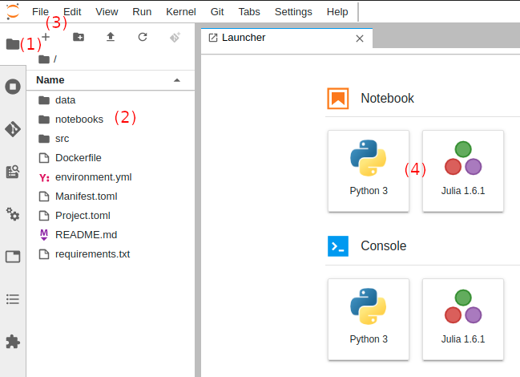

.. _first_steps:

Getting Started with Renku
==========================

This tutorial will help you get started working on the Renku platform. Feel
free to use renkulab.io_ or any other instance of
Renku that you can access. Following the steps below, you will  learn how to
use Renku for:

1. `Creating a new project <create_project_>`_
2. `Adding data to your project <add_data_>`_
3. `Installing and managing Python packages <python_environment_>`_
4. `Working with Renku within JupyterLab <jupyterlab_>`_
5. `Interactively exploring the bicycle counting data <interactive_exploration_>`_
6. `Producing a repeatable analysis <create_workflow_>`_
7. `Sharing your results and collaborating with your peers <sharing_is_caring_>`_
8. `Where to go from here? <where_to_go>`_

.. _create_project:

Create a new project
^^^^^^^^^^^^^^^^^^^^

First, head to renkulab.io_ (or your own instance of
Renku) and click on the **Login** button located on the top right corner of
the Renku web interface.

On renkulab.io_ you can sign in using with your GitHub
or LinkedIn account by clicking on the corresponding button.

Once logged in, create a new project by going to the **Projects** (1) page
and clicking on the **New Project** (2) button.

.. image:: ../_static/images/ui_create_project.png
    :width: 100%
    :align: center
    :alt: Head to new project page

Set **Zurich bikes tutorial** as your project title (1), fill-in a short
description (2) and set the project visibility to **Public** (3). Click on the
**Create** button (4).

.. image:: ../_static/images/ui_new_project.png
    :width: 100%
    :align: center
    :alt: Create a new project

Now that we have a project, we can start working on it by starting a
new JupyterLab notebook server. Click on **Notebook Servers** (1), then on
**Start new server** (2).

.. image:: ../_static/images/ui_notebook_servers.png
    :width: 100%
    :align: center
    :alt: Head to Notebook ui_notebook_servers

The default settings are fine for this tutorial, just click on
**Launch Server**. You will see a new row with a yellow button
on the right. Wait until its color has turned to green and the
text from **Starting** to **Running**.

.. note::

    Please be patient, the first time you start a server it may require
    up to one minute.

You can now connect to the server by clicking on the green button (1),
then on **Connect** (2)

.. image:: ../_static/images/ui_connect_to_server.png
    :width: 100%
    :align: center
    :alt: Start a new server

.. _add_data:

Add data to your project
^^^^^^^^^^^^^^^^^^^^^^^^^^^

In the JupyterLab interface, we can see that a few files already exist.
Let's start by adding data using the `Renku CLI <https://renku-python.readthedocs.io/en/latest/cli.html>`__.

From JupyterLab, start a terminal by clicking the **Terminal** icon (1)
on the bottom right of the **Launcher** page.

.. image:: ../_static/images/jupyterlab-open-terminal.png
    :width: 85%
    :align: center
    :alt: Open terminal in JupyterLab

If your JupyterLab interface does not have the launcher tab open, you can
find it in the top bar menu in File > New Launcher.

.. note::

  To paste commands to the JupyterLab console, use ``Cmd+V`` on MacOS or
  ``Ctrl+Shift+V`` on Linux.

When you start the terminal, you will already be inside your project
directory.  Use the following commands to add data to your project.

.. code-block:: console

    renku dataset create zhbikes
    # Output:
    # Creating a dataset ... OK

    renku dataset add zhbikes https://data.stadt-zuerich.ch/dataset/verkehrszaehlungen_werte_fussgaenger_velo/resource/d17a0a74-1073-46f0-a26e-46a403c061ec/download/2019_verkehrszaehlungen_werte_fussgaenger_velo.csv
    # Output:
    # Adding data to dataset  [     ]  1/1  https://data.stadt-zuerich.ch/dataset/verkehrszaehlungen_werte_fussgaenger_velo/resource/d17a0a74-
    # Adding data to dataset  [     ]  1/1

Let's take the time to see what happened there. Opening the terminal puts
you inside the project directory with ``git`` already configured.

Next we created a dataset named ``zhbikes`` using the  `Renku CLI <http
://renku-python.readthedocs.io/>`__ and finally we added a file to the
``zhbikes`` data set. Here, we can see the preferred method of referencing a
file to be added which is to use a permanent URL. By doing so, we create a
reference to the source of the file in the metadata of the project.

The data file we added is about bike traffic in the City of Zürich, and its
description can be found `here <https://data.stadt-
zuerich.ch/dataset/verkehrszaehlungen_werte_fussgaenger_velo>`_. As the file
name suggests, this file covers the year of 2019.

We can see that the two ``renku`` commands make use of the underlying git
repository:

.. code-block:: console

    git log
    # Output similar to:
    # commit ef542b5ec5a44fdbb16afc3de413308a7daff32f
    # Author: John Doe <john.doe@example.com>
    # Date:   Mon Apr 29 11:58:34 2019 +0000
    #
    #     renku dataset add zhbikes https://data.stadt-zuerich.ch/dataset/verkehrszaehlungen_werte_fussgaenger_velo/resource/d17a0a74-1073-46f0-a26e-46a403c061ec/
    # download/2019_verkehrszaehlungen_werte_fussgaenger_velo.csv
    #
    # commit 38ac3261e8b2964c4608a6ca6d30a4f907dc6930
    # Author: John Doe <john.doe@example.com>
    # Date:   Mon Apr 29 11:56:30 2019 +0000
    #
    #     renku dataset create zhbikes
    #
    # commit 3f74a2dfdf5e27c1dc124f6455931089023253b8
    # Author: John Doe <john.doe@example.com>
    # Date:   Mon Apr 29 11:53:41 2019 +0000
    #
    #     init renku repository

.. code-block:: console

    git status
    # Output similar to:
    # On branch master
    # Your branch is ahead of 'origin/master' by 2 commits.
    #   (use "git push" to publish your local commits)
    #
    # nothing to commit, working directory clean

Let's push the two fresh commits by running:

.. code-block:: console

    git push
    # Output similar to:
    # Locking support detected on remote "origin". Consider enabling it with: [...]
    # Counting objects: 19, done. (1/1), 66 MB | 0 B/s
    # Delta compression using up to 8 threads.
    # Compressing objects: 100% (15/15), done.
    # Writing objects: 100% (19/19), 2.26 KiB | 463.00 KiB/s, done.
    # Total 19 (delta 3), reused 0 (delta 0)
    # To https://renkulab.io/gitlab/john.doe/zurich-bikes-tutorial.git
    #     b55aea9..91b226b  master --> master

The data file can be opened from JupyterLab by browsing to the **File** tab
on the top left (1), then clicking ``data`` folder (2) and ``zhbikes``.

.. image:: ../_static/images/jupyterhub_file_data.png
    :width: 85%
    :align: center
    :alt: File tab and data folder

Opening the file
``zhbikes\2019_verkehrszaehlungen_werte_fussgaenger_velo.csv`` (1),
we can see its content (2).

.. image:: ../_static/images/jupyterlab-data-open-csv.png
    :width: 85%
    :align: center
    :alt: Files tab and notebooks folder in JupyterLab

.. _python_environment:

Install and manage Python packages
^^^^^^^^^^^^^^^^^^^^^^^^^^^^^^^^^^

Defining your runtime environment is critical if you would like for others to
reuse your work. The basic step to achieve this is to manage the software
libraries that are needed for your code to execute. In Renku, we use common
conventions  for the environment definitions. In python, the
``requirements.txt`` is one such conventional way to specify the required
libraries. When  you created your project, an empty ``requirements.txt`` was
created - find it in the file browser of your JupyterLab session by clicking
on the **Home** button (1), then double-click the file (2) to open the editor.
We will need ``pandas``, ``fastparquet`` and ``seaborn`` libraries, so enter
those on separate lines in the ``requirements.txt`` file on the right (3) and
**save it**:

.. image:: ../_static/images/jupyterlab-setup-requirements.png
    :width: 85%
    :align: center
    :alt: Configuring package dependencies

Going back to the same terminal session as before, we can now
install these packages with ``pip``:

.. code-block:: console

    pip install -r requirements.txt
    # Collecting fastparquet (from -r requirements.txt (line 2))
    #     Downloading https://files.pythonhosted.org/packages/85/b9/dc59386bc5824f86c640e7178fc78986ftp0c81763b924b2e37337ffb6a563
    #     /fastparquet-0.3.1.tar.gz (149kB)
    #         100% |████████████████████████████████| 153kB 5.6MB/s
    # Collecting seaborn (from -r requirements.txt (line 3))
    #     Downloading https://files.pythonhosted.org/packages/a8/76/220ba4420459d9c4c9c9587c6ce607bf5#6c25b3d3d2de62056efe482dadc
    #     /seaborn-0.9.0-py3-none-any.whl (208kB)
    #         100% |████████████████████████████████| 215kB 7.7MB/s
    # [...]
    # Building wheels for collected packages: fastparquet, thrift
    #     Building wheel for fastparquet (setup.py) ... done
    #     Stored in directory: /home/jovyan/.cache/pip/wheels/f3/27/fb/839c776ec8689ff9ee52ad3e91d7d4d848ac6d7545a127d5b0
    #     Building wheel for thrift (setup.py) ... done
    #     Stored in directory: /home/jovyan/.cache/pip/wheels/be/36/81/0f93ba89a1cb7887c91937948519840a72c0ffdd57cac0ae8f
    # Successfully built fastparquet thrift
    # Installing collected packages: llvmlite, numba, thrift, fastparquet, pyparsing, kiwisolver, cycler, matplotlib, scipy, seaborn
    # Successfully installed cycler-0.10.0 fastparquet-0.3.1 kiwisolver-1.1.0 llvmlite-0.28.0 matplotlib-3.0.3 numba-0.43.1 pyparsing-2.4.0
    #     scipy-1.2.1 seaborn-0.9.0 thrift-0.11.0

.. code-block:: console

    git add requirements.txt
    git commit -m "Installed pandas, fastparquet, seaborn"
    git push
    # [master c1dcfe4] Installed pandas, fastparquet, seaborn
    #     1 file changed, 3 insertions(+)
    # Counting objects: 3, done.
    # Delta compression using up to 8 threads.
    # Compressing objects: 100% (2/2), done.
    # Writing objects: 100% (3/3), 313 bytes | 313.00 KiB/s, done.
    # Total 3 (delta 1), reused 0 (delta 0)
    # To https://dev.renku.ch/gitlab/john.doe/zurich-bikes-tutorial.git
    #     91b226b..c1dcfe4  master -> master

.. warning::

  Make sure that you update the ``requirements.txt`` file after you install
  new packages. This ensures that the packages needed to work on your project
  will be available to your peers when collaborating on a project.

When updating and pushing the ``requirements.txt`` file to your project
repository, the Renku platform will rebuild the software stack used to launch
your JupyterLab notebook server. If you were to shut it down, the next time
you use the **Launch JupyterLab** button, the packages you will come already
pre-installed in the new server's environment.

.. _jupyterlab:

Use Renku from within JupyterLab
^^^^^^^^^^^^^^^^^^^^^^^^^^^^^^^^

Create new notebooks
""""""""""""""""""""

On the JupyterLab interface, use the left-hand bar to go to the **Files** (1)
tab. You can see the list of files and folders from your project. To create a
new notebook, first double click on the **notebooks** folder (2), then on the
'+' button (3). Select 'Python 3' to create a new notebook (4).

To rename the notebook, right click on its name (``Untitled.ipynb``) and
select rename.

.. image:: ../_static/images/jupyterlab-rename.png
    :width: 85%
    :align: center
    :alt: Rename notebook in JupyterLab

If you are not familiar with JupyterLab, you can read more on their
documentation_. You can take
the time to play with the JupyterLab interface and new notebooks before
continuing.

If you want to save your new notebook(s), you can go to the console and use
``git`` to add your work to the repository.

For example, if you want to keep the new notebook(s), run the following in the
terminal:

.. code-block:: console

    git add notebooks # track everything inside the notebooks folder
    git commit -m "Added some notebooks"
    git push
    # [master 0fb9ac1] Installed pandas, fastparquet, seaborn
    #     1 file changed, 32 insertions(+)
    #     create mode 100644 notebooks/MyNewNotebook.ipynb
    # Counting objects: 4, done.
    # Delta compression using up to 8 threads.
    # Compressing objects: 100% (4/4), done.
    # Writing objects: 100% (3/3), 639 bytes | 639.00 KiB/s, done.
    # Total 4 (delta 1), reused 0 (delta 0)
    # To https://dev.renku.ch/gitlab/john.doe/zurich-bikes-tutorial.git
    #     c1dcfe4..0fb9ac1  master -> master

Alternatively, you can click on the git icon on the left-hand side of your
JupyterLab session (1) to open the git panel. Here you can add untracked files
by selecting them and clicking (2). Finally, you can enter the commit message
in (3) and click the check mark to finish the commit. Currently there is no
push option in this panel, so you will need to go back to the terminal
and type ``git push`` to sync with the server.

.. image:: ../_static/images/jupyterlab-git-panel.png
    :width: 85%
    :align: center
    :alt: Commit notebook in JupyterLab

.. _interactive_exploration:

Interactively explore the bicycle count data
""""""""""""""""""""""""""""""""""""""""""""

To start working with the bicycle data, we have already created a sample
notebook that does some data cleaning and visualization. We will first
download the notebook so you can interactively explore the dataset, much like
you would in a real project. Feel free to execute the cells. When we are ready
to generate results, we will refactor the code from the notebook into a python
module and run it with ``renku`` to create a repeatable analysis workflow.

Use the commands below to add the notebook to your project.

.. code-block:: console

    wget -O "notebooks/zhbikes-notebook.ipynb" https://raw.githubusercontent.com/SwissDataScienceCenter/renku/master/docs/_static/zhbikes/ZHBikes.ipynb
    # Output similar to:
    # --2019-04-29 14:38:02--  https://raw.githubusercontent.com/SwissDataScienceCenter/renku/master/docs/_static/zhbikes/ZHBikes.ipynb
    # Resolving raw.githubusercontent.com (raw.githubusercontent.com)... 151.101.112.133
    # Connecting to raw.githubusercontent.com (raw.githubusercontent.com)|151.101.112.133|:443... connected.
    # HTTP request sent, awaiting response... 200 OK
    # Length: 851224 (831K) [text/plain]
    # Saving to: ‘notebooks/zhbikes-notebook.ipynb’
    #
    # notebooks/zhbikes-not 100%[======================>] 831.27K  --.-KB/s    in 0.06s
    #
    # 2019-04-29 14:38:03 (12.7 MB/s) - ‘notebooks/zhbikes-notebook.ipynb’ saved [851224/851224]

.. code-block:: console

    git add notebooks
    git commit -m "Added zuerich bike notebook"
    git push
    # [...]
    # To https://dev.renku.ch/gitlab/john.doe/zurich-bikes-tutorial.git
    #     0fb9ac1..d0c4d1f  master -> master

Refactor the notebook
"""""""""""""""""""""

To make our work here more reusable and easier to maintain we will refactor
the code we have written in the notebook into runnable python scripts. We will
make two scripts: one that does some initial preprocessing of the data and
saves the result, and another that will create the figures.

Here, we have already done the refactoring work for you - to get the scripts,
run:

.. code-block:: console

    mkdir src
    wget -O "src/clean_data.py" https://raw.githubusercontent.com/SwissDataScienceCenter/renku/master/docs/_static/zhbikes/clean_data.py
    wget -O "src/plot_data.py" https://raw.githubusercontent.com/SwissDataScienceCenter/renku/master/docs/_static/zhbikes/plot_data.py
    # [...]
    # 2019-04-29 14:56:52 (114 MB/s) - ‘src/clean_data.py’ saved [1823/1823]
    # [...]
    # 2019-04-29 14:56:56 (27.5 MB/s) - ‘src/plot_data.py’ saved [3117/3117]

Feel free to inspect the code in the file viewer in your JupyterLab session.
Note that in the scripts, we are saving first the intermediate output with
the cleaned ``DataFrame`` and finally also the two figures.

In addition, the scripts must be run with parameters -- to the
``clean_data.py`` script, we must give an input directory and an output path
for saving the cleaned dataset. The ``plot_data.py`` script takes as input the
location of the cleaned dataset.

When you are satisfied with the code you can commit it to your repository:

.. code-block:: console

    git add src
    git commit -m "added refactored scripts"
    git push
    # [...]
    # To https://dev.renku.ch/gitlab/john.doe/zurich-bikes-tutorial.git
    #     a40f192..7922ee1  master -> master

.. _create_workflow:

Produce a repeatable workflow
"""""""""""""""""""""""""""""

Here we will use ``renku`` and the refactored scripts to quickly create a
"workflow". A workflow consists of a series of steps, each of which consumes
some inputs, executes code based on those inputs and produces outputs. The
outputs of one step are frequently the inputs of another - this creates a
dependency between the code executions and results. When workflows become more
complex, the bookkeeping can become tedious. That is where ``Renku`` comes in
-- it is designed to keep track of these dependencies for you. We will
illustrate some of these concepts with a simple example (see also the
:ref:`lineage` in the documentation_).

First, let's make sure the project repository is clean. Run:

.. code-block:: console

    git status
    # On branch master
    # Your branch is up-to-date with 'origin/master'.
    #
    # nothing to commit, working directory clean

Make sure the output ends with ``nothing to commit, working tree clean``.
Otherwise you have to cleanup your project repository by either committing
your changes or getting rid of them

.. note::

    You can undo your changes with:

    .. code-block:: console

        git checkout .
        git clean -fd

    Otherwise commit:

    .. code-block:: console

        git add -A
        git commit -m "My own changes"
        git push

To run the ``clean_data.py`` script, we would normally do
``python src/clean_data.py data/zhbikes data/preprocessed/zhbikes.parquet``.
The only change required to execute the script with ``renku`` is adding
``renku run`` before the command

.. code-block:: console

    renku run python src/clean_data.py data/zhbikes data/preprocessed/zhbikes.parquet

Go ahead and run this command -- it will create the preprocessed file for you
including the specification of *how* this file was created, and commit all the
changes to the repository. See the `renku command line docs <https://renku-
python.readthedocs.io/en/latest/cli.html>`_ for more information on this and
other commands.

.. note::

    Did you get an error like this?

    .. code-block:: console

        # Traceback (most recent call last):
        #   File "src/clean_data.py", line 72, in <module>
        #     clean_data(args.input, args.output)
        # [...]
        # KeyError: "None of [Index(['fk_zaehler', 'datum', 'velo_in', 'velo_out', 'fuss_in', 'fuss_out',\n'objectid'],\n      dtype='object')] are in the [columns]"
        # Error: Command returned non-zero exit status 1.

    If you played around with the tutorial and you started a new
    Jupyter server, this may happen. Why?
    `Under the hood <https://renku-python.readthedocs.io/en/latest/api.html>`_,
    we use
    `git-lfs <https://git-lfs.github.com/>`_
    to save big files and we automatically fetch them only
    when it is required by a `renku` command. If you check the
    ``2019_verkehrszaehlungen_werte_fussgaenger_velo.csv`` file you
    will see only a few lines of metadata starting with
    ``version https://git-lfs.github.com/spec/v1``. You can easily
    fetch the data manually from the console by running

    .. code-block:: console

      git lfs pull
      # Downloading LFS objects: 100% (1/1), 66MB | 22 MB/s

All the required data are now available. To generate the figures, run

.. code-block:: console

    renku run python src/plot_data.py data/preprocessed/zhbikes.parquet

.. warning::

   Do *not* make any edit to the code before the ``renku run``
   command is finished. In oder to keep track of the outputs of
   your script, renku will automatically add the changes to
   ``git``. If you want to keep working while running
   a ``renku`` command, you should create a new branch.

Reuse your own work
"""""""""""""""""""

Here, we will quickly see one of the advantages of using the ``renku`` command
line tool.

Let's begin by adding some more data to the ``zhbikes`` data set:

.. code-block:: console

    renku dataset add zhbikes https://data.stadt-zuerich.ch/dataset/verkehrszaehlungen_werte_fussgaenger_velo/resource/ed354dde-c0f9-43b3-b05b-08c5f4c3f65a/download/2018_verkehrszaehlungen_werte_fussgaenger_velo.csv
    # Adding data to dataset  [            ]  1/1  https://data.stadt-zuerich.ch/dataset/verkehrszaehlungen_werte_fussgaenger_velo/resource/ed354dde-c0f9-
    # Adding data to dataset  [            ]  1/1

This new file corresponds to the year of 2018 and is part of the same bike
data set as above.

We can now see that ``renku`` recognizes that output files like
``data/preprocessed/zhbikes.parquet`` and the figures are outdated:

.. code-block:: console

    renku status
    # On branch master
    # Files generated from newer inputs:
    #   (use "renku log [<file>...]" to see the full lineage)
    #   (use "renku update [<file>...]" to generate the file from its latest inputs)

    #         data/preprocessed/zhbikes.parquet: data/zhbikes#cdfb6771
    #         figs/cumulative.png: data/zhbikes#cdfb6771
    #         figs/grid_plot.png: data/zhbikes#cdfb6771

To update all the outputs, we can run the following.

.. code-block:: console

    renku update
    # Resolved '.renku/workflow/6610408d093a427888ffae7744a3e072.cwl' to 'file:///home/jovyan/deleteme/.renku/workflow/6610408d093a427888ffae7744a3e072.cwl'
    # [workflow ] start
    # [workflow ] starting step step_2
    # [step step_2] start
    # [job step_2] /tmp/tmpxbo76axv$ python \
    #     /tmp/tmpm3icjq_m/stg218e2361-0962-4bb8-92fd-cdcbe857e7a9/clean_data.py \
    #     /tmp/tmpm3icjq_m/stg411c0870-ee56-4c58-a193-7358b5145d29/zhbikes \
    #     data/preprocessed/zhbikes.parquet
    # [job step_2] completed success
    # [step step_2] completed success
    # [workflow ] starting step step_1
    # [step step_1] start
    # [job step_1] /tmp/tmpaq66jtcf$ python \
    #     /tmp/tmpn2lxorlf/stg3c758e4e-4914-4954-b960-59890db12f79/plot_data.py \
    #     /tmp/tmpn2lxorlf/stg821b8957-628d-4ba8-913d-d026b988bcfd/zhbikes.parquet
    # /opt/conda/lib/python3.6/site-packages/pandas/plotting/_converter.py:129:
    #     FutureWarning: Using an implicitly registered datetime converter for a matplotlib plotting method. The converter was registered by pandas on import.
    #     Future versions of pandas will require you to explicitly register matplotlib converters.
    #
    # To register the converters:
    #         >>> from pandas.plotting import register_matplotlib_converters
    #         >>> register_matplotlib_converters()
    #   warnings.warn(msg, FutureWarning)
    # [job step_1] completed success
    # [step step_1] completed success
    # [workflow ] completed success

That's it! The intermediate data file ``data/preprocessed/zhbikes.parquet``
and the figures in ``figs/``, are recreated by re-running the necessary steps.
See the `renku update documentation <https://renku-python.readthedocs.io/en/latest/cli.html
#renku-update>`_ for a detailed explanation of how the workflow is re-
executed.

.. note::

    A very similar command is `renku rerun <https://renku-
    python.readthedocs.io/en/latest/cli.html#module-renku.cli.rerun>`__,
    except that it also allows you to modify the inputs. This is useful, for
    example, to vary hyper-parameters or input data sources.

Lastly, let's not forget to push our work:

.. code-block:: console

    git push
    # [...]
    # Uploading LFS objects: 100% (7/7), 69 MB | 25 MB/s, done
    # Counting objects: 39, done.
    # Delta compression using up to 8 threads.
    # Compressing objects: 100% (36/36), done.
    # Writing objects: 100% (39/39), 4.59 KiB | 1.15 MiB/s, done.
    # Total 39 (delta 14), reused 0 (delta 0)
    # To https://dev.renku.ch/gitlab/lorenzo.cavazzi.tech/deleteme.git
    #    8892173..8d00b71  master -> master

.. _sharing_is_caring:

Share your results and collaborate with your peers
^^^^^^^^^^^^^^^^^^^^^^^^^^^^^^^^^^^^^^^^^^^^^^^^^^

In this section, we will see how to use Renku to collaborate on projects.

Discussions with Kus
""""""""""""""""""""

Let's start by going back to the Renku web interface on renkulab.io_ or
whichever instance you are using for this tutorial. Make sure you are logged
in, so you can see your projects list by clicking on ``Projects`` in the top
navigation bar.

Click on your ``zurich-bikes-tutorial`` project to open it and then go to the
**Kus** tab (1). As you can see it's empty at the moment, so let's start a new
discussion by clicking on the **New Ku** button (2).

.. image:: ../_static/images/renku-ui-new-ku.png
    :width: 85%
    :align: center
    :alt: New Ku in Renku UI

In the **New Ku** form, fill in the **Title** and **Description** as follows.

* Title: Data source
* Description: Where does the data come from?

Do not change the **Visibility** and click on **Create**.

The **Kus** tab should now list the newly created Ku.

In Renku, Kus are media-rich discussions you can use to help keep track of
your work and to collaborate with others.

To participate in a given Ku and add comments, click on the title.

.. image:: ../_static/images/renku-ui-kus-list.png
    :width: 85%
    :align: center
    :alt: Kus list in Renku UI

This will display the thread of comments from the selected Ku.
To write something and add it to the discussion, use the text
box and click submit.

.. image:: ../_static/images/renku-ui-new-ku-comment.png
    :width: 85%
    :align: center
    :alt: Participate in a Ku in Renku UI

The comments are displayed using the Markdown format (`cheatsheet here <https://github.com/adam-p/markdown-here/wiki/Markdown-Cheatsheet>`_),
with the powerful addition that you can embed notebook files and markdown files.
The syntax is as follows:

.. code-block:: console

    

Let' try this with our question about where the data is coming from.
Copy and paste the following text in the text box and hit **Submit**.

.. code-block:: console

    The readme should be updated with information about the data source:

    

.. image:: ../_static/images/renku-ui-comment-1.png
    :width: 85%
    :align: center
    :alt: Ku example 1 in Renku UI

Now, you can use **Launch JupyterLab** to open and edit the ``README.md`` file.
You can mention that the data comes from the city of Zürich, with the following
link to the `bike data set <https://data.stadt-zuerich.ch/dataset/verkehrszaehlungen_werte_fussgaenger_velo>`__.

To save the changes to the ``README.md`` file, open a console by click on
the '+' button and then selecting **Terminal**.

Use ``git`` to save your changes:

.. code-block:: console

    git add README.md
    git commit -m "Added data information in the Readme"
    git push

Now that the ``README.md`` file has been updated, we can **Close** the Ku (1).

.. image:: ../_static/images/renku-ui-close-ku.png
    :width: 85%
    :align: center
    :alt: Close Ku in Renku UI

Doing so indicates that the corresponding discussion is closed.
This can be useful to sort discussions and find out what is currently work in progress
within the project.

Now, let's create another Ku and embed a notebook in the discussion.

* Title: General data exploration
* Description: First look at the data set

Add a comment with the following content.

.. code-block:: console

    Let's explore the dataset! Here is what we know:

    

As you can see, the content of the notebook is being displayed in the
comment. You can collapse/expand it by clicking on its corresponding title
in blue.

.. image:: ../_static/images/renku-ui-embed-notebook.png
    :width: 85%
    :align: center
    :alt: Embedded notebook in Renku UI

.. _where_to_go:

Where to go from here?
^^^^^^^^^^^^^^^^^^^^^^

* Create your own project on renkulab.io!
* Explore the documentation_
* Read more about the `Renku CLI <http://renku-python.readthedocs.io/>`__
* Join us on `Gitter <https://gitter.im/SwissDataScienceCenter/renku>`_ or `GitHub <https://github.com/SwissDataScienceCenter/renku>`_.

.. _renkulab.io: https://renkulab.io
.. _documentation: https://jupyterlab.readthedocs.io/en/latest/
