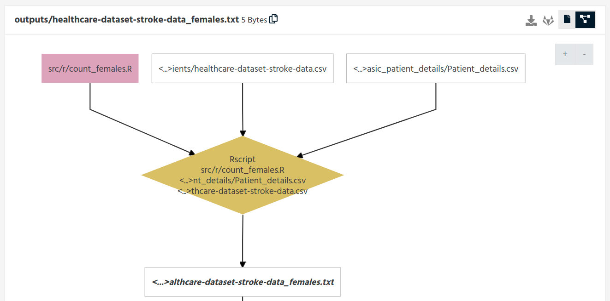
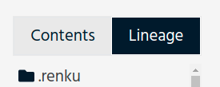
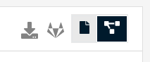

.. _knowledge-graph:

The Renku Knowledge Graph
=========================

The Knowledge Graph is the backbone of Renku. It is currently in beta and is
used to record and query the relationships between data and code. In the future
we will also use the Knowledge Graph to store and retrieve metadata and to
provide search functionality. See the :ref:`provenance` section for a high-level
description. A simple Knowledge Graph in the current Renku web user interface
looks something like this:

Generation
----------

Every time you use the ``renku run`` command we record some information about
the inputs, the outputs, and the actual execution of your script. While you are
working in your repository this information is simply stored in your project and
accessible via tools like the ``renku log`` command. However, as soon as the
project is pushed to the server, the commits are interpreted by the graph
service and the data is fed into the database holding the Knowledge Graph. This
happens automatically and there is no action required on your part, apart from
activating the Knowledge Graph integration.

Activation
----------

The Knowledge Graph is activated by default on all new projects. On projects
that were in place before this feature was released, the user is prompted to
enable the integration via a pop-up button:

.. image:: ../_static/images/kg_activation.png

File Lineage Display
--------------------

To see the current provenance information of any file in your project, select the
file in your file browser and click either the ``Lineage View`` drop down

or the graph icon on the right-hand side of the file preview pane:

Private Projects
----------------

In short: if you enable the Knowledge Graph integration on a private project,
the *metadata* about your project will become publicly accessible.
**Important**: your *data* is in no way affected by this - the contents of your
project are still private. What is metadata then? Things like filenames, paths
within the project, people working on the project, project directory structure
etc.  This is especially true if your private project references a public
project - a lineage query will reveal the workflow steps taken within your
private project using the public data. If sharing this level of metadata is not
acceptable to you, then please do not enable the Knowledge Graph integration for
now. For new private projects, you will be given an option when
creating the project whether to enable the Graph or not. If you choose not to do
so initially, you can change your mind later and we will happily add the project
to the Graph for you. However, while possible, removing a project completely
from the Graph is not easily supported at the moment. We are working on
providing comprehensive access control on the graph queries that traverse
projects, but at this stage they are not yet implemented.
